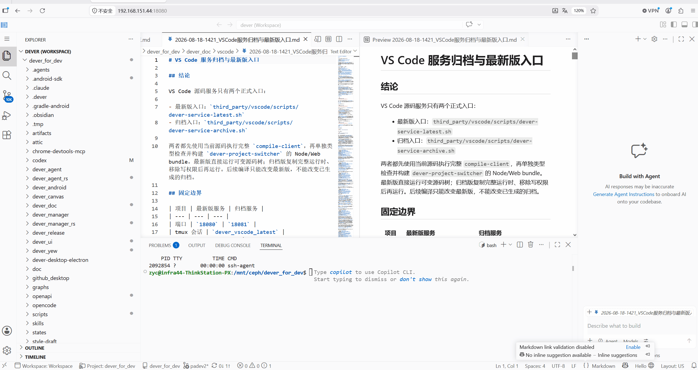

# vibe vscode

[English](README.md) | [简体中文](README_CN.md)

> **Long-term vision:** Keep your development environment running on a personal workstation or in the cloud. Wherever you are, open a browser, pick up where you left off, and start vibe coding.

vibe vscode is built on Code - OSS. It evolves the portable development editor of the pre-Agent era into a long-running workbench that can switch instantly between multiple task contexts. The goal is not to replace VS Code's editing, terminal, or extension capabilities, but to add stable context management so projects, terminals, and Agent sessions remain continuous across context switches and network interruptions.

## Features Roadmap

Status: ✅ Available　🚧 In progress　⬜ Planned

- ✅ **Web-first operation**: vibe vscode is designed for the browser first. We recommend hosting the development environment on an always-on machine or in the cloud, with the workbench always a web page away. Projects, terminals, and Agent tasks run on the server, while the browser handles interaction and state projection—no desktop client required.
  - 🚧 **Non-blocking remote connectivity**: Replace modal interruption with status-bar reconnect state, immediate retry after network recovery, and uninterrupted access to the current work. This is not yet included in the current implementation.

  After installing dependencies, start the development environment in two terminals:

  ```bash
  # Terminal 1: continuously compile changes
  npm run watch

  # Terminal 2: start the web workbench at http://localhost:8080
  ./scripts/code-web.sh .
  ```

- ✅ **Logical Workspace**: Create and select logical workspaces from the status bar or Command Palette without reloading the page. Switching saves and restores the visibility, size, and active view of the primary sidebar, panel, and secondary sidebar.
  - **Remote authoritative state**: The workspace catalog, layouts, and editor working sets are stored in remote SQLite. Other pages read the latest snapshot after refresh or reconnect, while each page keeps its active Workspace selection locally.
  - **Terminal isolation and persistence**: A terminal belongs to the logical workspace in which it was created, with ownership persisted in PTY process metadata. Switching workspaces moves terminals between foreground and background without closing them. A stable logical terminal ID survives local or remote PTYs, persistent-process reconnection, and page restoration.
  - ⬜ **Chat / Agent session-tab working sets**: The session catalog and Agent Sessions list remain global and are not owned by a logical workspace. A future workspace projection will restore only its open session tabs; the same session may appear in multiple workspaces, and closing a tab will not delete the session. PR #1 removes the premature single-owner filtering and does not claim session-tab restoration as implemented.

  

- ✅ **Project Context**: Select or add a project folder inside a single multi-root physical Workspace. Explorer and Source Control follow the same state projection: switching Project focuses the Explorer root and shows only Git repositories inside the current Project, while open editors, terminals, and sessions remain intact. Separate status-bar entries distinguish Workspace from Project.
- ⬜ **Fullscreen session management panel**: Provide a workbench-wide interface for viewing, creating, switching, and managing Agent sessions in one place.
- ⬜ **Document-driven development**: Select document content in the editor and create a new Agent session from the context menu, using the selection as context so requirements and design documents can directly drive implementation.
- ⬜ **Codex Agent-first interaction**: Treat Codex Agent as the primary session experience, with priority given to session creation, interaction, status visibility, and restoration.

## Non-goals

- **Electron desktop product**: vibe vscode product development, regression coverage, and releases target only Remote Web (browser Workbench + Remote Server). The repository retains the upstream Code - OSS Electron source to ease future synchronization, but does not publish, test, maintain, or promise compatibility for the desktop Electron product; Electron-specific regressions are not PR gates.

---

# Visual Studio Code - Open Source ("Code - OSS")
[](https://github.com/microsoft/vscode/issues?q=is%3Aopen+is%3Aissue+label%3Afeature-request+sort%3Areactions-%2B1-desc)
[](https://github.com/microsoft/vscode/issues?utf8=✓&q=is%3Aissue+is%3Aopen+label%3Abug)
[](https://gitter.im/Microsoft/vscode)

## The Repository

This repository ("`Code - OSS`") is where we (Microsoft) develop the [Visual Studio Code](https://code.visualstudio.com) product together with the community. Not only do we work on code and issues here, but we also publish our [roadmap](https://github.com/microsoft/vscode/wiki/Roadmap), [monthly iteration plans](https://github.com/microsoft/vscode/wiki/Iteration-Plans), and our [endgame plans](https://github.com/microsoft/vscode/wiki/Running-the-Endgame). This source code is available to everyone under the standard [MIT license](https://github.com/microsoft/vscode/blob/main/LICENSE.txt).

## Visual Studio Code

<p align="center">
  
</p>

[Visual Studio Code](https://code.visualstudio.com) is a distribution of the `Code - OSS` repository with Microsoft-specific customizations released under a traditional [Microsoft product license](https://code.visualstudio.com/License/).

[Visual Studio Code](https://code.visualstudio.com) combines the simplicity of a code editor with what developers need for their core edit-build-debug cycle. It provides comprehensive code editing, navigation, and understanding support along with lightweight debugging, a rich extensibility model, and lightweight integration with existing tools.

Visual Studio Code is updated monthly with new features and bug fixes. You can download it for Windows, macOS, and Linux on the [Visual Studio Code website](https://code.visualstudio.com/Download). To get the latest releases every day, install the [Insiders build](https://code.visualstudio.com/insiders).

## Contributing

There are many ways in which you can participate in this project, for example:

* [Submit bugs and feature requests](https://github.com/microsoft/vscode/issues), and help us verify them as they are checked in
* Review [source code changes](https://github.com/microsoft/vscode/pulls)
* Review the [documentation](https://github.com/microsoft/vscode-docs) and make pull requests for anything from typos to new content.

If you are interested in fixing issues and contributing directly to the codebase, please see the document [How to Contribute](https://github.com/microsoft/vscode/wiki/How-to-Contribute), which covers the following:

* [How to build and run from source](https://github.com/microsoft/vscode/wiki/How-to-Contribute)
* [The development workflow, including debugging and running tests](https://github.com/microsoft/vscode/wiki/How-to-Contribute#debugging)
* [Coding guidelines](https://github.com/microsoft/vscode/wiki/Coding-Guidelines)
* [Submitting pull requests](https://github.com/microsoft/vscode/wiki/How-to-Contribute#pull-requests)
* [Finding an issue to work on](https://github.com/microsoft/vscode/wiki/How-to-Contribute#where-to-contribute)
* [Contributing to translations](https://aka.ms/vscodeloc)

## Feedback

* Ask a question on [Stack Overflow](https://stackoverflow.com/questions/tagged/vscode)
* [Request a new feature](CONTRIBUTING.md)
* Upvote [popular feature requests](https://github.com/microsoft/vscode/issues?q=is%3Aopen+is%3Aissue+label%3Afeature-request+sort%3Areactions-%2B1-desc)
* [File an issue](https://github.com/microsoft/vscode/issues)
* Connect with the extension author community on [GitHub Discussions](https://github.com/microsoft/vscode-discussions/discussions) or [Slack](https://aka.ms/vscode-dev-community)
* Follow [@code](https://x.com/code) and let us know what you think!

See our [wiki](https://github.com/microsoft/vscode/wiki/Feedback-Channels) for a description of each of these channels and information on some other available community-driven channels.

## Related Projects

Many of the core components and extensions to VS Code live in their own repositories on GitHub. For example, the [node debug adapter](https://github.com/microsoft/vscode-node-debug) and the [mono debug adapter](https://github.com/microsoft/vscode-mono-debug) repositories are separate from each other. For a complete list, please visit the [Related Projects](https://github.com/microsoft/vscode/wiki/Related-Projects) page on our [wiki](https://github.com/microsoft/vscode/wiki).

## Bundled Extensions

VS Code includes a set of built-in extensions located in the [extensions](extensions) folder, including grammars and snippets for many languages. Extensions that provide rich language support (inline suggestions, Go to Definition) for a language have the suffix `language-features`. For example, the `json` extension provides coloring for `JSON` and the `json-language-features` extension provides rich language support for `JSON`.

## Development Container

This repository includes a Visual Studio Code Dev Containers / GitHub Codespaces development container.

* For [Dev Containers](https://aka.ms/vscode-remote/download/containers), use the **Dev Containers: Clone Repository in Container Volume...** command, which creates a Docker volume for better disk I/O on macOS and Windows.
  * If you already have VS Code and Docker installed, you can also click [here](https://vscode.dev/redirect?url=vscode://ms-vscode-remote.remote-containers/cloneInVolume?url=https://github.com/microsoft/vscode) to get started. This will cause VS Code to automatically install the Dev Containers extension if needed, clone the source code into a container volume, and spin up a dev container for use.

* For Codespaces, install the [GitHub Codespaces](https://marketplace.visualstudio.com/items?itemName=GitHub.codespaces) extension in VS Code, and use the **Codespaces: Create New Codespace** command.

Docker / the Codespace should have at least **4 cores and 6 GB of RAM (8 GB recommended)** to run a full build. See the [development container README](.devcontainer/README.md) for more information.

## Code of Conduct

This project has adopted the [Microsoft Open Source Code of Conduct](https://opensource.microsoft.com/codeofconduct/). For more information, see the [Code of Conduct FAQ](https://opensource.microsoft.com/codeofconduct/faq/) or contact [opencode@microsoft.com](mailto:opencode@microsoft.com) with any additional questions or comments.

## License

Copyright (c) Microsoft Corporation. All rights reserved.

Licensed under the [MIT](LICENSE.txt) license.
