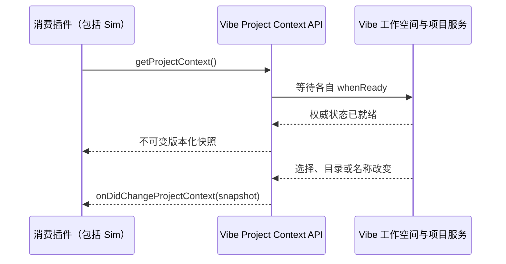

# Vibe Project Context 插件接口

内置插件 `vibe-vscode.project-switcher` 导出版本化、只读的项目接口。Sim 和其他插件通过同一契约读取项目，不访问 Logical Workspace 或 Project Context 的内部服务、存储键，也不自行维护第二套项目选择状态。类型定义以 [api.d.ts](api.d.ts) 为准。

## 插件调用

在同一个 Extension Host 内，通过标准 VS Code 插件导出访问接口。消费者应将 `vibe-vscode.project-switcher` 声明为 `extensionDependencies`；需要事件的 Web 插件与该插件一样运行在 UI Extension Host。

```ts
import * as vscode from 'vscode';
import type { VibeProjectContext, VibeVSCodeApi } from 'vibe-vscode';

export async function activate(context: vscode.ExtensionContext) {
	const extension = vscode.extensions.getExtension<VibeVSCodeApi>('vibe-vscode.project-switcher');
	if (!extension) {
		return; // 也允许消费者运行在未安装 Vibe 的 VS Code 中。
	}
	const api = await extension.activate();
	if (api.version !== 1) {
		throw new Error('Unsupported Vibe Project Context API');
	}
	let generation = -1;
	const project = (snapshot: VibeProjectContext) => {
		if (snapshot.generation <= generation) {
			return;
		}
		generation = snapshot.generation;
		// 更新插件自己的只读展示，或把该快照绑定到新创建的资源。
	};
	context.subscriptions.push(api.onDidChangeProjectContext(project));
	project(await api.getProjectContext());
}
```

消费者编译时需包含 `api.d.ts`，这是类型契约，不是可执行模块。插件包随附该文件；仓库内 Workbench 的类型入口仅引用它，不复制定义。

不同 Extension Host 之间不能依赖 `Extension.exports` 传递对象，可以通过公开命令执行一次读取：

```ts
const snapshot = await vscode.commands.executeCommand<VibeProjectContext>('vibe-vscode.getProjectContext');
```

此命令与导出接口读取同一个权威快照。`_vibe-vscode.*` 命令是实现细节，不是其他插件的订阅或控制接口。

## 快照、就绪与生命周期

`physicalWorkspace` 保留原始 Workspace 身份、名称、远端 authority 和目录列表；`logicalWorkspaces` 是已加载的完整逻辑工作空间目录，`logicalWorkspace` 是当前激活项，`project` 是当前选中目录。所有 URI 都保留 scheme 和 authority，消费者不能把远端 URI 强行解释为本机路径。目录归属判断应遵守文件系统的大小写规则；嵌套目录选择最具体的匹配项。

读取等待物理 Workspace、Logical Workspace 和 Project Context 各自的就绪门槛。初始化失败会拒绝 Promise，不会把“尚未加载”或“读取失败”伪装成空目录。就绪之后，明确的空目录或缺失选中项才是可消费状态。



`generation` 只在当前 Workbench 生命周期内单调递增，不是数据库 revision，不能跨窗口或刷新持久化比较。事件也覆盖同一项目的名称、目录内容变化；重复状态不重复发送。先订阅再读初始快照，并按 generation 丢弃落后的结果，可避免启动时漏掉更新。

创建会话等操作必须在权威读取完成后捕获一次发起上下文，随后保持它跨越异步调用。用于判断完成后是否抢焦点的最新快照，不能反过来修改资源的原始归属。销毁插件时释放订阅，销毁 Workbench 后的读取会失败。

## 职责边界

Vibe 主工作台仍独占项目选择、持久化和主入口鉴权；该 API 只负责就绪等待及不可变投影。Sim 保留原生侧栏、独立资源 tab、会话和运行记录，通过标准插件接口感知项目。编辑器选区和打开文件等能力仍走 VS Code API，不混进项目权威契约，也不因切 tab 重建 Sim 侧栏。

这个接口不授予读取文件内容、执行项目代码或使用凭据的权限。Sim 执行仍须通过主入口网关、Sim 会话鉴权、工作空间权限及部署方配置的本地目录/远端映射约束。
