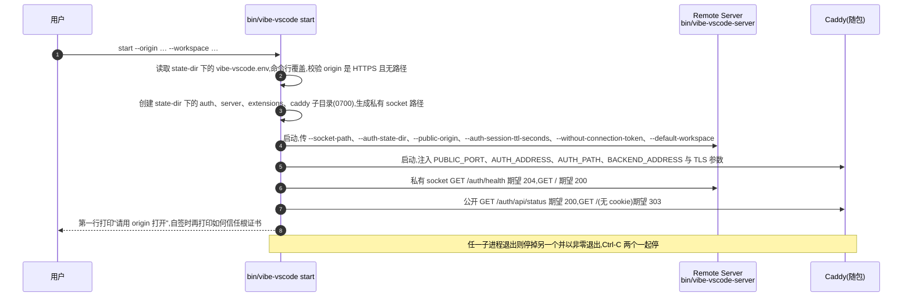

# 安装与启动:一个脚本、一个命令,服务化可选

> - 对应 PR:[feat: require login authentication for hosted VS Code](https://github.com/ActivePeter/vibe-vscode/pull/15)
> - 状态:设计已定,实现随首个 tag `v1.135.0-vibe.1` 之前完成
> - 范围:Linux x64 release 包的安装、启动、升级与回滚体验
> - 非目标:macOS / Windows 包、包管理器分发、自动更新、多实例编排

## 1. 问题

现在的"快速开始"要用户自己完成八步:下载并校验、解压、指 `current`、另装 Caddy、复制并手改 `service.env`、安装两份 systemd 模板、启动两个服务、再打开浏览器。任何一步的顺序或路径错了都没有提示;整套流程还默认机器有 systemd、用户有 root。对一个"打开浏览器就能用"的产品,这不是快速开始,是运维手册。

## 2. 目标体验

三条命令,不需要 root,不需要 systemd:

```bash
curl -fsSL https://github.com/ActivePeter/vibe-vscode/releases/download/<tag>/install.sh | bash -s -- --tag <tag>
~/.vibe-vscode/current/bin/vibe-vscode start --origin https://dev.example.com:18080 --workspace ~/projects
# 浏览器打开 https://dev.example.com:18080,第一次访问注册管理员
```

要做成后台服务的人再多一步:

```bash
~/.vibe-vscode/current/bin/vibe-vscode systemd --state-dir ~/.vibe-vscode/state > ~/.config/systemd/user/vibe-vscode.service
systemctl --user enable --now vibe-vscode
```

用不用服务由用户决定,产品只保证前台命令本身完整可用。

## 3. 部件

三个部件,逻辑大部分从 `deploy-18080.sh` 里已经验证过的函数提取,不另起炉灶。

| 部件 | 职责 | 复用什么 |
|---|---|---|
| `install.sh`(随 release 附带,仓库根目录也有一份) | `--tag`、`--root`(默认 `~/.vibe-vscode`)、`--rollback`。下载 tar 与 `.sha256` 并校验、解压到 `<root>/releases/<tag>`、原子切换 `<root>/current`、打印下一步命令。不写任何系统目录。 | [`docs/release.md`](../../docs/release.md) "Download and install" 的 shell 原样搬入 |
| Caddy 随包发布 | 固定版本的 Caddy 二进制放进 release 包,与 `node` 并列,打包时按 sha256 校验。用户不再单独安装 Caddy。 | `deploy-18080.sh` 的 `ensure_caddy_binary`:版本 `2.11.4`、两种架构的 sha256、下载与校验;移到 `build/web-release.ts package` |
| `bin/vibe-vscode`(用户入口) | `start`:一个前台进程组里拉起 Caddy 与 Remote Server,私有 socket、健康门、日志到 stdout,Ctrl-C 一起停。`systemd`:按同一组参数打印 unit。`status`:探一遍健康端点。 | `run_gateway_stack`(两进程、socket、`wait -n`、trap 清理)、`is_runtime_healthy`(四个探针)、`wait_until_ready`。现有 `bin/vibe-vscode-server` 保留为底层 launcher,由 `start` 调用 |

## 4. `vibe-vscode start`

### 4.1 参数

只保留用户必须知道的。全部参数都可以写在 `<state-dir>/vibe-vscode.env` 里,`start` 默认读取,命令行覆盖。

| 参数 | 默认 | 说明 |
|---|---|---|
| `--origin` | `https://<hostname -f>:<port>` | 浏览器地址栏里的 HTTPS 地址,即 Remote Server 的 `--public-origin`。可以给多个,逗号分隔,每个都是完整的 `https://主机或IP[:端口]`;不需要域名,IP、`localhost`、Tailscale 地址都行。唯一真正需要用户想一下的参数 |
| `--port` | `18080` | Caddy 公开端口 |
| `--state-dir` | `<root>/state` | 下面固定分 `auth/`、`server/`、`extensions/`、`caddy/`,升级不动它 |
| `--tls-cert` / `--tls-key` | 无 | 不给则用 Caddy 内置 CA 自签;给了就用用户证书 |
| `--workspace` | 无 | 默认打开的目录或 `.code-workspace` |
| `--base-path` | `/` | 反代到子路径时用,同时决定 `VIBE_VSCODE_AUTH_PATH` |
| `--session-ttl` | `43200` | 透传给 `--auth-session-ttl-seconds` |

### 4.1.1 示例

最简:只给浏览器地址,其余全部默认(端口 18080、状态目录 `~/.vibe-vscode/state`、Caddy 自签证书):

```bash
~/.vibe-vscode/current/bin/vibe-vscode start --origin https://dev.example.com:18080
```

自有证书、指定端口与默认工作区:

```bash
~/.vibe-vscode/current/bin/vibe-vscode start \
  --origin https://dev.example.com \
  --port 443 \
  --tls-cert /etc/letsencrypt/live/dev.example.com/fullchain.pem \
  --tls-key /etc/letsencrypt/live/dev.example.com/privkey.pem \
  --workspace ~/projects/vibe.code-workspace
```

挂在外层反代的子路径下,会话 TTL 改为 7 天:

```bash
~/.vibe-vscode/current/bin/vibe-vscode start \
  --origin https://tools.example.com \
  --base-path /vscode \
  --session-ttl 604800
```

把参数固定在状态目录的 env 文件里,之后只需 `start`;命令行给出的参数覆盖文件里的同名项:

```bash
cat > ~/.vibe-vscode/state/vibe-vscode.env <<'EOF'
VIBE_VSCODE_ORIGIN=https://dev.example.com:18080
VIBE_VSCODE_PORT=18080
VIBE_VSCODE_WORKSPACE=/home/me/projects
VIBE_VSCODE_TLS_CERT=/home/me/certs/fullchain.pem
VIBE_VSCODE_TLS_KEY=/home/me/certs/privkey.pem
EOF
~/.vibe-vscode/current/bin/vibe-vscode start
~/.vibe-vscode/current/bin/vibe-vscode start --port 18081   # 临时换端口,其余仍来自文件
```

env 文件的键名与参数一一对应:`--origin` 对应 `VIBE_VSCODE_ORIGIN`,`--state-dir` 对应 `VIBE_VSCODE_STATE_DIR`,其余同理,全部大写、连字符换下划线。

安装、升级与回滚:

```bash
# 安装到默认目录 ~/.vibe-vscode
curl -fsSL https://github.com/ActivePeter/vibe-vscode/releases/download/v1.135.0-vibe.1/install.sh | bash -s -- --tag v1.135.0-vibe.1
# 安装到自定义目录
curl -fsSL … | bash -s -- --tag v1.135.0-vibe.1 --root /opt/vibe-vscode
# 升级:再装一个 tag,自动切换 current
curl -fsSL … | bash -s -- --tag v1.135.0-vibe.2
# 回滚到上一个 release
~/.vibe-vscode/current/bin/install.sh --rollback
```

做成服务:

```bash
# 用户级服务,不需要 root
mkdir -p ~/.config/systemd/user
~/.vibe-vscode/current/bin/vibe-vscode systemd --state-dir ~/.vibe-vscode/state > ~/.config/systemd/user/vibe-vscode.service
systemctl --user daemon-reload
systemctl --user enable --now vibe-vscode
# 系统级服务
~/.vibe-vscode/current/bin/vibe-vscode systemd --state-dir /var/lib/vibe-vscode --user vibe-vscode | sudo tee /etc/systemd/system/vibe-vscode.service
```

启动成功时前两行输出固定为:

```text
vibe vscode is ready: open https://dev.example.com:18080
TLS is self-signed by Caddy; trust /home/me/.vibe-vscode/state/caddy/pki/authorities/local/root.crt in your browser or system
```

### 4.2 启动时序



第 6、7 步就是 `deploy-18080.sh` 的 `is_runtime_healthy`;第 4、5 步就是 `run_gateway_stack` 去掉 tmux 之后的部分。

### 4.3 TLS 与 Origin

这是整套体验能否成立的关键。会话 cookie 带 `__Secure-` 前缀,必须走 HTTPS,所以没有"先用 HTTP 试试"的选项。

- 没有证书:Caddyfile 使用 `tls internal`,Caddy 自签并把根证书放在 `<state-dir>/caddy/pki/authorities/local/root.crt`。启动日志给出一行"在浏览器或系统信任这个文件"的说明。
- 有证书:`--tls-cert` 与 `--tls-key` 两个路径,Caddyfile 使用 `tls <cert> <key>`。
- `--origin` 缺省取 `https://$(hostname -f):<port>`,启动日志第一行回显。Origin 填错的后果是所有登录被当作跨源拒绝,这是现在最容易踩的坑,所以要在启动时就把它打印出来。

**多个访问入口,不需要域名。** 一台机器常常同时有办公室局域网 IP、家里的 VPN 或 Tailscale IP 和 `localhost`。`--origin` 接受逗号分隔的多个地址:

```bash
~/.vibe-vscode/current/bin/vibe-vscode start \
  --origin https://192.168.1.5:18080,https://100.64.0.7:18080,https://localhost:18080
```

规则是显式白名单,而不是信任请求头:

- 服务端 `--public-origin` 可重复,整张表就是 Better Auth 的 `trustedOrigins`。每个请求按 Caddy 转来的 `Host` 在表里精确匹配,匹配到的那个作为该请求的 origin,用于 Better Auth 的 `host`、跳转地址与 Workbench 的 `remoteAuthority`;匹配不到时导航按第一个入口处理,表单提交一律 403。不从请求头推导任何未列出的地址,安全边界与单入口时相同。
- cookie 不设 `Domain`,按 host 隔离:从两个入口进来是两个会话,各自登录一次,退出互不影响。
- Caddy 站点块列出全部地址,`tls internal` 一次给所有主机名和 IP 签发;自有证书则需要证书的 SAN 覆盖这些名字。
- 不提供"任意 host 都信任"的开关,那等于回到被伪造 `Host` 的老问题。改了 IP 就改 `--origin` 或 env 文件后重启。

Caddyfile 模板按 TLS 来源二选一由 `start` 生成到 `<state-dir>/caddy/Caddyfile`,其余转发规则与 [`resources/server/vibe-vscode/Caddyfile`](../../resources/server/vibe-vscode/Caddyfile) 完全相同;鉴权语义不变,见[全屏登录与实例认证](login_authentication.md)。

## 5. 升级与回滚

- 升级:再跑一次 `install.sh --tag <new>`,只是多一个 `releases/<new>` 并切换 `current`;然后重启 `vibe-vscode start`。
- 回滚:`install.sh --rollback` 把 `current` 指回上一个 release。
- 状态目录不在 release 树里,来回切换不丢账号、会话、设置和扩展;`auth/` 丢失会使所有会话失效并重新开放注册,文档要写明。

语义与 [`docs/release.md`](../../docs/release.md) 现在描述的手工流程一致,只是从八步变成命令。

## 6. 服务化可选

`vibe-vscode systemd` 按当前参数打印一份 unit,`ExecStart` 就是 `<root>/current/bin/vibe-vscode start --state-dir …`。用户级(`systemctl --user`)与系统级都可用,不再需要 `service.env.example`、`vibe-vscode.service`、`caddy.service.conf` 三份模板让用户手改;这三份模板在实现落地后删除。

## 7. 与现有脚本的关系

- `bin/vibe-vscode-server`:保留,底层 launcher,契约不变。
- `deploy-18080.sh`:本次不动。它多出来的部分是构建、快照、tmux 与回滚事务;后续让它调用 `vibe-vscode start`,把两进程编排收敛成一份逻辑。
- `docs/release.md`:"Download and install"、"Configure and start"、"systemd and Caddy/TLS" 三节收成"Quick start"与"Run as a service (optional)"两节。
- release 文案 `docs/release-notes/v1.135.0-vibe.1.md` 的"快速开始"与 README 的 Web 优先运行一节引用同一段三条命令。

## 8. 验证

| 层 | 场景 |
|---|---|
| `install.sh` | 校验失败拒绝安装;重复安装同一 tag 不覆盖;`--rollback` 切回并可再切回来 |
| `vibe-vscode start` | 无证书自签启动并通过四个探针;有证书启动;origin 非 HTTPS 或带路径时拒绝;子进程任一退出则整体退出且 socket 清理;Ctrl-C 两进程都停 |
| `vibe-vscode systemd` | 生成的 unit 能被 `systemd-analyze verify` 通过,`ExecStart` 参数与当前 env 一致 |
| 打包 | release 包内含 Caddy 且 sha256 与 `web-release.ts` 固定值一致 |
