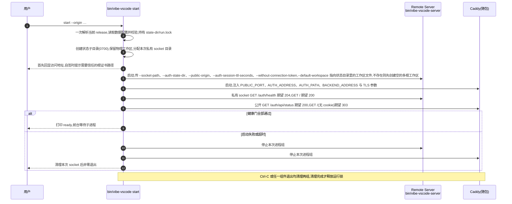

# 安装与启动:一个脚本、一个命令,服务化可选

> - 对应 PR:[feat: require login authentication for hosted VS Code](https://github.com/ActivePeter/vibe-vscode/pull/15)
> - 状态:实现已落在本 PR,安装、启动与打包门禁一并合入,首个 tag `v1.135.0-vibe.1` 才可使用该流程
> - 范围:Linux x64 release 包的安装、启动、升级与回滚体验
> - 非目标:macOS / Windows 包、包管理器分发、自动更新、多实例编排

## 1. 问题

此前的"快速开始"要用户自己完成八步:下载并校验、解压、指 `current`、另装 Caddy、复制并手改 `service.env`、安装两份 systemd 模板、启动两个服务、再打开浏览器。任何一步的顺序或路径错了都没有提示;整套流程还默认机器有 systemd、用户有 root。对一个"打开浏览器就能用"的产品,这不是快速开始,是运维手册。

## 2. 目标体验

三条命令,不需要 root,不需要 systemd:

```bash
curl -fsSL 'https://github.com/ActivePeter/vibe-vscode/releases/download/v1.135.0-vibe.1/install.sh' | bash -s -- --tag 'v1.135.0-vibe.1'
~/.vibe-vscode/current/bin/vibe-vscode start --origin https://dev.example.com:18080
# 浏览器打开 https://dev.example.com:18080,第一次访问注册管理员,然后在界面里添加项目目录
```

要做成后台服务的人再多一步:

```bash
~/.vibe-vscode/current/bin/vibe-vscode systemd --install --origin https://dev.example.com:18080
systemctl --user daemon-reload && systemctl --user enable --now vibe-vscode
loginctl enable-linger "$(id -un)"
```

用不用服务由用户决定,产品保证前台命令本身完整可用。正式操作步骤以 [安装与启动文档](../../docs/install.md#quick-start) 为准;本文维护实现职责与生命周期。首次注册完成前必须限制入口只对预期管理员开放。

## 3. 部件

三个部件,逻辑大部分从 `deploy-18080.sh` 里已经验证过的函数提取,不另起炉灶。

| 部件 | 职责 | 复用什么 |
|---|---|---|
| [`install.sh`](../../install.sh)(release 附件和包内 `bin/install.sh`) | 持有 `<root>/install.lock`,下载并校验 tar/metadata,验证后发布不可变 release,原子切换 `current`/`previous`;不启动进程、不写状态或系统目录。 | 将原手工安装流程固化,增加并发锁、路径包含性验证与失败清理 |
| [Caddy 随包发布](../../build/lib/caddy.ts) | `package` 将固定版本二进制放在包根,与 `node` 并列;归档 SHA-512 与二进制 SHA-256 都通过才接受。 | 沿用 `ensure_caddy_binary` 的 Caddy `2.11.4`、架构和校验值,使用已有构建下载工具 |
| [`bin/vibe-vscode`](../../resources/server/vibe-vscode/vibe-vscode.sh)(用户入口) | `start` 持有状态目录的运行锁,拥有 Caddy/Remote Server 两个子进程组和 socket 的最终清理;`systemd` 只输出 unit;`status` 只读探测。配置由随包 Node 执行的 [TypeScript 解析器](../../resources/server/vibe-vscode/cli-config.ts) 按数据读取。 | `run_gateway_stack`(两进程、socket、`wait -n`、trap 清理)、`is_runtime_healthy`(四个探针)、`wait_until_ready`。现有 `bin/vibe-vscode-server` 保留为底层 launcher,由 `start` 调用 |

## 4. `vibe-vscode start`

### 4.1 参数

只保留用户必须知道的。`--state-dir` 先定位 `<state-dir>/vibe-vscode.env`,其余参数可写进该文件,命令行覆盖。文件只按 dotenv 数据解析,不执行 shell,不展开变量、`~` 或命令替换;未知键直接拒绝。

| 参数 | 默认 | 说明 |
|---|---|---|
| `--origin` | `https://<hostname -f>:<port>` | 浏览器地址栏里的 HTTPS 地址,即 Remote Server 的 `--public-origin`。可以给多个:命令行重复该参数,env 文件里用逗号分隔;每个都是完整的 `https://主机或IP[:端口]`;不需要域名,IP、`localhost`、Tailscale 地址都行。唯一真正需要用户想一下的参数 |
| `--port` | `18080` | Caddy 公开端口 |
| `--state-dir` | `<root>/state` | 由 `start` 创建(0700),创建不了就报错退出并给出路径;下面固定分 `auth/`、`server/`、`extensions/`、`caddy/` 和物理工作区文件 `vibe-vscode.code-workspace`,升级不动它 |
| `--tls-cert` / `--tls-key` | 无 | 不给则用 Caddy 内置 CA 自签;给了就用用户证书 |
| `--session-ttl` | `43200` | 透传给 `--auth-session-ttl-seconds` |

**没有 `--workspace` 参数,用户不需要关心物理工作区在哪。** 有了 Logical Workspace 与 Project Context,物理工作区只是一个承载项目目录列表的多根 `.code-workspace` 文件,属于实例状态:`start` 在 `<state-dir>/vibe-vscode.code-workspace` 不存在时创建一个空的多根工作区并作为 `--default-workspace` 传给 Remote Server,和 `deploy-18080.sh` 的 `resolve_workspace_path` 一致。用户打开浏览器后在界面里用 Project Context 添加项目目录,项目本身在哪里都行,git 仓库或共享存储不受影响;逻辑工作区的布局、编辑器工作集和终端归属另存在服务端 SQLite。这样 secret、账号库和工作区文件都只在 `0700` 的状态目录里,不会落进任何项目目录。

### 4.1.1 示例

最简:只给浏览器地址,其余全部默认(端口 18080、状态目录 `~/.vibe-vscode/state`、Caddy 自签证书):

```bash
~/.vibe-vscode/current/bin/vibe-vscode start --origin https://dev.example.com:18080
```

自有证书、指定端口:

```bash
~/.vibe-vscode/current/bin/vibe-vscode start \
  --origin https://dev.example.com \
  --port 443 \
  --tls-cert '<absolute-certificate-file>' \
  --tls-key '<absolute-private-key-file>'
```

443 需要低端口绑定权限;无特权启动继续使用默认的 18080 即可。

多个访问入口,办公室局域网、Tailscale 与本机各一个,`--origin` 重复给出:

```bash
~/.vibe-vscode/current/bin/vibe-vscode start \
  --origin https://192.168.1.5:18080 \
  --origin https://100.64.0.7:18080 \
  --origin https://localhost:18080
```

会话 TTL 改为 7 天:

```bash
~/.vibe-vscode/current/bin/vibe-vscode start \
  --origin https://dev.example.com:18080 \
  --session-ttl 604800
```

把参数固定在状态目录的 env 文件里,之后只需 `start`;命令行给出的参数覆盖文件里的同名项:

```bash
mkdir -p ~/.vibe-vscode/state
cat > ~/.vibe-vscode/state/vibe-vscode.env <<'EOF'
VIBE_VSCODE_ORIGIN=https://dev.example.com:18080
VIBE_VSCODE_PORT=18080
VIBE_VSCODE_SESSION_TTL=43200
EOF
~/.vibe-vscode/current/bin/vibe-vscode start
~/.vibe-vscode/current/bin/vibe-vscode start --port 18443 --origin https://dev.example.com:18443
```

文件键只有 `VIBE_VSCODE_ORIGIN`、`VIBE_VSCODE_PORT`、`VIBE_VSCODE_TLS_CERT`、`VIBE_VSCODE_TLS_KEY`、`VIBE_VSCODE_SESSION_TTL`;**没有 `VIBE_VSCODE_STATE_DIR`**,避免配置文件重定向自己。CLI 的 `--origin` 替换文件里的整张表。文件内相对证书路径以状态目录为基准,CLI 相对路径以调用目录为基准;生成 systemd 时 CLI 证书路径固化为绝对路径。

安装、升级、回滚和服务化命令见 [安装与启动文档](../../docs/install.md#upgrade-health-checks-and-rollback)。自定义安装目录必须对当前用户可写。

启动首先回显访问地址和自签信任提示,只有通过健康门后才输出 ready,不能先宣布启动成功:

```text
Vibe VS Code browser addresses: https://dev.example.com:18080
TLS uses Caddy's local CA; trust <state-dir>/caddy/pki/authorities/local/root.crt in your browser or system.
…Caddy 与 Remote Server 日志…
vibe vscode is ready: open https://dev.example.com:18080
```

### 4.2 启动时序



健康边界沿用 `is_runtime_healthy`:两个私有探针加每个 origin 的两个公开探针。公开探针保留真实 Host/SNI,仅将连接定向本机并跳过证书信任校验;它不能替代浏览器端的 DNS、网络与 CA 信任验证。状态目录只记录 `backend.sock` 符号链接,实际 socket 位于 `XDG_RUNTIME_DIR`/临时目录下本次创建的 `0700` 目录,避免长状态路径与旧进程清理冲突。清理只处理本次子进程组和 socket,不按端口或外部 PID 文件杀进程。

### 4.3 TLS 与 Origin

这是整套体验能否成立的关键。会话 cookie 带 `__Secure-` 前缀,必须走 HTTPS,所以没有"先用 HTTP 试试"的选项。

- 没有证书:Caddyfile 使用 `tls internal`,Caddy 自签并把根证书放在 `<state-dir>/caddy/pki/authorities/local/root.crt`。启动日志给出一行"在浏览器或系统信任这个文件"的说明。
- 有证书:`--tls-cert` 与 `--tls-key` 必须成对,Caddyfile 使用 `tls <cert> <key>`。
- `--origin` 缺省取 `https://$(hostname -f):<port>`,启动日志第一行回显。Origin 填错的后果是所有登录被当作跨源拒绝,这是现在最容易踩的坑,所以要在启动时就把它打印出来。

**多个访问入口,不需要域名。** 一台机器常常同时有办公室局域网 IP、家里的 VPN 或 Tailscale IP 和 `localhost`。`--origin` 重复给出即可,每个入口一次:

```bash
~/.vibe-vscode/current/bin/vibe-vscode start \
  --origin https://192.168.1.5:18080 \
  --origin https://100.64.0.7:18080 \
  --origin https://localhost:18080
```

写在 env 文件里时用逗号分隔:

```bash
VIBE_VSCODE_ORIGIN=https://192.168.1.5:18080,https://100.64.0.7:18080,https://localhost:18080
```

规则是显式白名单,而不是信任请求头:

- 服务端 `--public-origin` 可重复,整张表就是 Better Auth 的 `trustedOrigins`。每个请求按 Caddy 转来的 `Host` 在表里精确匹配,匹配到的那个作为该请求的 origin,用于 Better Auth 的 `host`、跳转地址与 Workbench 的 `remoteAuthority`;匹配不到时导航按第一个入口处理,表单提交一律 403。不从请求头推导任何未列出的地址,安全边界与单入口时相同。
- cookie 不设 `Domain`,不同主机名/IP 通常各自登录、各自退出;同一主机名仅端口不同不形成 cookie 隔离。
- Caddy 站点块按主机名/IP 去重,在 `--port` 监听,`tls internal` 为全部名字签发;自有证书的 SAN 需覆盖全部名字。没有自动信任操作,只分发根证书给客户端,不要分发 CA 私钥。
- 不提供"任意 host 都信任"的开关,那等于回到被伪造 `Host` 的老问题。改了 IP 就改 `--origin` 或 env 文件后重启。

Caddyfile 模板按 TLS 来源二选一由 `start` 生成到 `<state-dir>/caddy/Caddyfile`,其余转发规则与 [`resources/server/vibe-vscode/Caddyfile`](../../resources/server/vibe-vscode/Caddyfile) 完全相同;鉴权语义不变,见[全屏登录与实例认证](login_authentication.md)。

**子路径部署不在首版启动命令里。** 一个服务一个子域名或端口就够。技术上应用必须知道自己的前缀,因为静态资源地址、WebSocket 地址、登录跳转的 `Location` 和 cookie 的 `Path` 都是应用自己生成的绝对路径,外层网关剥掉前缀转进来容易,替应用把响应里的地址补回前缀不可靠。前缀要么静态声明(Remote Server 已有的 `--server-base-path`,保留给部署脚本与测试),要么由网关按标准的 `X-Forwarded-Prefix` 头动态告知,`webClientServer` 已支持后者。需要子路径时按后者补齐鉴权路由与 cookie `Path` 的处理即可,用户不需要在启动命令里声明。

## 5. 升级与回滚

- 升级:再跑一次 `install.sh --tag <new>`,只是多一个 `releases/<new>` 并切换 `current`;然后重启 `vibe-vscode start`。
- 回滚:`install.sh --rollback` 把 `current` 指回上一个 release。
- 状态目录不在 release 树里,来回切换不丢账号、会话、设置和扩展;`auth/` 丢失会使所有会话失效并重新开放注册,文档要写明。

安装锁只负责下载、验证与版本指针;运行锁负责实例整个生命周期,所以安装新版本不会打断旧实例,正在运行的进程也不会随 `current` 漂移。验证失败不发布 candidate 或修改 `current`;启动失败只清理本次进程,需要用户显式回滚版本后再启动。所有 release 均保留,不自动回收或覆盖;回滚不是数据库迁移撤销,升级前应备份状态。

## 6. 服务化可选

`vibe-vscode systemd` 按当前参数生成一份 unit,`ExecStart` 就是 `<root>/current/bin/vibe-vscode start --state-dir …`。加 `--install` 时自动创建 unit 目录(用户级 `~/.config/systemd/user/`,带 `--user <account>` 时为 `/etc/systemd/system/`)并写入文件,目录创建不了或文件写不进就报错退出并给出路径,由用户自行创建或授权后重跑;之后打印要执行的 `daemon-reload` 与 `enable` 命令,不自动启用。不带 `--install` 只打印到 stdout。用户级与系统级都可用,三个旧手改模板已删除。生成器保留命令行覆盖项,其他默认值在每次启动时从同一个配置文件读取。

用户级服务若要在注销后常驻,还需 `loginctl enable-linger <user>`,该操作可能需要管理员授权;生成的 unit 顶部也带此提示。系统级用 `--user <service-account>` 生成 `User=`,账号、目录权限与安装 unit 由操作者管理。

## 7. 与现有脚本的关系

- `bin/vibe-vscode-server`:保留,底层 launcher,契约不变。
- `deploy-18080.sh`:不重构现有编排,仅将候选配置预检适配为 `publicOrigins` 列表。它多出来的部分是构建、快照、tmux 与回滚事务;后续让它调用 `vibe-vscode start`,把两进程编排收敛成一份逻辑。
- `docs/release.md`:"Download and install"、"Configure and start"、"systemd and Caddy/TLS" 三节收成"Quick start"与"Run as a service (optional)"两节。
- release 文案 `docs/release-notes/v1.135.0-vibe.1.md` 的"快速开始"与 README 的 Web 优先运行一节引用同一段三条命令。

## 8. 验证

| 层 | 场景 |
|---|---|
| [`install.sh` 回归](../../build/lib/test/vibeVscodeInstall.test.ts) | checksum/metadata/外逃链接失败不发布;重复安装同一 tag 不覆盖;双向 rollback;安装锁冲突不下载或切换 |
| [安装后运行测试](../../build/lib/test/vibeVscodeRuntime.integration.ts) | 对 bundled、minified 与正式发布附件运行:自签和自有 TLS、两入口及四个边界、运行锁、工作区创建与保留、Ctrl-C/任一组件退出清理、端口占用时不杀无关进程 |
| `vibe-vscode systemd` / 配置 | unit 通过 `systemd-analyze verify`,保留 CLI 覆盖与 linger 提示;路径转义、相对证书路径、未知配置拒绝、数据不执行 |
| [打包](../../build/lib/test/webClientRelease.test.ts) | 包内含经校验的 Caddy;附件包含 `install.sh` 且与仓库根目录、包内副本一致;重复发布不覆盖 |
| 发布工作流 | `package` 产生 tar、sha256、install.sh 三个产物,`gh release create` 同时上传三者;安装启动验证通过后才允许创建 draft |
