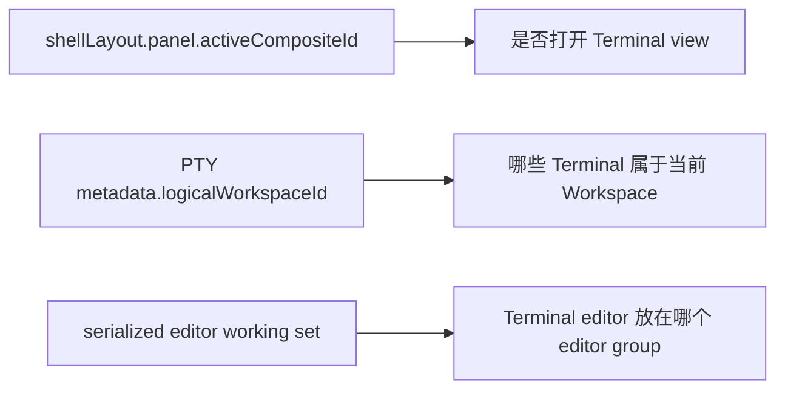
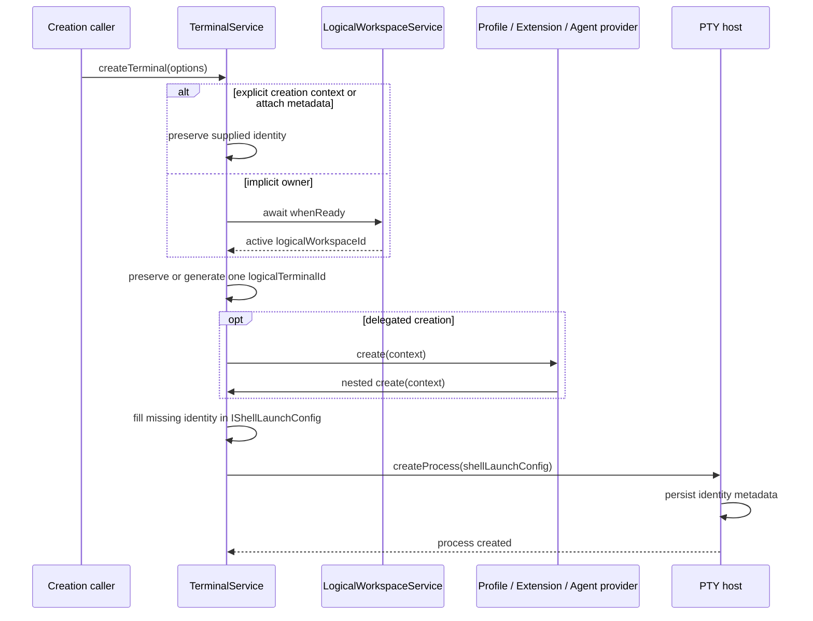
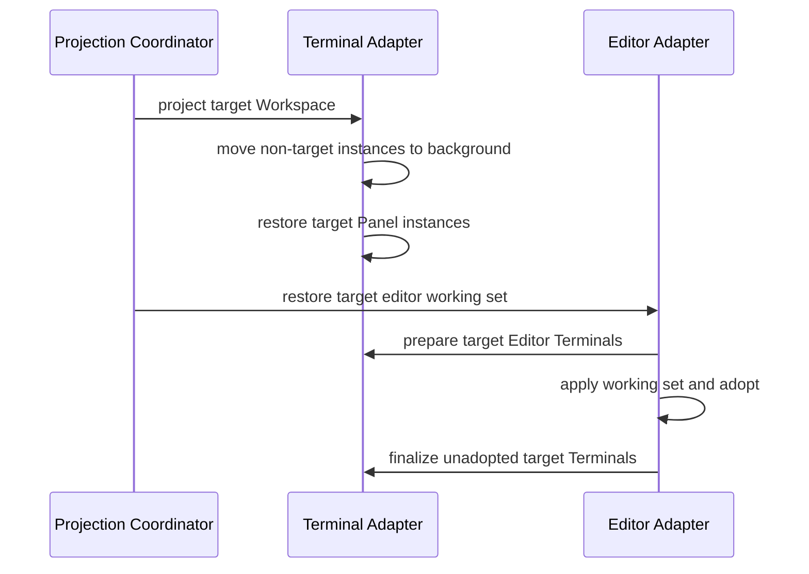
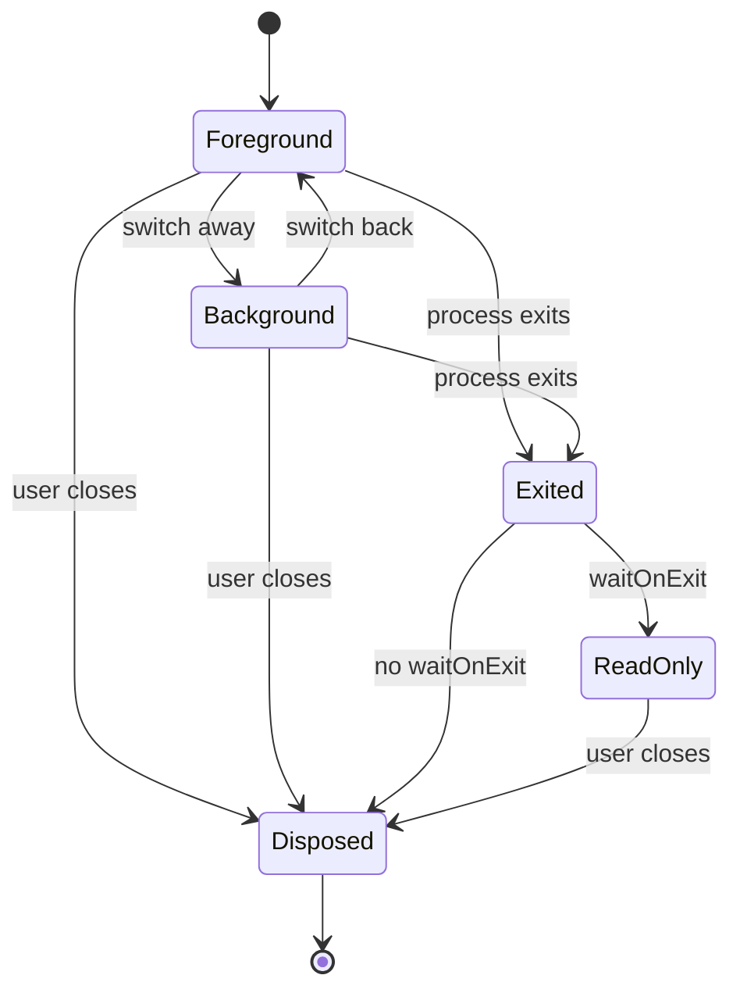
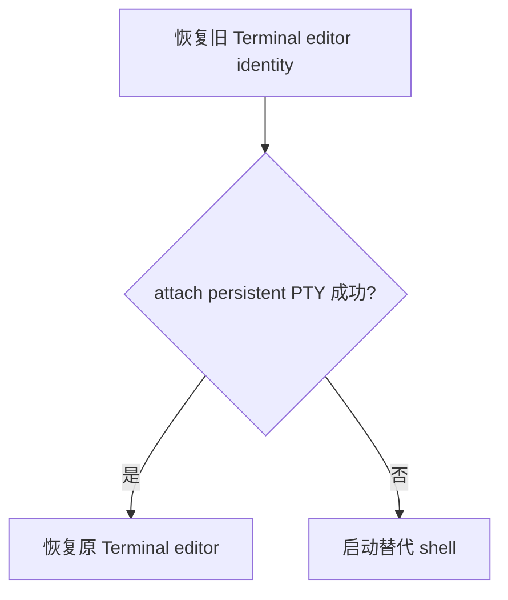

# Logical Workspace Terminal：identity、投影与持久化

> 适用范围：Terminal 创建、Logical Workspace 归属、前后台投影、Editor Terminal、PTY 持久化与重连
>
> 总览：[PR #1：Logical Workspace 与全屏会话宿主](./pr1_logical_workspace_and_fullscreen.md)

## 1. 结论

Logical Workspace 不拥有 Terminal process，也不保存 Terminal owner map。Terminal/PTY 层管理进程生命周期，persistent PTY metadata 持有 identity 与 ownership；Logical Workspace 只根据这些 metadata 投影当前可见的 Terminal。

- `shellLayout` 只决定 Panel 是否显示、Panel 当前是否打开 Terminal view，不映射具体 Terminal。
- Panel Terminal 属于哪个 Logical Workspace，由进程 metadata 中的 `logicalWorkspaceId` 决定。
- Terminal editor 放在哪个 editor group，由 serialized editor working set 决定。
- 切换 Logical Workspace 只移动同一个 Terminal instance，不关闭 PTY。
- 进程真正结束后不会作为 live Terminal 被 Workspace snapshot 保留。

## 2. 上游复用与新增边界

继续复用 VS Code 的能力：

- Terminal instance、Panel group、Terminal editor 和 background instance；
- PTY process 创建、持久化、detach、revive 与 reconnect；
- Terminal editor serializer 及现有 attach/relaunch 行为；
- Local/Remote backend 与 `remoteAuthority` 分区。

VS Code 原生 ID 只在各自边界内稳定：`instanceId` 属于 renderer，`persistentProcessId` 属于 PTY backend。Vibe 继续复用两者，并补充一个跨创建委托与恢复稳定、可绑定 Logical Workspace 的逻辑 identity；完整创建链见 [5.1 创建](#51-创建)。

Vibe 只新增：

- `logicalWorkspaceId`：Terminal 所属的 Logical Workspace；
- `logicalTerminalId`：同一个逻辑 Terminal 的稳定 ID；
- `ITerminalCreationContext`：Terminal 创建 identity 契约；
- `LogicalWorkspaceTerminalAdapter`：根据 metadata 在前台和 background 之间投影实例。

这里不创建第二套 Terminal engine、进程表或持久化协议。

## 3. Authority 与持久化

- Persistent PTY metadata 保存 `logicalWorkspaceId` 与 `logicalTerminalId`，是恢复后的归属依据。
- `remoteAuthority`/backend 是 Terminal identity 的命名空间；不同 backend 的相同 process ID 不能合并。
- Logical Workspace snapshot 中的旧 `terminalIds` 只用于一次迁移：找到旧 owner 后写回 PTY metadata，后续不再读取它裁决归属。

## 4. 与 Shell layout、editor working set 的映射

Shell layout 不保存 Terminal ID、Panel 内部 split、Terminal 顺序或 active Terminal。目标 Workspace 的 Panel 即使打开 Terminal view，也可能没有任何 live Terminal。

Panel Terminal 由 Terminal Adapter 从现有实例中筛选：其他 Workspace 的实例移入 background，目标 Workspace 的实例移回前台。Editor Terminal 先由 editor working set 领养到原 group；apply 后仍未被领养的目标实例才由 Terminal Adapter 放入 active editor group。

Editor 切换事务的完整顺序见 [5.2 Workspace 切换](#52-workspace-切换)。

## 5. 生命周期

### 5.1 创建

`ITerminalCreationContext` 是创建期间使用的只读 identity，`IShellLaunchConfig` 是 VS Code 原有的实际启动配置。前者在异步委托前固定 initiating Workspace，并在委托需要关联结果时携带逻辑 Terminal ID；后者接收这组 identity 并将其送入 PTY。Creation context 本身不持久化。

- 显式 creation context 或 attach metadata 优先，不能重新绑定到当前 Workspace。
- 隐式 owner 必须等待 authority ready，再在后续异步操作前捕获一次。
- 缺少 `logicalTerminalId` 时，在首次委托或创建 PTY 前生成一次；普通、contributed、fallback、Extension Host 和 Agent Host 路径转发同一 context。
- Shell launch config 只传递 identity，不成为第二个 authority；PTY 创建成功后，persistent process metadata 成为归属依据。
- 创建失败不得发布 ghost owner；用户另行创建的 Terminal 使用新 ID。

### 5.2 Workspace 切换

这样 working set 与 Terminal Adapter 不会同时创建或抢占同一个 editor Terminal。每个异步步骤都检查 projection generation；过期恢复不得覆盖更新的 Workspace。

### 5.3 Reload 与 reconnect

- 仍由 VS Code 的 persistent Terminal/PTY 链路决定进程是否可恢复。
- attach/revive 返回的 metadata 恢复 Logical Workspace owner。
- Remote layout 只处理属于当前 `remoteAuthority` 的 Terminal，不能把 Local 和 Remote 的同号 process ID 当成同一资源。

## 6. 进程结束

Workspace 切换只是 UI background，不等于进程结束。进程真正退出或用户关闭 Terminal 时，沿用 VS Code 的生命周期：

Disposed Terminal 会从前台或 background 集合移除，切回 Workspace 时不会由 `shellLayout` 重建。当前 Workspace 中关闭的 Terminal editor 会触发 editor working-set 重新 capture，后续不再恢复该 tab。`waitOnExit` 只保留已结束的只读界面，不保留可重连的 live process。

旧 working set 引用已经消失的 Terminal editor 时，沿用上游恢复流程：

替代 shell 不是对旧进程的重连。

本 PR 保持上述 VS Code Terminal editor 恢复语义，不新增“已关闭进程历史”或第二份 owner 状态。若产品以后要求旧 working set 绝不启动替代 shell，需要单独修改并验收上游 Terminal editor restore 契约。

## 7. 失败边界

- 新建 Editor Terminal 的 `openEditor()` 失败时，清理新实例并向调用方返回失败。
- Background Editor Terminal 恢复失败时，实例回到 background，不能从可达集合丢失。
- 旧 generation 的 editor open 即使已经发生，后续 reconcile 也必须把最终前台状态收敛到最新 Workspace。
- Terminal exit、detach 或 Workbench shutdown 不修改 Logical Workspace 远端 snapshot。

## 8. 主要代码

- Identity 与创建链
  - [`terminal.ts`](../../src/vs/platform/terminal/common/terminal.ts)：identity、creation context 与 DTO。
  - [`terminalService.ts`](../../src/vs/workbench/contrib/terminal/browser/terminalService.ts)：捕获、转发和恢复 identity。
  - [`terminalProcessManager.ts`](../../src/vs/workbench/contrib/terminal/browser/terminalProcessManager.ts)：把 identity 写入 PTY metadata，并执行 attach fallback。
  - [`ptyService.ts`](../../src/vs/platform/terminal/node/ptyService.ts)：随 persistent process 保存并返回 metadata。
- Workspace 投影
  - [`logicalWorkspaceTerminalAdapter.ts`](../../src/vs/workbench/contrib/workspace/browser/logicalWorkspaceTerminalAdapter.ts)：前台/background 投影与 generation 检查。
  - [`logicalWorkspaceEditorAdapter.ts`](../../src/vs/workbench/contrib/workspace/browser/logicalWorkspaceEditorAdapter.ts)：协调 editor working set 的 prepare/apply/finalize。
  - [`terminalEditorSerializer.ts`](../../src/vs/workbench/contrib/terminal/browser/terminalEditorSerializer.ts)：序列化并恢复 Terminal editor identity。
  - [`terminalEditorService.ts`](../../src/vs/workbench/contrib/terminal/browser/terminalEditorService.ts)：打开、领养和清理 Editor Terminal。
- 跨进程入口
  - [`mainThreadTerminalService.ts`](../../src/vs/workbench/api/browser/mainThreadTerminalService.ts) 与 [`extHostTerminalService.ts`](../../src/vs/workbench/api/common/extHostTerminalService.ts)：Extension Host creation context。
  - [`agentService.ts`](../../src/vs/platform/agentHost/node/agentService.ts)：Agent Host creation context。
  - [`remoteTerminalChannel.ts`](../../src/vs/server/node/remoteTerminalChannel.ts)：Remote PTY metadata 透传。

## 9. 验收重点

- authority 延迟、创建期间切换 Workspace、contributed/fallback 路径都保留 initiating owner；
- 创建失败不留下 ExtHost entry、Terminal instance 或 ghost owner；
- A→B 快切、Editor Terminal 晚完成和同 target reconcile 最终收敛；
- persistent PTY attach 后恢复 owner，旧 `terminalIds` 只迁移一次；
- Local/Remote process ID 相同仍按 backend 分区；
- Panel、Editor 和 background Terminal dispose 后从投影集合移除。

Terminal editor 在 attach 失败后启动替代 shell 是未修改的上游行为，本 PR 只记录该边界；若以后改变该语义，再补对应专项测试。

主要测试位于：

- [`terminalService.test.ts`](../../src/vs/workbench/contrib/terminal/test/browser/terminalService.test.ts)
- [`logicalWorkspaceTerminalAdapter.test.ts`](../../src/vs/workbench/contrib/workspace/test/browser/logicalWorkspaceTerminalAdapter.test.ts)
- [`mainThreadTerminalService.test.ts`](../../src/vs/workbench/api/test/browser/mainThreadTerminalService.test.ts)

## 10. 不在本 PR

- 按 Logical Workspace 保存 Panel split、Terminal 顺序或 active Terminal；
- 已关闭 Terminal transcript、输出归档和重新运行；
- 改变 VS Code Terminal editor 在 attach 失败后的 relaunch 语义；
- 让 Logical Workspace SQLite 成为 Terminal process 或 ownership authority。
