# 全屏登录与实例认证

> - 关联 Issue:[feat: 增加全屏登录与首次注册认证](https://github.com/ActivePeter/vibe-vscode/issues/2)
> - 对应 PR:[feat: require login authentication for hosted VS Code](https://github.com/ActivePeter/vibe-vscode/pull/15)
> - 实现范围:PR #15 当前分支;代码链接相对本文解析,随实现一同更新。
> - 范围:托管 Web 入口、单实例管理员账号与 18080 开发部署
> - 非目标:多用户公开注册、用户间文件或 Terminal 隔离、第三方 OAuth / OIDC
> - 安装、配置、升级与回滚操作以 [Releases and installation][release-doc] 与 [deploy-vscode-18080 SKILL][skill-doc] 为准;本文不重复维护操作手册。

## 1. 背景与目标

改动前,托管部署的链路是:

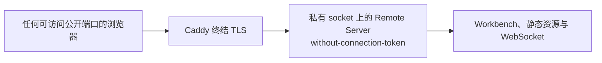

问题在于连接 token 关闭后,实例对网络上的任何人开放;而 VS Code 自带的 token 机制只是 URL 参数,既不是登录,也没有会话生命周期。

目标是让**所有托管 HTTP 与 WebSocket 请求在到达 VS Code 路由前先通过登录**;首个注册者成为唯一管理员,之后公开注册关闭;会话持久、滑动续期、可退出;登录页全屏且自包含,不依赖 Workbench 资源;开发部署与正式发布共用同一套鉴权契约。

## 2. 术语

- **Remote Server**:`server-main.js` 进程,[`remoteExtensionHostAgentServer.ts`][agent-server] 在其中分发 HTTP 与 WebSocket 请求,[`webClientServer.ts`][web-client] 渲染 Workbench 页面与静态资源。
- **Caddy `forward_auth`**:Caddy 在反代每个请求前,先向鉴权端点发一个子请求,只有 2xx 才把原请求送往后端;WebSocket 升级请求同样经过它。
- **Better Auth**:嵌入 Remote Server 进程内的认证库。本设计只在进程内调用它的 `handler`,把它的原始 API 当作内部实现,不对外暴露。
- **单管理员 / `instanceOwner`**:用户表上一个固定值、唯一约束的字段,让并发注册也只能写入一条记录。
- **滑动续期**:会话在被使用且距上次续期超过 `updateAge` 时刷新过期时间,Caddy 把续期产生的 `Set-Cookie` 回传浏览器。

## 3. 登录校验与安全边界

### 3.1 登录校验一页纸:传什么、怎么传、谁校验

**Better Auth 是什么。** [Better Auth](https://better-auth.com) 是一个 MIT 许可的 TypeScript 认证库(本 PR 固定 1.7.2),不是独立服务:它以普通依赖的形式在你的 Node 进程里运行,对外只暴露一个 `handler(Request) → Response`,把 `/sign-up/email`、`/sign-in/username`、`/get-session`、`/sign-out` 这类路由的实现打包好。它自带密码哈希(scrypt)、随机会话 token 与用 secret 签名的 cookie、按 IP 与路由的限速、`Origin` 校验,以及按需装配的插件(本 PR 只用 `username` 插件让用户名登录)。数据通过适配器落库,本 PR 用它内置的 Kysely 适配器接 Node 自带的 `node:sqlite`,表结构由它的迁移脚本创建。选它而不是自研,是为了不自己维护密码哈希、会话与限速这三件最容易做错的事;选它而不是 Keycloak 一类的独立身份服务,是为了不多一个进程、一个端口和一套部署。本设计把它当作进程内实现细节:浏览器永远只和 Remote Server 的 `/auth/*` 页面与 `/auth/verify` 打交道,Better Auth 的原始 API 不对公网暴露。

网络上只传两样东西:密码只在注册和登录时各出现一次,之后一切靠会话 cookie。

| | 是什么 | 什么时候出现在网络上 | 谁校验,拿什么校验 |
|---|---|---|---|
| 用户名 + 密码 | 用户输入的凭据 | 只在注册与登录的 `POST` 表单里各出现一次,HTTPS 内 | Remote Server 内嵌的 Better Auth:注册时做 scrypt 哈希写入 SQLite,明文不落盘;登录时比对哈希 |
| 会话 cookie `__Secure-vibe.session_token` | 值为 `token.签名`。token 是服务端生成的随机串,签名是用 `better-auth.secret` 对 token 做的 HMAC | 登录成功的 303 响应以 `Set-Cookie` 下发;之后浏览器对本站每个 HTTP 请求和 WebSocket 握手自动附带,HTTPS 内 | 同一个 Better Auth:先用 secret 验签,签名不对直接当作无会话;再用 token 查 SQLite `session` 表,存在且未过期才有效 |

每个请求的校验路径只有一条:

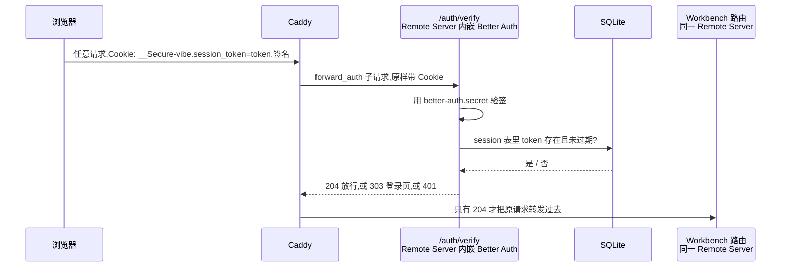

- **谁强制**:Caddy。它是唯一公开入口,除 `/auth/*` 外的每个请求都要先拿到 `/auth/verify` 的 204 才会转发。Workbench 自己的路由不看 cookie,所以 Remote Server 的 Unix socket 必须私有(目录 `0700` 或 `0750`),绕过 Caddy 就等于绕过校验。
- **谁判定**:Remote Server 进程内的 Better Auth。状态只有两份文件:SQLite 数据库和 `better-auth.secret`,都是 `0600`。任一缺失或损坏,服务启动失败,不会退回无鉴权。
- **cookie 为什么偷不走、改不了**:`HttpOnly` 让页面脚本读不到;`Secure` 只在 HTTPS 上发送;`SameSite=Lax` 让别的网站发起的 POST 不带它;改动值会让 HMAC 验签失败;拿到旧值也会在退出或过期后查不到 session。
- **续期**:验证通过且距上次续期超过 `updateAge` 时,verify 顺手发一个新的 `Set-Cookie`,由 Caddy 带回浏览器。超过 TTL 未使用即过期。
- **退出**:删除 SQLite 里那条 session 并下发过期 cookie,同一 cookie 再来就查不到,返回 401。
- **不校验的**:已建立的 WebSocket 帧;其他浏览器里的会话。

### 3.2 安全边界

未登录浏览器只能取得 Remote Server 返回的全屏注册或登录文档,不能取得 Workbench 启动配置、静态资源、管理连接或 Extension Host WebSocket。登录页不是 Workbench 内的遮罩;Caddy 在请求到达正常 VS Code 路由前,对所有非认证 HTTP 请求与 WebSocket 握手执行 `forward_auth`。Remote Server 只监听私有运行目录内的 Unix socket(开发部署目录为 `0700`,systemd 目录为 `0750`,仅专用组可访问),公开网络只暴露 Caddy 的 HTTPS / WSS 入口。

已建立 WebSocket 的帧不会重新触发 `forward_auth`;退出会撤销后续 HTTP 请求与握手的授权,不会主动断开已建立连接。

认证只证明浏览器可以访问这个单用户实例。它不会在共享的 Remote Server 内建立多租户文件、进程或 Terminal 权限边界。

## 4. 责任与 authority

| 角色 | 唯一拥有的状态或不变量 | 依赖 | 明确不拥有 |
| --- | --- | --- | --- |
| Remote Server 内的 Better Auth([`vibeAuthentication.ts`][auth]) | 首个管理员、密码验证、持久会话、滑动续租、可信 Origin 与失败限速 | CLI 提供的 auth state 目录、公开 Origin 和 Node 内置 SQLite | 公开 TLS、Workbench 资源授权策略 |
| Remote Server HTTP adapter([`vibeAuthenticationServer.ts`][auth-server]) | 全屏表单、`/auth/*` contract、请求大小与 `return_to` 边界 | Better Auth | 密码 hash 算法、会话存储实现 |
| Caddy Gateway([`Caddyfile`][caddyfile]) | 每个公开的非认证请求必须先得到 `/auth/verify` 的 2xx;续租 cookie 必须返回浏览器 | Remote Server 私有 socket | 账号、密码与会话生命周期 |
| VS Code Server([`webClientServer.ts`][web-client]) | 已获准连接的 Workbench 与远端能力;从已验证的公开 Origin 投影 `remoteAuthority` | 认证服务提供的固定公开身份 | 浏览器登录状态与登录 UI |
| Workbench 账号入口([`vibeAuthentication.contribution.ts`][auth-contribution]) | 当前页面内的实例账号菜单和退出命令,仅投影已认证的 status | 同源 `/auth/api/status`、`MenuId.AccountsContext` | 凭据、会话撤销、GitHub / Microsoft 等认证提供者账号 |
| Deployment Entry Point([`deploy-18080.sh`][deploy]) | 两进程生命周期、私有 socket、健康门、不可变 release 与回滚 | 环境 state、TLS material、构建产物 | 账号内容与会话 token |

Better Auth 和 VS Code 路由处于同一个 Remote Server 进程,共享同一个私有 Unix socket;Caddy 是唯一另一个常驻进程。认证数据库的打开、迁移和关闭属于 Remote Server 生命周期。部署入口只创建父目录并传入位置,不读取账号或会话内容。

## 5. 方案:六个任务与对应模块

鉴权涉及网关、Remote Server、认证库、部署编排与 Workbench 入口,拆成六个任务。下表是"哪个文件做什么、为什么必须在这一层做"的唯一出处。

| 任务 | 要解决什么 | 模块 | 为什么必须动这一层 |
|---|---|---|---|
| **A. 在 Remote Server 内嵌入认证域** | 账号、密码校验、会话、限速、可信 Origin,以及持久化 | [`vibeAuthentication.ts`][auth]:Better Auth 配置、SQLite 数据库与 secret 的创建和权限、单管理员约束 | 认证状态必须与 Remote Server 同生命周期打开和关闭;放进同一进程后只剩一个私有 socket,不再需要 sidecar |
| **B. 对外 HTTP 契约与全屏页面** | 浏览器看到的只有登录 / 注册 / 退出页和 `/auth/*` 契约 | [`vibeAuthenticationServer.ts`][auth-server]:显式路由、`return_to` 与请求体边界、表单到 Better Auth 的适配、自包含 HTML、CSP 与打包的双语 JSON 文案 | Better Auth 的原始 API 面(`/update-user`、`/list-sessions` 等)不该暴露;显式路由把可达面收敛到第 8 节的契约 |
| **C. 接入 Remote Server 生命周期** | 鉴权路由要在原有"仅 GET、连接 token"检查之前处理;资源随服务器一起释放 | [`remoteExtensionHostAgentServer.ts`][agent-server]:`handleRequest` 先交给鉴权,创建失败时释放,禁止与连接 token 同时启用;[`webClientServer.ts`][web-client]:`remoteAuthority` 从配置的公开 Origin 投影 | 登录表单是 POST,原有分支会以 405 截断;`remoteAuthority` 与 cookie 的 Origin 必须是同一个公开身份 |
| **D. 网关强制授权** | 除鉴权路由外的一切请求先过 `/auth/verify` | [`Caddyfile`][caddyfile]:`@authentication` 直通、其余 `forward_auth`、续期 cookie 回传与 HTTP-only 鉴权子请求 | 只有网关能在请求到达 VS Code 路由前统一拦截 HTTP 与 WebSocket;后端私有 socket 不需要自己判断 |
| **E. 部署编排、健康门与回滚** | 两进程启动、鉴权状态目录、健康检查、不可变 release 与回滚 | [`deploy-18080.sh`][deploy] 及其[测试][deploy-tests]、[`SKILL.md`][skill-doc] | 状态目录权限、socket 归属、"未登录根路径必须 303"等门禁只能在部署入口验证 |
| **F. Workbench 账号与退出入口** | 登录后可在 Accounts 菜单或命令面板进入退出确认页 | [`vibeAuthentication.contribution.ts`][auth-contribution]:`AfterRestored` 读取 status,贡献 `MenuId.AccountsContext` 子菜单和独立 `Action2` | 使用既有菜单贡献点,不改 `globalCompositeBar.ts`,不让 Workbench 服务端读取用户名,不接管内置账号退出 |

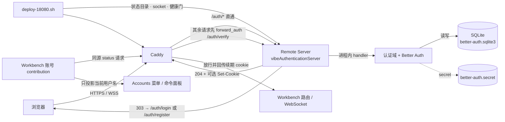

网关、认证域、Remote Server 与部署层维持原有授权边界;F 只依赖 status 契约,把已登录账号投影到 Workbench 的现有菜单贡献点。

## 6. 全流程时序

本节分多个角度。6.1 是用户操作流程,只看用户在浏览器里做了什么、看到了什么,Caddy 与 Remote Server 合并为"服务"。6.2 是内部运行流程,把服务拆成 Caddy、Remote Server 请求分发、鉴权 adapter、Better Auth、SQLite、Workbench 服务端,图中的箭头直接标注函数名与传递的头。两个视角都按首次注册、后续登录、退出三个场景组织;部署启动只出现在内部视角,作为三个场景的前置。6.3 把 `/auth/verify` 的出口按条件画成决策树,6.4 用状态图看实例与会话的组合;每一步的失败出口见第 9 节。

### 6.1 用户操作流程

三个场景放在一张图里,只看用户做了什么、看到了什么;Caddy 与 Remote Server 合并为"服务"。

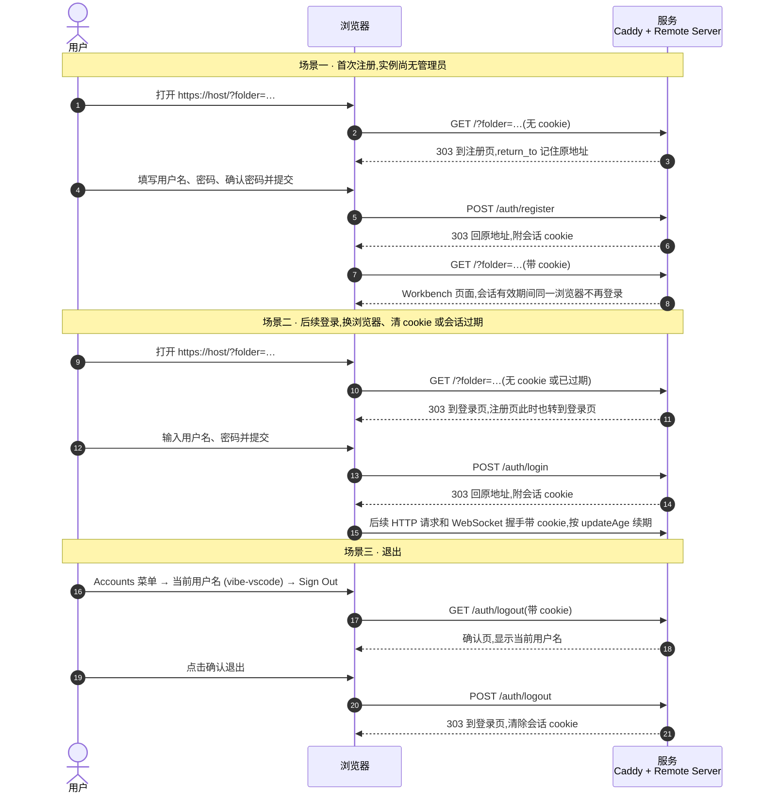

用户可见的失败与边界:两次密码不一致、用户名不合法、用户名或密码错误时留在当前页并提示;两人同时注册只有一个成功,另一个转到登录页;提交过快提示稍后再试;从别的站点提交表单提示来源不被信任;已登录再打开登录页直接回到 `return_to`。退出只删除当前浏览器的实例会话,其他设备的登录和 GitHub / Microsoft 等提供者账号互不影响;命令面板的 `vibe-vscode: Sign Out` 复用同一入口。

### 6.2 内部运行流程

#### 前置:部署启动与健康门

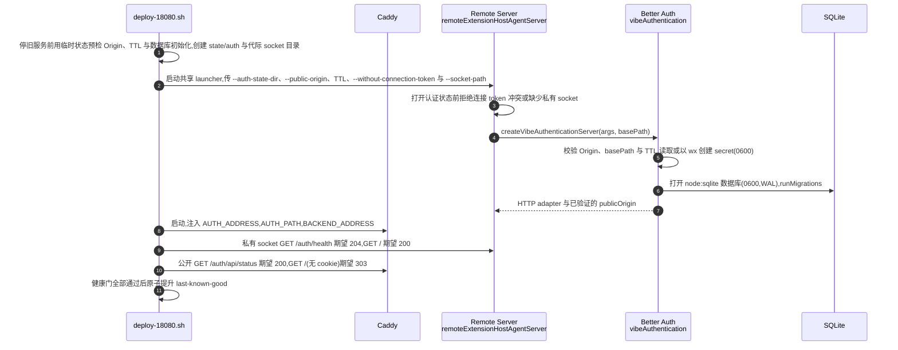

#### 场景一:首次注册

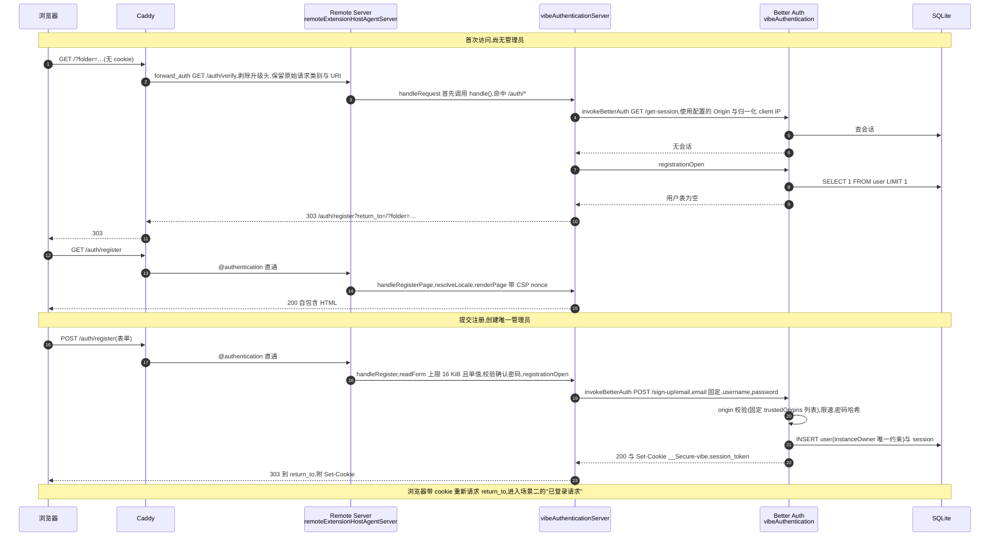

#### 场景二:后续登录

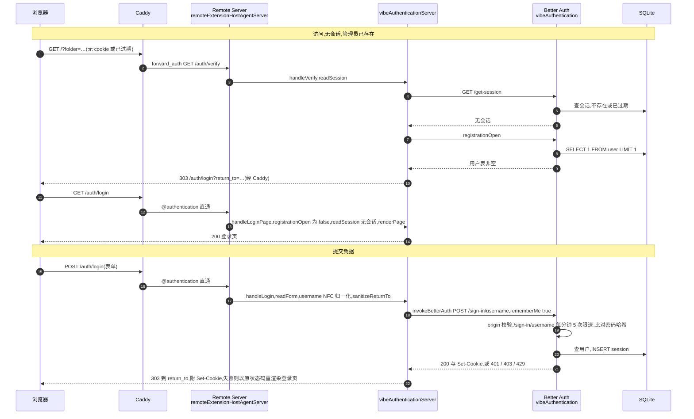

登录成功后浏览器带 cookie 重新请求 `return_to`,进入下面的"已登录请求与续期"。每个非认证 HTTP 请求、静态资源、manifest 分块与 WebSocket 握手都走一遍这张图;已建立连接的帧不重新验证。

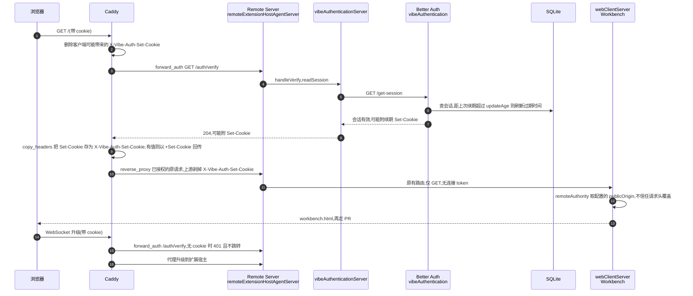

#### 场景三:退出

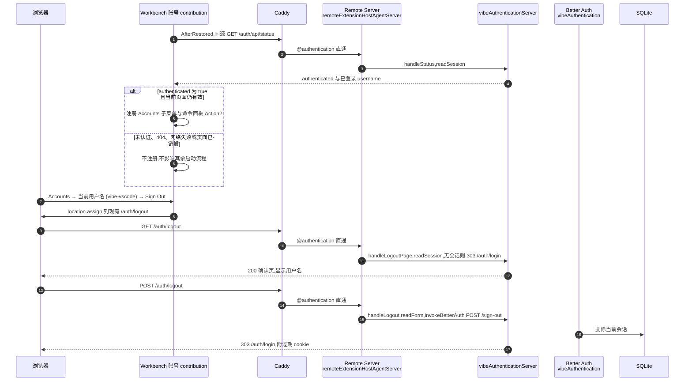

### 6.3 授权决策

时序图按时间展开,这张图按条件展开:`/auth/verify` 对一个请求只有四种出口,登录页与注册页的入口守卫与之对称。

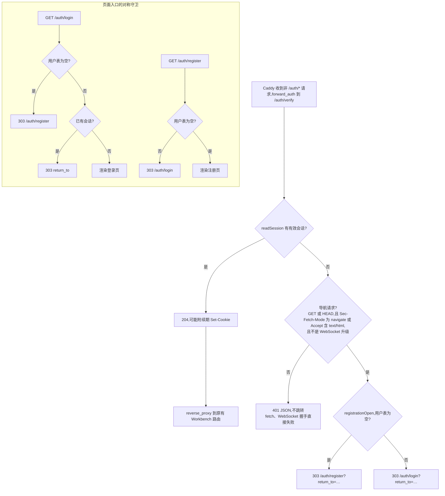

`return_to` 在每个出口都经 `sanitizeReturnTo` 收敛到 base path 内且不指向 `/auth/*`;WebSocket 的判定依赖 Caddy 转发的 `X-Forwarded-Upgrade`,因为 `forward_auth` 子请求本身已剥掉升级头。

### 6.4 实例与会话状态

再换一个角度:实例只有"未注册 / 已注册"两个状态且单向,浏览器会话在"无 / 有效"之间往返。两者的组合决定了 6.3 的每个出口。

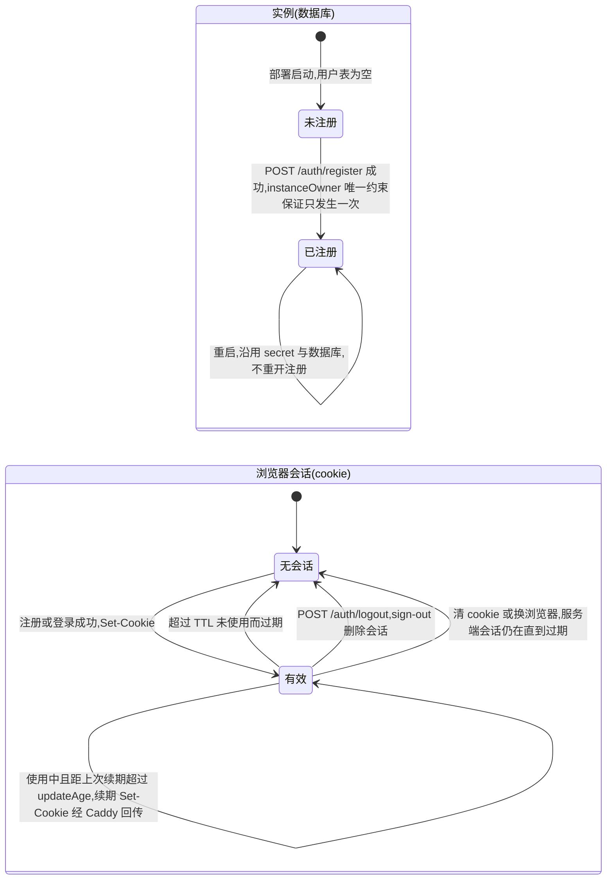

| 实例 | 会话 | 导航请求 | 非导航与 WebSocket |
|---|---|---|---|
| 未注册 | 无 | 303 注册页 | 401 |
| 已注册 | 无 | 303 登录页 | 401 |
| 已注册 | 有效 | 204,放行 | 204,放行 |
| 未注册 | 有效 | 不可能出现,会话只能在注册后建立 | 同左 |

## 7. 各任务的关键实现与取舍

### A. 认证域(`vibeAuthentication.ts`)

- **持久化**:`<state>/auth/better-auth.sqlite3` 与 `better-auth.secret`,目录 `0700`,文件 `0600`;secret 为 32 字节 base64url,以 `wx` 独占创建,存在则读取并校验格式,格式不对直接启动失败,不重建、不清空。数据库开启 WAL、外键、5 秒 busy timeout;启动时跑 Better Auth 迁移。
- **单管理员**:用户表附加字段 `instanceOwner`,固定值、`input: false`、唯一约束。任何注册都写同一个值,数据库层面保证只有一条能提交;`registrationOpen` 就是"用户表是否为空"。
- **会话**:`expiresIn` 默认 12 小时(可配 60 秒到 7 天),`updateAge` 取 5 分钟与半个 TTL 的较小值;cookie 前缀 `vibe`,`Secure` / `HttpOnly` / `SameSite=Lax`,`Path` 限定到 server base path。
- **限速**:存 SQLite,默认 100 次每分钟;`/sign-in/username`、`/sign-up/email` 各 5 次每分钟;`/get-session` 免限速,因为 Caddy 对每个 Workbench 资源都会调它。
- **续租 cookie**:显式关闭 `session.cookieCache`,成功的 `/auth/verify` 最多发一个 `session_token` cookie;拒绝时允许多个清除 cookie。HTTP 请求与握手触发续租,单靠已建立 WebSocket 的帧不会续租。
- **可信 Origin**:运维通过 `--public-origin` 指定唯一的浏览器可见 HTTPS Origin。`create` 在打开持久状态前验证并规范化它,Better Auth 的 `baseURL`、`trustedOrigins`、HTTP adapter 的 Request URL 与 Workbench 公开身份共用该值,不从请求头决定可信来源。
- **basePath**:`create` 同时验证并规范化 base path,根路径 `/` 转为空前缀,HTTP adapter 直接使用服务的 `basePath`,不维护第二份校验或独立配置。
- **取舍**:嵌入进程而不是 sidecar,是为了一个进程、一个 socket、一次生命周期;用 Better Auth 而不是自研,是为了不自己维护密码哈希、会话与限速。使用 Node 内置 `node:sqlite` 的 `DatabaseSync`,不新增原生 SQLite 构建依赖;数据库文件与 secret 格式保持不变。

### B. HTTP 契约与页面(`vibeAuthenticationServer.ts`)

- 仅开放第 8 节的显式认证路由;其余认证子路径一律 405。
- `/auth/verify` 是 Caddy 契约:有会话 204;无会话且是页面导航(`Sec-Fetch-Mode: navigate` 或 `Accept: text/html`,非 WebSocket)303 到注册或登录页并带 `return_to`;其余 401。
- `return_to` 只接受当前 base path 内的绝对路径,拒绝 `//`、跨 base path、鉴权路由自身和超长值;表单只接受单值字段,请求体上限 16 KiB,超限先排空再 413。
- 页面是自包含 HTML 与内联样式,CSP `default-src 'none'; style-src 'nonce-…'; form-action 'self'; frame-ancestors 'none'`,无脚本,`X-Frame-Options: DENY`;英文与简中 JSON 文案在模块加载时各读一次并缓存,由 `?lang=` 或 `Accept-Language` 选用;所有插值经 `escapeHtml`。
- 到 Better Auth 的适配:用 `fromNodeHeaders` 转换请求头,按固定 Origin 设置 URL 与构造时缓存的 `host`,按 Caddy 归一化后的 `X-Forwarded-For` 首值设置 `x-vibe-client-ip`,按路由构造 JSON 请求;`Set-Cookie` 与 `Retry-After` 原样回传。
- 三个表单共用 `describeBetterAuthFailure`:429 优先映射限速,403 映射来源错误,其余按 Origin / username / password 错误码表选择文案,最后使用调用方默认提示,不透传 Better Auth 原文。已关闭注册不再调用 Better Auth,并发注册失败与预先关闭共用一次 409 渲染。

### C. Remote Server 接入

- `handleRequest` 第一步交给鉴权服务器,命中 `/auth*` 即返回;因此登录 POST 不会被原有"仅 GET"分支以 405 截断。
- `--auth-state-dir` 是唯一启用入口,须同时提供 `--public-origin`、`--socket-path` 和 `--without-connection-token`;冲突在打开认证数据库前拒绝,后续构造失败会释放认证服务。
- `webClientServer.ts` 从已验证的公开 Origin 取 `remoteAuthority`,不允许 Host、转发 Host 或转发端口覆盖;未开启此认证的上游 token server 保持原来的 proxy host 回退契约。

### D. Caddy

- `@authentication` 匹配 `/auth` 与 `/auth/*`,直接反代到 Remote Server socket。
- 其余请求进入 `route`:先删除客户端可能带来的 `X-Vibe-Auth-Set-Cookie`,`forward_auth` 到 `/auth/verify` 并把其 `Set-Cookie` 复制成该头,有值时以 `+Set-Cookie` 回传浏览器,再反代并在上游剥掉该头。
- 鉴权路由与子请求只允许 HTTP;升级头剥除与原请求放行顺序见第 6.2 节的已登录请求时序。公开身份来自配置,不依赖原始代理头。

### E. 部署脚本

- 新 runtime 只有 Caddy 与内嵌 Better Auth 的 Remote Server 两进程,没有 sidecar 或额外 auth socket。`vibe-release.json` 的 `authentication: "embedded-cli-v1"` 声明共享 CLI 契约,不靠空的编译标记模块。
- 每次启动按代际命名 socket(`backend-<pid>-<n>.sock`),通过 tmux 环境传递。`tmux kill-session` 删除会话早于旧 shell 的 HUP / EXIT trap 完成,因此 `has-session` 失败不能作为清理完成屏障;独立 tmux 的受控阻塞测试可复现旧 trap 删除新同名路径,代际路径使清理只影响自己的 socket。鉴权状态目录 `0700`,进程 `umask 0077`。
- TTL 范围由认证服务唯一校验,CLI 只做 `Number()` 解析;候选预检在临时状态调用该服务,不重复维护 shell 范围规则。指针替换、promotion / cleanup 和依赖复制沿用 main,本 PR 不夹带这些无关重构;健康失败仍按既有事务恢复旧服务。

### F. Workbench 账号入口

- 仅 Web Workbench 导入此 contribution,在 `AfterRestored` 发一次同源、`no-store` 的 status 请求,不把用户名注入 `workbench.html`,也不保存会话副本。注册门槛是 `authenticated === true` 且有非空用户名。
- `MenuId.AccountsContext` 的既有 `otherCommands` 路径显示 `<username> (vibe-vscode)` 子菜单;`Action2` 同时提供子菜单内的 `Sign Out` 和命令面板的 `vibe-vscode: Sign Out`。它只导航到已有确认页,不发退出 POST,不调用 `_signOutOfAccount` 或认证提供者服务。
- 页面销毁会中止请求并撤销菜单与命令;异步响应返回后再次检查生命周期。404、未认证、无效响应与网络失败均安静退出,不阻断其他 Web 启动方式。
- 英文文案通过 `localize` / `localize2` 登记到标准 Workbench NLS。上游语言包尚无此下游 contribution 的键,因此附带简中 `vibeAuthentication.nls.zh-cn.json` 默认文案;仅简中且缺少语言包译文时读取这份随 Web 构建打包的资源,失败保留英文入口。命令始终保留英文搜索别名,翻译请求同样受页面生命周期约束。

## 8. HTTP contract

下列路径都加上可选的 server base path:

| 路径 | 方法 | 行为 |
| --- | --- | --- |
| `/auth` 或 `/auth/` | GET / HEAD | 登录页面别名 |
| `/auth/register` | GET / HEAD / POST | 首次注册页面与唯一管理员创建 |
| `/auth/login` | GET / HEAD / POST | 登录页面与 Better Auth 凭据验证 |
| `/auth/logout` | GET / HEAD / POST | 退出确认与当前会话撤销 |
| `/auth/api/status` | GET | 返回 `authenticated`、`registrationOpen` 和已登录用户名 |
| `/auth/verify` | GET / HEAD | Caddy `forward_auth` contract;已登录返回 204,页面导航返回 303,非导航与 WebSocket 返回 401 |
| `/auth/health` | GET | Remote Server 内部认证状态检查,返回 204 |

Caddy 将认证路由直接转发到同一个 Remote Server socket;其他路径必须先通过 `/auth/verify`。Remote Server 在认证路由处理之后才进入原有的仅 GET、连接 token 和 Workbench 路由,所以登录表单 POST 不会被原有 405 分支截断。启用嵌入式认证时必须同时使用 `--without-connection-token`,因为私有 socket 和强制 Caddy 边界已经成为唯一入口;配置冲突会使启动失败。

## 9. 请求授权与失败处理

| 情况 | 行为 | 用户看到 / 恢复方式 |
|---|---|---|
| 首次访问,尚无管理员 | `/auth/verify` 对导航返回 303 到 `/auth/register` | 全屏注册页;创建后 303 回原地址 |
| 已有管理员,浏览器无会话 | 导航 303 到 `/auth/login`;非导航与 WebSocket 401 | 登录页;登录后 303 回 `return_to` |
| 并发首次注册 | 唯一约束只允许一条提交 | 一个 303,其余 409 并提示改用登录 |
| 用户名或密码错误 | Better Auth 返回错误,页面重渲染 | 401 与本地化提示;连续 5 次后 429 |
| 跨站表单或 Origin 不匹配 | Better Auth origin 校验拒绝 | 403,提示从同一地址重新打开 |
| 请求体超过 16 KiB | 排空后拒绝 | 413 |
| 会话使用超过 `updateAge` | `/auth/verify` 续期并经 Caddy 回传 `Set-Cookie` | 请求会刷新会话;持久化账号和有效会话不因重启丢失 |
| 退出 | `/sign-out` 撤销当前会话 | 303 到登录页;其他浏览器会话不受影响 |
| secret 或数据库损坏 | 启动失败 | 服务端报错,不清空状态、不重开注册 |
| 同时配置连接 token | 构造阶段抛错 | 服务端报错,要求 `--without-connection-token` |
| 共享 launcher 缺少 `--auth-state-dir` | 拒绝启动;其余鉴权配置由 Remote Server 验证 | 按安装文档配置持久状态与公开 Origin |

本次从原生 SQLite 依赖切换为 Node 内置 SQLite,沿用既有 `better-auth.sqlite3` 与 `better-auth.secret`,不重建账号或清空会话。

## 10. 部署、健康与回滚

新不可变 release 同时包含声明 `embedded-cli-v1` 的 metadata、Caddyfile、Node runtime、Better Auth 依赖、登录 JSON 文案和 VS Code 构建输出。可变认证状态位于 release 与 checkout 之外,运行时只启动 Remote Server 与 Caddy。部署健康门要求:

- Remote Server 私有 socket 的 `/auth/health` 返回 204;
- 公开 `/auth/api/status` 返回 200;
- 无 cookie 的 Workbench 根路径返回 303,而不是 Workbench HTML;
- 同一个私有 socket 的 Workbench 路由返回 200;
- Caddy 监听公开的 `0.0.0.0:18080`。

新候选和选定快照必须声明共享 CLI 契约。唯一兼容桥是恢复已验证健康、但尚未采用 CLI 的旧 embedded release 时传入它原来的环境参数;它不能成为新选定快照,也不会启动 sidecar。切换前的候选验证失败不停止旧服务,切换后的启动或健康失败恢复原健康版本。

保留该桥的原因是当前开发服务确实还在使用旧环境契约,不是兼容已发布 tag。旧 release 同样包含 `vibeAuthenticationServer.js`,仅检查文件存在无法证明支持 CLI,可能把未知参数被忽略的旧版本误当成新候选。首次成功切到共享 CLI 后才可移除这条迁移桥;不再提供额外的 `compatibility` 快照构建模式。

`VIBE_VSCODE_PUBLIC_ORIGIN` 必须从运维配置或用户确认得到,不能用探针的 localhost 地址代替浏览器真实地址。配置缺失时保留现有服务,不启动更新。可伪造代理头的安全边界由下列回归测试验证,不再数 Caddyfile 行数或 grep HTML。

## 11. 验证

| 验证层 | 关键场景 |
| --- | --- |
| [认证域与 HTTP 回归][auth-tests] | 未注册时的导航与 WebSocket 门禁;注册、持久化、续期、退出;并发单管理员与预先关闭注册;`/verify` 免限速;固定 Origin 与伪造请求头、空 state 与 basePath 校验、双语错误映射、两种传输下的流式限长;状态损坏时失败关闭 |
| [Workbench contribution 回归][contribution-tests] | Accounts 子菜单、命令面板与 base path 导航;原菜单保留;英 / 简中文案;404、会话过期、网络失败与销毁后的迟到响应 |
| 隔离 Web Workbench 界面验证 | 已验证 Accounts → 实例账号 → Sign Out → 确认页 → 登录页;GET 确认页不撤销会话,确认 POST 后 status 为未登录;重新登录后测试 provider 账号仍在,退出该 provider 后实例 status 仍为已登录;使用一次性认证扩展、账号与状态,不操作真实 GitHub / Microsoft 会话 |
| [Web Client 服务端回归][web-client-tests] | 固定公开身份不被伪造 Host/端口覆盖,原 token server 回退,以及缓存与启动路径 |
| [部署 transaction 回归][deploy-tests] | latest / snapshot 模式、单写锁、配置校验、真实 CLI 参数传递、健康门调用顺序、代际 socket 分配、构建失败保留旧服务与健康失败回滚 |
| [真实 Caddy 门禁回归][gateway-tests] | 未登录导航 303、资源与握手 401,认证路径无法升级或路径归一化绕过;伪造 Origin 403、登录后 HTTP 200/WS 101、单 cookie 续租、退出撤销与多 cookie 清理 |
| [发布与 launcher 回归][release-tests] | metadata、资源完整性、开发/正式 CLI 参数一致性与 systemd 环境展开 |

[release-doc]: ../../docs/release.md
[skill-doc]: ../../.agents/skills/deploy-vscode-18080/SKILL.md
[auth]: ../../src/vs/server/node/vibeAuthentication.ts
[auth-server]: ../../src/vs/server/node/vibeAuthenticationServer.ts
[auth-contribution]: ../../src/vs/workbench/contrib/vibeAuthentication/browser/vibeAuthentication.contribution.ts
[contribution-tests]: ../../src/vs/workbench/contrib/vibeAuthentication/test/browser/vibeAuthentication.contribution.test.ts
[agent-server]: ../../src/vs/server/node/remoteExtensionHostAgentServer.ts
[web-client]: ../../src/vs/server/node/webClientServer.ts
[caddyfile]: ../../resources/server/vibe-vscode/Caddyfile
[deploy]: ../../.agents/skills/deploy-vscode-18080/scripts/deploy-18080.sh
[deploy-tests]: ../../.agents/skills/deploy-vscode-18080/tests/deploy-18080.test.sh
[auth-tests]: ../../src/vs/server/test/node/vibeAuthentication.test.ts
[web-client-tests]: ../../src/vs/server/test/node/webClientServer.test.ts
[gateway-tests]: ../../.agents/skills/deploy-vscode-18080/tests/authentication-gateway.test.ts
[release-tests]: ../../build/lib/test/webClientRelease.test.ts
