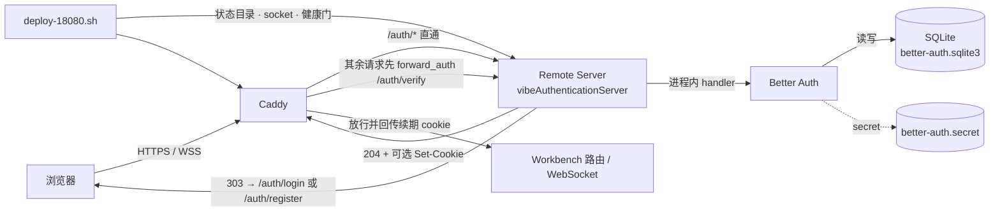
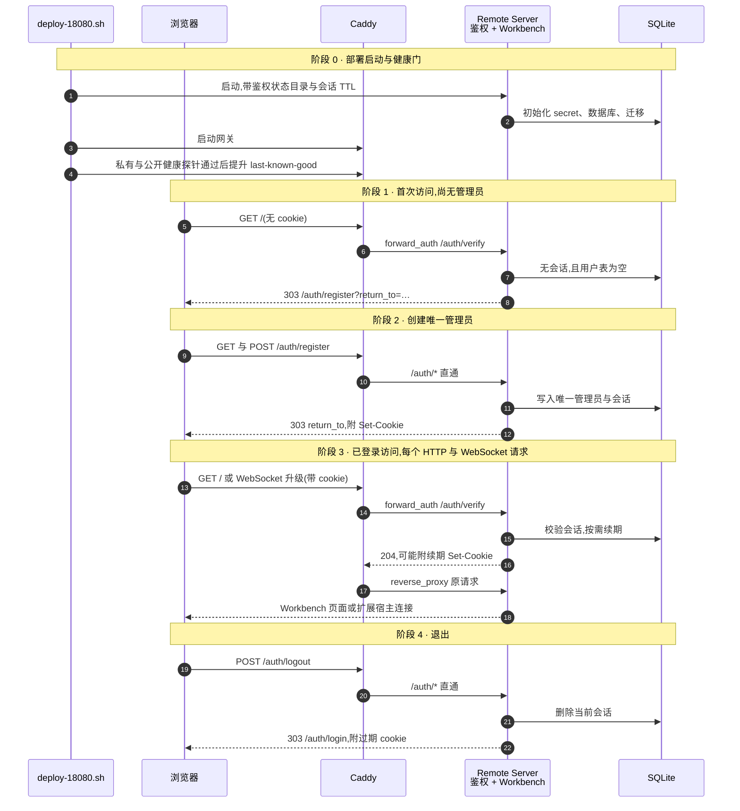
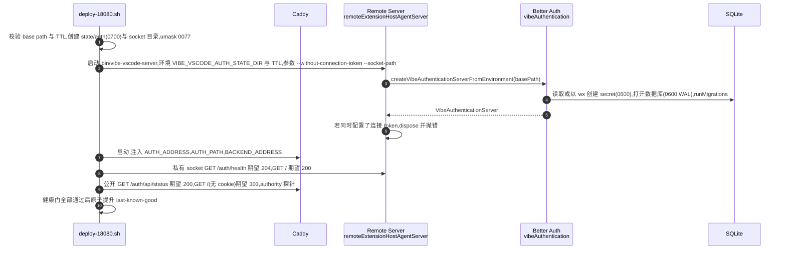
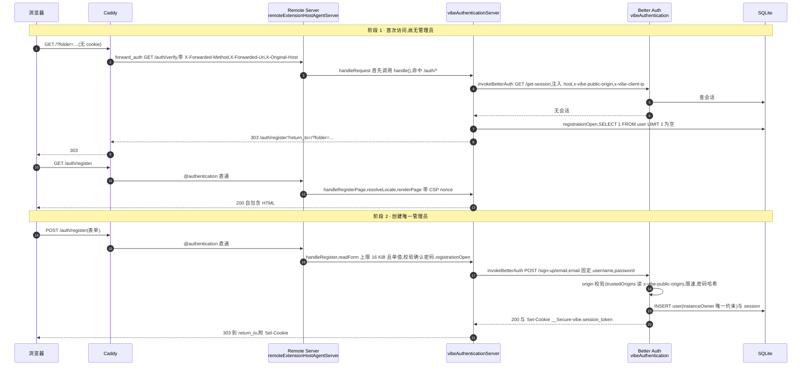
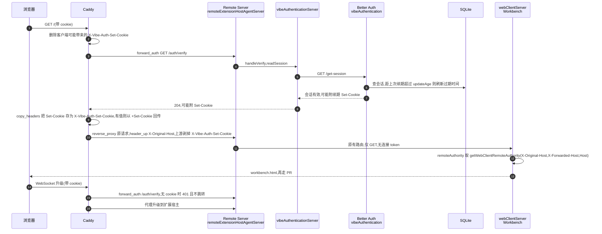
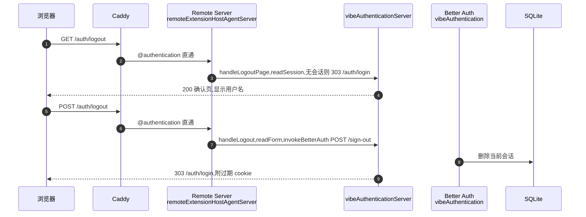

# 全屏登录与实例认证

> - 关联 Issue:[feat: 增加全屏登录与首次注册认证](https://github.com/ActivePeter/vibe-vscode/issues/2)
> - 对应 PR:[feat: require login authentication for hosted VS Code](https://github.com/ActivePeter/vibe-vscode/pull/15)
> - 实现基线:[579ce7186bd](https://github.com/ActivePeter/vibe-vscode/commit/579ce7186bdd97e12544be519b06a8926a2118b5)。本文说明该版本的设计,代码链接固定到该提交。
> - 范围:托管 Web 入口、单实例管理员账号与 18080 开发部署
> - 非目标:多用户公开注册、用户间文件或 Terminal 隔离、第三方 OAuth / OIDC
> - 安装、配置、升级与回滚操作以 [Releases and installation][release-doc] 与 [deploy-vscode-18080 SKILL][skill-doc] 为准;本文不重复维护操作手册。

## 1. 背景与目标

改动前,托管部署的链路是:

```
浏览器请求 https://host:18080/
  → Caddy 终结 TLS,原样反代到 Remote Server 的私有 Unix socket
  → Remote Server 以 --without-connection-token 运行
  → 任何能连到 18080 的浏览器都能拿到 Workbench 启动配置、静态资源和扩展宿主 WebSocket
```

问题在第三、四步:连接 token 关闭后,实例对网络上的任何人开放;而 VS Code 自带的 token 机制只是 URL 参数,既不是登录,也没有会话生命周期。

目标是让**所有托管 HTTP 与 WebSocket 请求在到达 VS Code 路由前先通过登录**;首个注册者成为唯一管理员,之后公开注册关闭;会话持久、滑动续期、可退出;登录页全屏且自包含,不依赖 Workbench 资源;开发部署与正式发布共用同一套鉴权契约。

## 2. 术语

- **Remote Server**:`server-main.js` 进程,[`remoteExtensionHostAgentServer.ts`][agent-server] 在其中分发 HTTP 与 WebSocket 请求,[`webClientServer.ts`][web-client] 渲染 Workbench 页面与静态资源。
- **Caddy `forward_auth`**:Caddy 在反代每个请求前,先向鉴权端点发一个子请求,只有 2xx 才把原请求送往后端;WebSocket 升级请求同样经过它。
- **Better Auth**:嵌入 Remote Server 进程内的认证库。本设计只在进程内调用它的 `handler`,把它的原始 API 当作内部实现,不对外暴露。
- **单管理员 / `instanceOwner`**:用户表上一个固定值、唯一约束的字段,让并发注册也只能写入一条记录。
- **滑动续期**:会话在被使用且距上次续期超过 `updateAge` 时刷新过期时间,Caddy 把续期产生的 `Set-Cookie` 回传浏览器。

## 3. 结果与安全边界

未登录浏览器只能取得 Remote Server 返回的全屏注册或登录文档,不能取得 Workbench 启动配置、静态资源、管理连接或 Extension Host WebSocket。登录页不是 Workbench 内的遮罩;Caddy 在请求到达正常 VS Code 路由前,对所有 HTTP 与 WebSocket 请求执行 `forward_auth`。Remote Server 只监听权限为 `0700` 的运行目录内的 Unix socket,公开网络只暴露 Caddy 的 HTTPS / WSS 入口。

认证只证明浏览器可以访问这个单用户实例。它不会在共享的 Remote Server 内建立多租户文件、进程或 Terminal 权限边界。

## 4. 责任与 authority

| 角色 | 唯一拥有的状态或不变量 | 依赖 | 明确不拥有 |
| --- | --- | --- | --- |
| Remote Server 内的 Better Auth([`vibeAuthentication.ts`][auth]) | 首个管理员、密码验证、持久会话、滑动续租、可信 Origin 与失败限速 | 环境提供的 auth state 目录和 SQLite | 公开 TLS、Workbench 资源授权策略 |
| Remote Server HTTP adapter([`vibeAuthenticationServer.ts`][auth-server]) | 全屏表单、`/auth/*` contract、请求大小与 `return_to` 边界 | Better Auth | 密码 hash 算法、会话存储实现 |
| Caddy Gateway([`Caddyfile`][caddyfile]) | 每个公开的非认证请求必须先得到 `/auth/verify` 的 2xx;续租 cookie 必须返回浏览器 | Remote Server 私有 socket | 账号、密码与会话生命周期 |
| VS Code Server([`webClientServer.ts`][web-client]) | 已获准连接的 Workbench 与远端能力;从保留的公开 Host 投影 `remoteAuthority` | Caddy 传入的请求 | 浏览器登录状态与登录 UI |
| Deployment Entry Point([`deploy-18080.sh`][deploy]) | 两进程生命周期、私有 socket、健康门、不可变 release 与回滚 | 环境 state、TLS material、构建产物 | 账号内容与会话 token |

Better Auth 和 VS Code 路由处于同一个 Remote Server 进程,共享同一个私有 Unix socket;Caddy 是唯一另一个常驻进程。认证数据库的打开、迁移和关闭属于 Remote Server 生命周期。部署入口只创建父目录并传入位置,不读取账号或会话内容。

## 5. 方案:五个任务与对应模块

鉴权横跨网关、Remote Server、认证库和部署编排四层,拆成五个任务。下表是"哪个文件做什么、为什么必须在这一层做"的唯一出处。

| 任务 | 要解决什么 | 模块 | 为什么必须动这一层 |
|---|---|---|---|
| **A. 在 Remote Server 内嵌入认证域** | 账号、密码校验、会话、限速、可信 Origin,以及持久化 | [`vibeAuthentication.ts`][auth]:Better Auth 配置、SQLite 数据库与 secret 的创建和权限、单管理员约束 | 认证状态必须与 Remote Server 同生命周期打开和关闭;放进同一进程后只剩一个私有 socket,不再需要 sidecar |
| **B. 对外 HTTP 契约与全屏页面** | 浏览器看到的只有登录 / 注册 / 退出页和 `/auth/*` 契约 | [`vibeAuthenticationServer.ts`][auth-server]:7 个显式路由、`return_to` 与请求体边界、表单到 Better Auth 的适配、自包含 HTML 与 CSP;[`vibeEmbeddedAuthentication.ts`][marker] re-export 作部署标记 | Better Auth 的原始 API 面(`/update-user`、`/list-sessions` 等)不该暴露;显式路由把可达面收敛到需要的 7 个 |
| **C. 接入 Remote Server 生命周期** | 鉴权路由要在原有"仅 GET、连接 token"检查之前处理;资源随服务器一起释放 | [`remoteExtensionHostAgentServer.ts`][agent-server]:`handleRequest` 先交给鉴权,创建失败时释放,禁止与连接 token 同时启用;[`webClientServer.ts`][web-client]:`remoteAuthority` 从保留的公开 Host 投影 | 登录表单是 POST,原有分支会以 405 截断;`remoteAuthority` 与 cookie 的 Origin 必须是同一个公开身份 |
| **D. 网关强制授权** | 除鉴权路由外的一切请求先过 `/auth/verify` | [`Caddyfile`][caddyfile]:`@authentication` 直通、其余 `forward_auth`、续期 cookie 回传、`X-Original-Host` 保留 | 只有网关能在请求到达 VS Code 路由前统一拦截 HTTP 与 WebSocket;后端私有 socket 不需要自己判断 |
| **E. 部署编排、健康门与回滚** | 两进程启动、鉴权状态目录、健康检查、不可变 release 与回滚 | [`deploy-18080.sh`][deploy] 及其[测试][deploy-tests]、[`SKILL.md`][skill-doc] | 状态目录权限、socket 归属、"未登录根路径必须 303"等门禁只能在部署入口验证 |



读图顺序:D 在网关拦截 → B 决定是放行、跳转还是 401 → A 在进程内完成凭据与会话 → C 保证鉴权先于原有路由并共享公开身份 → E 把这些接进部署与健康门。

## 6. 全流程时序:从部署到退出

本节分两层。6.1 是粗粒度总览,把 Remote Server 内部的鉴权与 Workbench 合并成一个参与方,只看请求在部署脚本、浏览器、Caddy、Remote Server、SQLite 之间怎么流转。6.2 按阶段展开,把 Remote Server 拆成请求分发、鉴权 adapter、Better Auth、Workbench 服务端四个参与方,每张图后列出由哪个文件的哪个函数完成、传递了什么。

### 6.1 粗粒度总览



### 6.2 按阶段展开

#### 阶段 0 · 部署启动与健康门



1. [`deploy-18080.sh`][deploy] 的 `validate_authentication_configuration` 校验 `VIBE_VSCODE_SERVER_BASE_PATH` 与 `VIBE_VSCODE_AUTH_SESSION_TTL_SECONDS`;`run_gateway_stack` 创建 `<state>/auth`(`0700`)与 socket 目录,设置 `umask 0077`,按代际生成 socket 路径。
2. 以 `bin/vibe-vscode-server` 启动 Remote Server,环境里带 `VIBE_VSCODE_AUTH_STATE_DIR` 与 TTL,参数带 `--without-connection-token` 与 `--socket-path`。
3. [`remoteExtensionHostAgentServer.ts`][agent-server] 的 `createServer` 调用 `createVibeAuthenticationServerFromEnvironment(serverBasePath)`。[`vibeAuthentication.ts`][auth] 的 `VibeAuthenticationService.create` 读取或独占创建 secret、打开数据库、跑迁移,再由 [`vibeAuthenticationServer.ts`][auth-server] 包装成 HTTP adapter。若 `connectionToken.type` 不是 `None`,立即 `dispose` 并抛错。
4. 部署脚本启动 Caddy,注入 `VIBE_VSCODE_AUTH_ADDRESS`、`VIBE_VSCODE_AUTH_PATH`、`VIBE_VSCODE_BACKEND_ADDRESS`;[`Caddyfile`][caddyfile] 据此生成 `@authentication` 直通与 `forward_auth` 两条路径。
5. `is_runtime_healthy` 依次探测:私有 socket `/auth/health` 204、私有 Workbench 200、公开 `/auth/api/status` 200、公开根路径无 cookie 303,以及两项 authority 探针。全部通过后 `promote_runtime` 原子切换 `last-known-good`。

#### 阶段 1 与 2 · 首次访问并创建唯一管理员



6. 浏览器请求 Workbench 根路径。Caddy 对非 `/auth/*` 路径先发 `forward_auth` 子请求 `GET /auth/verify`,携带 `X-Forwarded-Method`、`X-Forwarded-Uri`、`X-Original-Host`。
7. Remote Server 的 `handleRequest` 第一步把请求交给 `VibeAuthenticationServer.handle`,路径以 `/auth` 开头即由 `dispatch` 处理,原有的"仅 GET"与连接 token 分支不会介入。
8. `handleVerify` 调 `readSession`,后者经 `invokeBetterAuth` 构造一个指向 `${publicOrigin}${apiPath}/get-session` 的 `Request`,注入 `host`、`x-vibe-public-origin`、`x-vibe-client-ip`,交给 Better Auth 的 `handler`。无会话返回 `{ authenticated: false }`。
9. `isNavigationRequest` 判定这是页面导航(`Sec-Fetch-Mode: navigate` 或 `Accept: text/html`,非 WebSocket),`registrationOpen` 查用户表为空,于是 303 到 `/auth/register`,`return_to` 经 `sanitizeReturnTo` 收敛到 base path 内。
10. 浏览器请求 `/auth/register`,Caddy 的 `@authentication` 直接反代;`handleRegisterPage` 用 `resolveLocale` 选语言,`renderPage` 生成带 CSP nonce 的自包含页面。
11. 表单 POST 到 `/auth/register`。`handleRegister` 用 `readForm` 读取(`application/x-www-form-urlencoded`,上限 16 KiB,超限排空后 413),`getSingleFormValue` 只接受单值,先比对两次密码,再查 `registrationOpen`。
12. `invokeBetterAuth POST /sign-up/email`,email 固定为 `administrator@vibe.invalid`,`name` 与 `username` 取表单值。Better Auth 依 `trustedOrigins` 回调校验 `Origin`,按 `/sign-up/email` 每分钟 5 次限速,哈希密码,插入用户与会话。`instanceOwner` 的唯一约束保证并发注册只有一条能提交。
13. `copyBetterAuthHeaders` 把 `Set-Cookie` 与 `Retry-After` 原样带回,成功则 303 到 `return_to`;失败时 `readBetterAuthError` 取错误码映射为本地化文案,重渲染注册页。

#### 阶段 3 · 已登录访问 Workbench

每个非 `/auth/*` 的 HTTP 请求、静态资源、manifest 分块与 WebSocket 升级都走一遍这张图。



14. 每个非 `/auth/*` 请求(含 WebSocket 升级)都重复第 6 到 8 步。Caddy 先删除客户端可能伪造的 `X-Vibe-Auth-Set-Cookie`。
15. Better Auth 的 `get-session` 在距上次续期超过 `updateAge` 时刷新过期时间并返回新的 `Set-Cookie`;`handleVerify` 返回 204 并附上它。
16. Caddy 的 `forward_auth` 用 `copy_headers Set-Cookie>X-Vibe-Auth-Set-Cookie` 暂存,`@renewedSession` 匹配到时以 `+Set-Cookie` 加到响应,再 `reverse_proxy` 原请求到同一 socket,并在上游剥掉该头。
17. Remote Server 进入原有路由。[`webClientServer.ts`][web-client] 用 `getWebClientRemoteAuthority` 从 `X-Original-Host` → `X-Forwarded-Host` → `Host` 取公开身份写入 `remoteAuthority`,渲染 `workbench.html`;之后走 PR #14 的分块缓存启动,静态资源与 manifest 同样逐个经过 `forward_auth`。
18. WebSocket 升级无 cookie 时 `/auth/verify` 返回 401 而不是 303,浏览器不会被重定向,扩展宿主连接直接失败。

#### 阶段 4 · 退出



19. `GET /auth/logout` 需要有效会话,否则 303 到登录页;有会话时渲染确认页并显示用户名。
20. `POST /auth/logout` 经 `invokeBetterAuth POST /sign-out` 删除当前会话,303 到 `/auth/login` 并附过期 cookie;其他浏览器的会话不受影响。

### 6.3 失败分支

每一步的失败出口见第 9 节的表:manifest 与 secret 损坏在阶段 0 失败关闭;并发注册在阶段 2 由唯一约束裁决;凭据错误、跨源、超限、限速在阶段 2 与登录时以 401 / 403 / 413 / 429 返回并重渲染页面;会话缺失在阶段 3 按导航与否分别 303 与 401。

所有注册请求都为用户写入同一个不可伪造的 `instanceOwner` 值,该字段在数据库中具有唯一约束。因此并发首次注册也只能提交一个管理员;胜出的请求建立账号和会话,其他请求看到注册已关闭。账号一旦存在,`/auth/register` 只会转向登录流程。数据库、secret 或 schema 无法安全读取时启动失败关闭,不会清空状态后重新开放注册。

## 7. 各任务的关键实现与取舍

### A. 认证域(`vibeAuthentication.ts`)

- **持久化**:`<state>/auth/better-auth.sqlite3` 与 `better-auth.secret`,目录 `0700`,文件 `0600`;secret 为 32 字节 base64url,以 `wx` 独占创建,存在则读取并校验格式,格式不对直接启动失败,不重建、不清空。数据库开启 WAL、外键、5 秒 busy timeout;启动时跑 Better Auth 迁移。
- **单管理员**:用户表附加字段 `instanceOwner`,固定值、`input: false`、唯一约束。任何注册都写同一个值,数据库层面保证只有一条能提交;`registrationOpen` 就是"用户表是否为空"。
- **会话**:`expiresIn` 默认 12 小时(可配 60 秒到 7 天),`updateAge` 取 5 分钟与半个 TTL 的较小值;cookie 前缀 `vibe`,`Secure` / `HttpOnly` / `SameSite=Lax`,`Path` 限定到 server base path。
- **限速**:存 SQLite,默认 100 次每分钟;`/sign-in/username`、`/sign-up/email` 各 5 次每分钟;`/get-session` 免限速,因为 Caddy 对每个 Workbench 资源都会调它。
- **可信 Origin**:`trustedOrigins` 回调读服务端注入的 `x-vibe-public-origin` 头;`baseURL` 故意设为 `.invalid`,使 Better Auth 默认信任的 baseURL origin 永远匹配不上浏览器。
- **取舍**:嵌入进程而不是 sidecar,是为了一个进程、一个 socket、一次生命周期;用 Better Auth 而不是自研,是为了不自己维护密码哈希、会话与限速。当前基线用 `better-sqlite3` 作为 SQLite 驱动。

### B. HTTP 契约与页面(`vibeAuthenticationServer.ts`)

- 对外只有 7 个路由(见第 8 节);其余一律 405。
- `/auth/verify` 是 Caddy 契约:有会话 204;无会话且是页面导航(`Sec-Fetch-Mode: navigate` 或 `Accept: text/html`,非 WebSocket)303 到注册或登录页并带 `return_to`;其余 401。
- `return_to` 只接受当前 base path 内的绝对路径,拒绝 `//`、跨 base path、鉴权路由自身和超长值;表单只接受单值字段,请求体上限 16 KiB,超限先排空再 413。
- 页面是自包含 HTML 与内联样式,CSP `default-src 'none'; style-src 'nonce-…'; form-action 'self'; frame-ancestors 'none'`,无脚本,`X-Frame-Options: DENY`;英文与简中由 `?lang=` 或 `Accept-Language` 决定;所有插值经 `escapeHtml`。
- 到 Better Auth 的适配:用 `fromNodeHeaders` 转换请求头,设置 `host`、`x-vibe-public-origin`、`x-vibe-client-ip`(取 `X-Forwarded-For` 首值),按路由构造 JSON 请求;`Set-Cookie` 与 `Retry-After` 原样回传;错误码映射为本地化文案,不透传 Better Auth 原文。
- `/auth/api/origin-check` 用伪造 cookie 调 `/sign-out`,让部署健康门验证代理保留的公开 Origin 能通过 Better Auth 的 origin 校验,不影响真实会话。

### C. Remote Server 接入

- `handleRequest` 第一步交给鉴权服务器,命中 `/auth*` 即返回;因此登录 POST 不会被原有"仅 GET"分支以 405 截断。
- 启用鉴权时必须 `--without-connection-token`,否则构造阶段抛错并释放已打开的数据库;`RemoteExtensionHostAgentServer` 构造失败同样释放。
- `webClientServer.ts` 的 `getWebClientRemoteAuthority`:`X-Original-Host` → `X-Forwarded-Host` → `Host` 三级回退,取逗号前首值。

### D. Caddy

- `@authentication` 匹配 `/auth` 与 `/auth/*`,直接反代到 Remote Server socket。
- 其余请求进入 `route`:先删除客户端可能带来的 `X-Vibe-Auth-Set-Cookie`,`forward_auth` 到 `/auth/verify` 并把其 `Set-Cookie` 复制成该头,有值时以 `+Set-Cookie` 回传浏览器,再反代并在上游剥掉该头。
- 三处 `header_up X-Original-Host {http.request.header.X-Forwarded-Host}` 在 Caddy 归一化转发头之前保留外层代理的浏览器可见 Host,使鉴权与 Workbench 使用同一个公开身份。

### E. 部署脚本

- 运行形态按 release 内容判定:有 `vibeEmbeddedAuthentication.js` 为 embedded,有 `vibeAuthenticationMain.js` 为 legacy sidecar,都没有为无鉴权;只有 embedded 可成为新候选或选定快照。
- 每次启动按代际命名 socket(`backend-<pid>-<n>.sock`),通过 tmux 环境传递,避免新旧代际抢同一路径;鉴权状态目录 `0700`,进程 `umask 0077`。
- `VIBE_VSCODE_SERVER_BASE_PATH` 与 `VIBE_VSCODE_AUTH_SESSION_TTL_SECONDS` 在入口校验;`set_runtime_link` 原子化并处理失败;`promote_runtime` 与 `cleanup_inactive_releases` 拆开,晋升失败回滚、清理失败仅告警。

## 8. HTTP contract

下列路径都加上可选的 server base path:

| 路径 | 方法 | 行为 |
| --- | --- | --- |
| `/auth/register` | GET / POST | 首次注册页面与唯一管理员创建 |
| `/auth/login` | GET / POST | 登录页面与 Better Auth 凭据验证 |
| `/auth/logout` | GET / POST | 退出确认与当前会话撤销 |
| `/auth/api/status` | GET | 返回 `authenticated`、`registrationOpen` 和已登录用户名 |
| `/auth/api/origin-check` | POST | 部署健康门使用 Better Auth 验证代理保留的公开 Origin;不转发 cookie,也不改变会话 |
| `/auth/verify` | GET / HEAD | Caddy `forward_auth` contract;已登录返回 204,页面导航返回 303,非导航与 WebSocket 返回 401 |
| `/auth/health` | GET | Remote Server 内部认证状态检查,返回 204 |

Caddy 将认证路由直接转发到同一个 Remote Server socket;其他路径必须先通过 `/auth/verify`。Remote Server 在认证路由处理之后才进入原有的仅 GET、连接 token 和 Workbench 路由,所以登录表单 POST 不会被原有 405 分支截断。启用嵌入式认证时必须同时使用 `--without-connection-token`,因为私有 socket 和强制 Caddy 边界已经成为唯一入口;配置冲突会使启动失败。

## 9. 请求授权与失败处理

| 情况 | 行为 | 用户看到 / 恢复方式 |
|---|---|---|
| 首次访问,尚无管理员 | `/auth/verify` 对导航返回 303 到 `/auth/register` | 全屏注册页;创建后 303 回原地址 |
| 已有管理员,浏览器无会话 | 导航 303 到 `/auth/login`;非导航与 WebSocket 401 | 登录页;登录后 303 回 `return_to` |
| 并发首次注册 | 唯一约束只允许一条提交 | 一个 303,其余 409 并提示改用登录 |
| 用户名或密码错误 | Better Auth 返回错误,页面重渲染 | 401 与本地化提示;连续 5 次后 429 |
| 跨站表单或 Origin 不匹配 | Better Auth origin 校验拒绝 | 403,提示从同一地址重新打开 |
| 请求体超过 16 KiB | 排空后拒绝 | 413 |
| 会话使用超过 `updateAge` | `/auth/verify` 续期并经 Caddy 回传 `Set-Cookie` | 无感;持续使用不掉线,重启服务器不注销 |
| 退出 | `/sign-out` 撤销当前会话 | 303 到登录页;其他浏览器会话不受影响 |
| secret 或数据库损坏 | 启动失败 | 服务端报错,不清空状态、不重开注册 |
| 同时配置连接 token | 构造阶段抛错 | 服务端报错,要求 `--without-connection-token` |
| 未设置 `VIBE_VSCODE_AUTH_STATE_DIR` | 不启用鉴权 | 沿用原有行为 |

从旧自研认证首次切换到 Better Auth 时,不自动导入 `account.json`,需要创建一次新的管理员账号。旧文件保留不动,仅供首次部署失败时恢复旧 release;新系统建立后以 SQLite 为唯一认证 authority。

## 10. 部署、健康与回滚

新不可变 release 同时包含 embedded-auth marker、Caddyfile、Node runtime、Better Auth 依赖和 VS Code 构建输出。可变认证状态位于 release 与 checkout 之外,运行时只启动 Remote Server 与 Caddy。部署健康门要求:

- Remote Server 私有 socket 的 `/auth/health` 返回 204;
- 公开 `/auth/api/status` 返回 200;
- 无 cookie 的 Workbench 根路径返回 303,而不是 Workbench HTML;
- 同一个私有 socket 的 Workbench 路由返回 200;
- 模拟外层代理改写 Host 时,Better Auth 仍以保留的公开 Host 校验 Origin;
- Workbench 配置把同一个公开 Host 投影为 `remoteAuthority`;
- Caddy 监听公开的 `0.0.0.0:18080`。

第一次启用嵌入式认证时,正在运行的旧 sidecar release 只能作为本次切换失败的已验证回滚锚点,不能成为新的 selected snapshot。新 candidate 健康后才原子提升;后续快照重启和回滚只选择带 embedded-auth marker 的两进程 release。

## 11. 验证

| 验证层 | 关键场景 |
| --- | --- |
| [认证域与 HTTP 回归][auth-tests](7 项) | 未注册时的导航与 WebSocket 门禁;注册、持久化、续期、退出;并发单管理员;`/verify` 免限速;origin 校验、限速与越界请求体;状态损坏时失败关闭 |
| [Web Client 服务端回归][web-client-tests](31 项) | `remoteAuthority` 三级回退,以及 PR #14 引入的缓存与启动路径 |
| [部署 transaction 回归][deploy-tests] | 配置校验、健康门调用顺序、代际 socket 分配、指针替换失败、晋升与清理失败路径 |
| 真实部署 | 未登录导航重定向到登录、登录页 200、私有 Workbench 与后端探针通过 |

## 12. 代码责任地图

| 责任 | 入口 |
| --- | --- |
| Better Auth 配置、SQLite、单管理员约束与会话 | [`vibeAuthentication.ts`][auth] |
| HTTP contract、全屏页面与 Better Auth adapter | [`vibeAuthenticationServer.ts`][auth-server] |
| 嵌入式鉴权的部署标记 | [`vibeEmbeddedAuthentication.ts`][marker] |
| Remote Server 生命周期与认证初始化 | [`remoteExtensionHostAgentServer.ts`][agent-server] |
| 公开路由、`forward_auth` 与续租 cookie 传递 | [`Caddyfile`][caddyfile] |
| 公开 Host 到 Workbench `remoteAuthority` 的投影 | [`webClientServer.ts`][web-client] |
| 构建、两进程编排、不可变 release 与健康门 | [`deploy-18080.sh`][deploy] |
| 认证域与 HTTP 回归 | [`vibeAuthentication.test.ts`][auth-tests] |
| 部署 transaction 回归 | [`deploy-18080.test.sh`][deploy-tests] |

[release-doc]: https://github.com/ActivePeter/vibe-vscode/blob/579ce7186bdd97e12544be519b06a8926a2118b5/docs/release.md
[skill-doc]: https://github.com/ActivePeter/vibe-vscode/blob/579ce7186bdd97e12544be519b06a8926a2118b5/.agents/skills/deploy-vscode-18080/SKILL.md
[auth]: https://github.com/ActivePeter/vibe-vscode/blob/579ce7186bdd97e12544be519b06a8926a2118b5/src/vs/server/node/vibeAuthentication.ts
[auth-server]: https://github.com/ActivePeter/vibe-vscode/blob/579ce7186bdd97e12544be519b06a8926a2118b5/src/vs/server/node/vibeAuthenticationServer.ts
[marker]: https://github.com/ActivePeter/vibe-vscode/blob/579ce7186bdd97e12544be519b06a8926a2118b5/src/vs/server/node/vibeEmbeddedAuthentication.ts
[agent-server]: https://github.com/ActivePeter/vibe-vscode/blob/579ce7186bdd97e12544be519b06a8926a2118b5/src/vs/server/node/remoteExtensionHostAgentServer.ts
[web-client]: https://github.com/ActivePeter/vibe-vscode/blob/579ce7186bdd97e12544be519b06a8926a2118b5/src/vs/server/node/webClientServer.ts
[caddyfile]: https://github.com/ActivePeter/vibe-vscode/blob/579ce7186bdd97e12544be519b06a8926a2118b5/resources/server/vibe-vscode/Caddyfile
[deploy]: https://github.com/ActivePeter/vibe-vscode/blob/579ce7186bdd97e12544be519b06a8926a2118b5/.agents/skills/deploy-vscode-18080/scripts/deploy-18080.sh
[deploy-tests]: https://github.com/ActivePeter/vibe-vscode/blob/579ce7186bdd97e12544be519b06a8926a2118b5/.agents/skills/deploy-vscode-18080/tests/deploy-18080.test.sh
[auth-tests]: https://github.com/ActivePeter/vibe-vscode/blob/579ce7186bdd97e12544be519b06a8926a2118b5/src/vs/server/test/node/vibeAuthentication.test.ts
[web-client-tests]: https://github.com/ActivePeter/vibe-vscode/blob/579ce7186bdd97e12544be519b06a8926a2118b5/src/vs/server/test/node/webClientServer.test.ts
