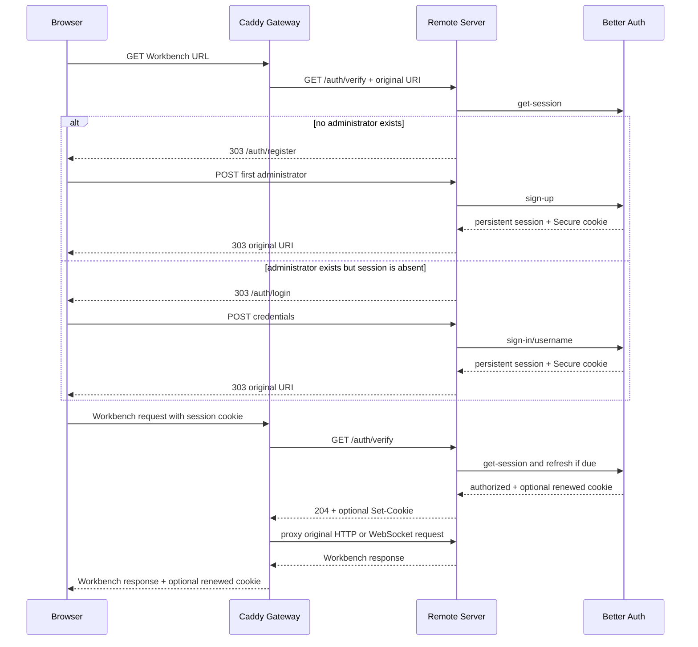

# 全屏登录与实例认证

> - 关联 Issue：[feat: 增加全屏登录与首次注册认证](https://github.com/ActivePeter/vibe-vscode/issues/2)
> - 范围：托管 Web 入口、单实例管理员账号与 18080 开发部署
> - 非目标：多用户公开注册、用户间文件或 Terminal 隔离、第三方 OAuth/OIDC

## 1. 结果与安全边界

未登录浏览器只能取得 Remote Server 返回的全屏注册或登录文档，不能取得 Workbench 启动配置、静态资源、管理连接或 Extension Host WebSocket。登录页不是 Workbench 内的遮罩；Caddy 在请求到达正常 VS Code 路由前，对所有 HTTP 与 WebSocket 请求执行 `forward_auth`。Remote Server 只监听权限为 `0700` 的运行目录内的 Unix socket，公开网络只暴露 Caddy 的 HTTPS/WSS 入口。

认证只证明浏览器可以访问这个单用户实例。它不会在共享的 Remote Server 内建立多租户文件、进程或 Terminal 权限边界。

## 2. 责任与 authority

| 角色 | 唯一拥有的状态或不变量 | 依赖 | 明确不拥有 |
| --- | --- | --- | --- |
| Remote Server 内的 Better Auth | 首个管理员、密码验证、持久会话、滑动续租、可信 Origin 与失败限速 | 环境提供的 auth state 目录和 SQLite | 公开 TLS、Workbench 资源授权策略 |
| Remote Server HTTP adapter | 全屏表单、`/auth/*` contract、请求大小与 `return_to` 边界 | Better Auth | 密码 hash 算法、会话存储实现 |
| Caddy Gateway | 每个公开的非认证请求必须先得到 `/auth/verify` 的 2xx；续租 cookie 必须返回浏览器 | Remote Server 私有 socket | 账号、密码与会话生命周期 |
| VS Code Server | 已获准连接的 Workbench 与远端能力；从保留的公开 Host 投影 `remoteAuthority` | Caddy 传入的请求 | 浏览器登录状态与登录 UI |
| Deployment Entry Point | 两进程生命周期、私有 socket、健康门、不可变 release 与回滚 | 环境 state、TLS material、构建产物 | 账号内容与会话 token |

Better Auth 和 VS Code 路由处于同一个 Remote Server 进程，共享同一个私有 Unix socket；Caddy 是唯一另一个常驻进程。认证数据库的打开、迁移和关闭属于 Remote Server 生命周期。部署入口只创建父目录并传入位置，不读取账号或会话内容。

## 3. 首次访问、注册与登录

所有注册请求都为用户写入同一个不可伪造的 `instanceOwner` 值，该字段在数据库中具有唯一约束。因此并发首次注册也只能提交一个管理员；胜出的请求建立账号和会话，其他请求看到注册已关闭。账号一旦存在，`/auth/register` 只会转向登录流程。数据库、secret 或 schema 无法安全读取时启动失败关闭，不会清空状态后重新开放注册。

## 4. 凭据与会话

- Better Auth 数据库位于 `<service-state>/auth/better-auth.sqlite3`，持久 secret 位于 `<service-state>/auth/better-auth.secret`。目录权限为 `0700`，两个文件为 `0600`；数据库不保存明文密码。
- 会话由 Better Auth 持久化。cookie 使用 `Secure`、`HttpOnly`、`SameSite=Lax` 和 server base path 限定的 `Path`。默认有效期为 12 小时，可通过 `VIBE_VSCODE_AUTH_SESSION_TTL_SECONDS` 配置为 60 秒至 7 天。
- 默认每 5 分钟允许一次滑动续租。访问期间，Caddy 的 `/auth/verify` 会触发 Better Auth 的会话检查，并把续租产生的 `Set-Cookie` 送回浏览器。因此持续使用会延长会话，Remote Server 重启也不会主动注销有效会话。
- 退出会撤销当前浏览器的会话；其他浏览器会话保持独立。
- 注册、登录和退出由 Better Auth 校验浏览器可见 Origin，并依赖安全 cookie 策略抵御跨站请求；不存在自定义 CSRF token、可配置的“表单有效时间”或要求重新部署的过期提示。
- Better Auth 的登录和注册失败限速持久化在 SQLite 中。HTTP adapter 另将表单请求体限制为 16 KiB，并只接受单值字段。
- 登录文档是自包含 HTML/CSS，不请求 Workbench asset；CSP 禁止脚本、frame、外部资源与跨源表单。英文和简体中文由 URL 语言选择或 `Accept-Language` 决定。
- `return_to` 只接受当前 server base path 内的绝对路径，拒绝 scheme-relative、跨 base path、认证路由和超长值。密码、会话 token 与凭据不进入 URL 或应用日志。

从旧自研认证首次切换到 Better Auth 时，不自动导入 `account.json`，需要创建一次新的管理员账号。旧文件保留不动，仅供首次部署失败时恢复旧 release；新系统建立后以 SQLite 为唯一认证 authority。

## 5. HTTP contract

下列路径都加上可选的 server base path：

| 路径 | 方法 | 行为 |
| --- | --- | --- |
| `/auth/register` | GET / POST | 首次注册页面与唯一管理员创建 |
| `/auth/login` | GET / POST | 登录页面与 Better Auth 凭据验证 |
| `/auth/logout` | GET / POST | 退出确认与当前会话撤销 |
| `/auth/api/status` | GET | 返回 `authenticated`、`registrationOpen` 和已登录用户名 |
| `/auth/api/origin-check` | POST | 部署健康门使用 Better Auth 验证代理保留的公开 Origin；不转发 cookie，也不改变会话 |
| `/auth/verify` | GET / HEAD | Caddy `forward_auth` contract；已登录返回 204，页面导航返回 303，非导航与 WebSocket 返回 401 |
| `/auth/health` | GET | Remote Server 内部认证状态检查，返回 204 |

Caddy 将认证路由直接转发到同一个 Remote Server socket；其他路径必须先通过 `/auth/verify`。Remote Server 在认证路由处理之后才进入原有的仅 GET、连接 token 和 Workbench 路由，所以登录表单 POST 不会被原有 405 分支截断。启用嵌入式认证时必须同时使用 `--without-connection-token`，因为私有 socket 和强制 Caddy 边界已经成为唯一入口；配置冲突会使启动失败。

## 6. 部署、健康与回滚

新不可变 release 同时包含 embedded-auth marker、Caddyfile、Node runtime、Better Auth 依赖和 VS Code 构建输出。可变认证状态位于 release 与 checkout 之外，运行时只启动 Remote Server 与 Caddy。部署健康门要求：

- Remote Server 私有 socket 的 `/auth/health` 返回 204；
- 公开 `/auth/api/status` 返回 200；
- 无 cookie 的 Workbench 根路径返回 303，而不是 Workbench HTML；
- 同一个私有 socket 的 Workbench 路由返回 200；
- 模拟外层代理改写 Host 时，Better Auth 仍以保留的公开 Host 校验 Origin；
- Workbench 配置把同一个公开 Host 投影为 `remoteAuthority`；
- Caddy 监听公开的 `0.0.0.0:18080`。

第一次启用嵌入式认证时，正在运行的旧 sidecar release 只能作为本次切换失败的已验证回滚锚点，不能成为新的 selected snapshot。新 candidate 健康后才原子提升；后续快照重启和回滚只选择带 embedded-auth marker 的两进程 release。

## 7. 代码责任地图

| 责任 | 入口 |
| --- | --- |
| Better Auth 配置、SQLite、单管理员约束与会话 | [`vibeAuthentication.ts`](../../src/vs/server/node/vibeAuthentication.ts) |
| HTTP contract、全屏页面与 Better Auth adapter | [`vibeAuthenticationServer.ts`](../../src/vs/server/node/vibeAuthenticationServer.ts) |
| Remote Server 生命周期与认证初始化 | [`remoteExtensionHostAgentServer.ts`](../../src/vs/server/node/remoteExtensionHostAgentServer.ts) |
| 公开路由、`forward_auth` 与续租 cookie 传递 | [`Caddyfile`](../../resources/server/vibe-vscode/Caddyfile) |
| 公开 Host 到 Workbench `remoteAuthority` 的投影 | [`webClientServer.ts`](../../src/vs/server/node/webClientServer.ts) |
| 构建、两进程编排、不可变 release 与健康门 | [`deploy-18080.sh`](../../.agents/skills/deploy-vscode-18080/scripts/deploy-18080.sh) |
| 认证域与 HTTP 回归 | [`vibeAuthentication.test.ts`](../../src/vs/server/test/node/vibeAuthentication.test.ts) |
| 部署 transaction 回归 | [`deploy-18080.test.sh`](../../.agents/skills/deploy-vscode-18080/tests/deploy-18080.test.sh) |
