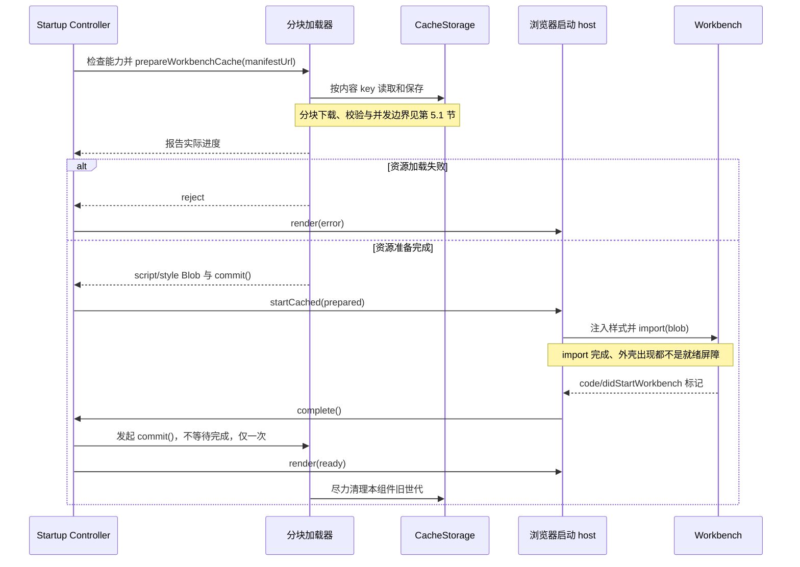

<!-- Copyright (c) Microsoft Corporation. All rights reserved. -->

# PR #14：Web 启动资源缓存与断点续传

> 对应 PR：[perf: cache and resume web startup resources](https://github.com/ActivePeter/vibe-vscode/pull/14)。
>
> 实现基线：[baa1e4674db](https://github.com/ActivePeter/vibe-vscode/commit/baa1e4674db4d4384217cbc9015e815a1e638eaf)，包含截至该提交的 review 修复。本文说明该版本的设计，代码链接固定到该提交，不要求阅读者所在分支已经合并此 PR。
>
> 安装、配置、升级与回滚操作以 [Releases and installation][release-doc] 为准；本文不重复维护部署操作手册。

## 1. 目标与范围

本 PR 把 Web workbench 的核心 JS/CSS 从浏览器自行加载的模块图，变成构建期生成、按内容寻址、可独立校验的分块资源。浏览器显式保存已验证的块，刷新或中断后只补齐缺失、损坏的部分，并显示实际下载与复用进度。

这里的 workbench 是编辑器窗口的应用外壳，包括编辑器区、侧边栏、面板和相关服务；构建入口是 `vs/code/browser/workbench/workbench.js`，样式入口是同目录的 `workbench.css`。缓存覆盖这两个入口产出的核心前端资源，不覆盖服务端程序、独立加载的 worker/扩展、用户文件、数据库或会话状态。

这不是离线 IDE，也不是浏览器全部请求的缓存层。HTML、清单、启动模块和其他非核心资源仍可能请求服务器；远程工作区仍依赖网络连接。浏览器也可能驱逐 CacheStorage，不能承诺永久保存或所有发布都零下载。

## 2. 职责与权威边界

| 角色 | 拥有的状态或资源 | 对外契约与不负责的内容 |
| --- | --- | --- |
| [构建准备器][build-cache] | staging 中生成的核心 bundle、分块、清单与 loader | 接收构建输出目录，产出可验证资源；不修改源模块，不在请求时重新打包 |
| [WebClientServer][server] | 启动模式、模板渲染、资源 URL 与 HTTP 表示选择 | 接收环境服务和请求上下文，返回启动页面与静态资源；不管理浏览器缓存，不以 `isBuilt` 决定分块是否启用 |
| [WebClientStartupMessages][server] | 单个服务器资源根的已发布 locale 集合及文案 Promise 缓存 | 接收 locale，返回启动文案；不缓存某次请求的 manifest URL、代理前缀或其他配置 |
| [分块加载器][loader] | 核心资源的 CacheStorage 读写、校验、下载 worker 与世代清理 | 接收 manifest URL，报告进度，返回 `script` / `style` Blob 和 `commit()`；是这一缓存命名空间的唯一读写与清理实现，不启动 workbench |
| [WorkbenchStartupController][controller] | 启动状态、计时器、当前 prepared 资源的持有权 | 通过注入的 host 加载和启动，向视图投影状态；不直接操作 CacheStorage 或浏览器 DOM |
| [浏览器启动 host][startup] | 浏览器监听器、observer、页面生命周期、样式注入和临时 Blob URL | 将真实浏览器能力接入控制器，观察 workbench 的就绪标记；不自行推断缓存命中 |
| [WorkbenchStartupView][view] | 启动遮罩的 DOM、无障碍属性和按钮监听 | 接收状态与文案，展示进度和手动重载入口；不下载、持久化或裁决启动成功 |
| [WorkbenchStartupMetrics][controller] | 最近的传输采样窗口 | 接收累计传输字节和时间，计算速率；不保存缓存状态或推进启动阶段 |

共享的 [缓存协议][manifest-contract] 与 [启动配置协议][startup-contract] 位于 `platform/remote/common`，不引入环境相关运行时依赖。它们定义跨构建、服务器与浏览器的契约，不成为第二个运行时状态所有者。

## 3. 构建产物与身份

### 3.1 产物生成

esbuild 将核心 JS 打成单一 ESM，并单独打包显式的 CSS 入口。字体、图片等静态依赖内联为 `data:`；构建检查输出不能残留外部静态依赖。动态加载的资源不因此全部进入核心缓存。

JS 与 CSS 都按固定 **256 KiB 原始字节**切块，每块独立 gzip（level 9），以压缩后字节的 SHA-256 命名。输出位于 `out/vs/code/browser/workbench/cache/`：

- `manifest.json`：有序的 JS/CSS 分块描述。
- `<chunk-hash>.bin`：gzip 压缩后的块内容。
- `loader.js`：独立打包的浏览器加载器。

从 Blob 执行时，`import.meta.url` 不再是可用于定位相邻文件的层级 URL。构建准备器将这类引用替换为基于 `_VSCODE_FILE_ROOT` 和原始模块相对位置的 URL，保留 worker/iframe 等资源的定位语义，不写入构建机路径、主机或端口。

生产构建已经提供 `workbench.css` 与独立启动入口；源码 staging 则先从复制的输出中补齐它们。后续缓存构建始终读取同一个显式 CSS 入口，忽略 JS 的 CSS import，避免生产样式被遗漏或由另一份样式竞争。Gulp Web/REH-Web、`build/next` 和源码 staging 复用同一套准备逻辑。两条准备路径共用私有的 `createEsbuildOptions(root)`，仅在调用点覆盖 `metafile`、`sourcemap`、`allowOverwrite` 等差异项，打包行为保持不变。

[预压缩器][precompress] 另为可压缩静态文件生成 `.br` / `.gz` HTTP 表示，通过临时文件与 rename 替换；压缩无收益时删除旧旁挂。它与 `.bin` 内部的 gzip 分块协议是两件事：前者由 HTTP 编码协商使用，后者由加载器显式解压，不能混用响应头或存储表示。

### 3.2 三种身份不能混用

| 身份 | 生成方式 | 用途 |
| --- | --- | --- |
| 发布版本 | 运行时元数据中的 `version`，经 `--web-client-cache-version` 传入 | 服务器使用 `sha256(version)` 构造 `/static/<version-hash>` 路由，隔离不可变发布资源 |
| 缓存世代 | manifest 的 `hash`，由 `{ version: 1, script, style }` 的 JSON 内容计算 | CacheStorage 名称为 `vscode-workbench-core-v1:<manifest-hash>`；这里的 `version: 1` 是协议版本，不是发布版本 |
| 分块身份 | gzip payload 的 SHA-256 | 文件名与本地 key；本地 key 为同源的 `/vscode-workbench-cache/<chunk-hash>`，不包含发布路由 |

因此发布版本变化不必导致核心重新下载：只要构建结果的分块内容相同，就能跨发布复用。复用仍受同源存储边界限制，改变协议、主机或端口后不能假定访问同一份缓存。

当前采用固定偏移切块，不是内容定义分块。核心中较早位置的插入或删除可能使大量后续块边界位移，从而显著降低复用率；不能把“按哈希复用”描述成任意代码更新都具有高命中率。FastCDC 一类内容定义分块尚未实现，也不在本版本的性能承诺内。

### 3.3 清单与校验边界

`IWebClientCacheManifest` 包含协议 `version`、世代 `hash`、`script` 和 `style`。每个文件包含原始总 `size` 与有序 `chunks`；每块包含 `hash`、压缩后 `size`、解压后 `originalSize`。

共享校验器在下载核心代码之前约束结构和分配上界：

- 哈希必须是 64 个小写十六进制字符。
- 单块压缩大小大于 0 且不超过 2 MiB，原始大小不超过 1 MiB。
- 单文件原始大小不超过 256 MiB，块数为 1–2048，各块 `originalSize` 之和必须等于文件 `size`。
- 同一哈希重复出现时，压缩大小与原始大小必须一致。

浏览器在结构校验后继续验证每块的实际字节数、哈希和解压长度；发布校验还会重新计算 manifest 内容哈希并检查必要启动资源。服务器构造期只断言 manifest 是文件，不重复解析清单或扫描全部块。这些校验防止损坏和不一致，不是对恶意发布者的签名认证，资源来源仍须由可信服务器与 HTTPS 保证。

## 4. 服务端启动契约

### 4.1 模式选择与模板

分块模式仅由 `--web-client-cache-version` 是否提供决定，与开发/生产的 `isBuilt` 标志正交：

- 提供版本时，`WebClientServer` 构造期同步检查 manifest 文件。通过后，HTML 同时下发 `resourceCache` URL，并将主脚本的 `type` 设为 `application/json`，禁止原生模块自行启动。
- 未提供版本时，不下发 `resourceCache`，主脚本保持 `type="module"`，由文档原生加载。控制器只观察启动，不再额外执行主模块。

两个 workbench HTML 模板复用 `workbench-startup.html` 的 style/body/script 片段。独立的 `workbenchStartup.js` 排在主模块之前，同步注册 load/error 和就绪监听，不能先 `await` 再注册，否则可能漏掉后续原生脚本的事件。

启动配置只包含 `resourceCache` 和 `messages`。配置 JSON 写入 HTML 属性时转义 `& < > " '`；manifest URL 等请求相关值按本次请求的公共前缀生成，不与文案一起缓存。

### 4.2 URL 与 HTTP 表示

启用版本后的静态资源使用 `/static/<version-hash>`，响应为 `Cache-Control: public, max-age=31536000, immutable`；workbench HTML 保持 `no-store`。公共 base/product/proxy 前缀仍由服务器组合，不能固化为某个部署地址。

有版本时才选择预压缩旁挂：按 `Accept-Encoding` 的 q 值排序，尊重显式拒绝，同等优先级先 `br` 后 `gzip`；选中旁挂时带 `Content-Encoding`，并维护所选表示的 `Content-Length` 和 `Vary: Accept-Encoding`，条件响应也保留相应协商信息。可变源码与工作区文件不能因旧旁挂而返回过期内容。

未启用分块时沿用上游 HTTP 缓存策略：开发静态资源使用 ETag，已构建资源仍可使用 immutable；“关闭显式分块缓存”不等于“关闭浏览器 HTTP 缓存”。加载器自己的 manifest/分块请求策略见[分块加载器](#51-分块加载器)。

### 4.3 资源根与启动文案

manifest 检查、workbench/启动/callback 模板及启动 NLS JSON 统一经 `_resolveWebResource(relative)` 解析为注入的 `appRoot/out` 下的资源。测试可以使用独立资源根，不依赖服务器模块恰好安装在哪里。这里约束的是这些启动资源，不声称已重写服务器所有静态路由的资源解析方式。

启动时主 workbench 的 NLS 尚不可用，因此单独发布英文、简中和繁中文案，英文 JSON 定义消息类型。`WebClientStartupMessages` 的缓存属于单个服务器实例及其资源根：

- locale 候选选择是纯函数，规范化输入、保留中文脚本/地区对应关系，并以英文兜底。
- 首次成功枚举实际发布的语言文件后复用结果，按已发布 locale 缓存 Promise，合并并发读取；不为任意请求 locale 建无限条目，也不反复探测未发布的语言文件。
- 目录读取或文案读取失败时，仅在缓存仍持有同一 Promise 的条件下将其移除，让后续请求可重试，避免旧失败删掉新的请求结果。
- 仅非英文包的 `ENOENT` 允许继续回退；坏 JSON、权限错误和缺失默认英文仍然报错。失败不是“语言目录为空”，不能把故障缓存成权威的缺省结果。

## 5. 浏览器加载、提交与投影

### 5.1 分块加载器

加载器使用 `cache: 'no-store'` 获取 manifest 和未命中的块，显式缓存不依赖 HTTP 缓存命中。最多 4 个 worker 并行处理：先检查当前世代及最近两个其他世代的同源内容 key，校验命中块后复用并按需迁入当前世代；没有有效命中才下载。

网络 payload 先受声明大小约束，再验证压缩字节的 SHA-256，随后经 `DecompressionStream('gzip')` 解压并核对 `originalSize`。新下载块验证成功后独立落盘；组装 Blob 时按 manifest 的顺序排列，不按下载完成顺序排列。

CacheStorage 只保存校验过的压缩 body，重新构造 `Response`，不保留网络 Response 上的 `Vary` / `Content-Encoding` 等传输属性。缓存损坏按未命中处理，保留其他有效块；不需要 Service Worker 注册或请求拦截，也不使用 localStorage 的“曾经启动成功”标记。

任一块下载或验证失败时，加载器取消其他网络请求，并等待全部 worker 收束后才 reject；此后不再有该调用遗留的进度回调或写入。已经保存的有效块不回滚，手动重载可复用它们。续传粒度是完整分块，未完成块重新下载，不使用 HTTP Range 恢复半个响应。存储不可写与资源失败的区别见第 6 节。

### 5.2 就绪屏障与提交

下面展示启用分块时的成功路径及加载失败出口；文档原生启动分支由第 4.1 节单独定义，不是失败回退路径。

启动成功的权威是 workbench 发出的 `code/didStartWorkbench` performance mark。host 通过 PerformanceObserver（或轮询）观察，并检查已经出现的标记，避免漏掉早到的就绪信号。模块 load、动态 import 返回和 `.monaco-workbench` 外壳出现只能用于阶段投影，不能代替这一屏障。

控制器在执行 `startCached` 前持有 prepared 资源；即使就绪标记在 `await import(blob)` 返回前到达，也能提交。提交前先移交并清空持有权，重复标记不能重复调用 `commit()`。

这里的 `commit()` **不是把全部块一次性写入缓存的事务**：有效块早已逐块保存。它仅在成功后尽力清理旧世代，保留“本次成功世代”与“枚举顺序最近两个本组件世代”的并集；后者可能包含其他标签页正在写的新世代。清理只针对 `vscode-workbench-core-v1:` 前缀，不删除其他组件缓存，失败也不否定已经成功的启动。这是有界保留策略，不是任意数量并发世代永不被回收的保证。

页面 `pagehide` 或成功后的遮罩移除负责销毁控制器、视图、监听器和 observer。异步恢复点与进度回调检查生命周期，销毁后不再启动 workbench、投影视图或发起提交。临时脚本 Blob URL 在 import 的 `finally` 中释放；已保存的分块不属于页面 DOM 生命周期。

### 5.3 进度与可访问性

加载器报告原始总/完成字节、复用字节、实际传输的压缩字节、完成/总块数及存储状态。控制器据此显示检查、首次下载、复用、补全或无法保存缓存；不根据原生脚本加载时间或上一次成功记录猜测命中率。“workbench 已启动”也不代表本次资源已成功持久化。

`readBytes` 在上报 `onBytes` 前检查上界：已接受的前缀计入传输量，导致越界的整段输入不计入，响应被取消。速率由 Metrics 的最近 2 秒压缩字节采样计算，每 0.5 秒刷新；完整块完成前的合法在途字节也会计入，不把缓存读取量算成网络速率。

进度状态只有控制器一处定义：原生启动里程碑为 18/62/84/100；分块模式从 0% 开始，按实际资源完成比例推进。HTML 不声明初始 `aria-valuenow`，CSS 默认 0%，首次 render 同时写视觉与 ARIA。分块达到 100% 只表示核心资源准备完成，仍需经过上一节的就绪屏障才移除遮罩。

View 同时更新 `aria-busy`、`aria-valuetext` 和进度信息，错误时移除数值进度，按状态展示重载/继续加载按钮；样式支持 `forced-colors` 与 `prefers-reduced-motion`。UI 只投影控制器状态，不另存一份启动结论。

## 6. 失败与恢复边界

启用分块后，它是唯一的核心启动路径；不自动切回原生模块，不发恢复令牌，不改写 recovery URL，也不自动重试。不同失败由各自的所有者处理：

| 情况 | 行为与恢复方式 |
| --- | --- |
| 提供版本但 manifest 缺失或不是文件 | 服务器构造期同步失败；修复/重建产物后再启动，不静默关闭分块 |
| 非安全上下文 | 停止核心启动，明确要求 HTTPS 或 localhost，不显示无效的重试按钮 |
| 缺少 `DecompressionStream` 或 `crypto.subtle` | 停止核心启动，提示更换支持这些 API 的浏览器；按能力检测，不假定未经验证的版本下限 |
| CacheStorage 被策略拒绝、不可用或写入超配额 | 下载、校验、分块启动继续，只是持久化不可用；显示“无法保存缓存”，不是原生回退 |
| manifest 获取/结构校验、块下载/完整性校验失败 | 保留已落盘的有效块，展示“继续加载”；用户手动整页重载后补缺失或损坏块 |
| 分块显式关闭时原生模块失败 | 留在错误遮罩，提供手动“重新加载”；若 HTTP 缓存持续复用坏内容，需单独清理该缓存 |
| 超过 60 秒仍未就绪 | 显示 slow 状态，后台加载继续，不视为失败；允许手动重载，后续进度和真实就绪仍可推进状态 |
| 就绪后的世代清理失败 | 尽力处理，不撤销成功状态，不以缓存维护故障阻止使用 workbench |

## 7. 发布与配套修改

### 7.1 发布边界

[统一 CLI][release-cli] 的 `prepare`、`verify`、`package` 分别负责 runtime 准备、核心缓存验证和正式归档。[发布打包器][release-builder] 在 staging 副本中校验精确源码 commit、必要资源、块完整性、压缩副本、符号链接不越出包边界，以及使用包内 Node 的原生依赖 ESM/CommonJS 加载；不修改输入包，也不覆盖已生成的同名发布归档。

正式产物为 Linux x64 runtime 和 SHA-256 校验文件，包含匹配的 Node、生产依赖和内置扩展。共享启动器一次调用包内 Node，从 `vibe-release.json` 同时读取版本与模式，并传入缓存版本参数：production 模式清除 `VSCODE_DEV`，development 模式设置 `VSCODE_DEV=1`，不从目录名或继承环境猜测运行模式。

[发布工作流][release-workflow] 由版本 tag 或指定已有 tag 的手动调用触发，固定到同一 commit，先通过 Vibe CI 门禁，再生成 draft release，由维护者正式发布。PR 检查本身不创建 tag 或公开发布；bundled 与 minified 两种产品包均有缓存、归档和生产启动器检查。

源码开发部署复用相同的缓存/压缩实现和启动器，部署协调器仍拥有锁、进程归属、健康检查与回滚事务。环境状态、凭据和证书留在源码与不可变 runtime 之外，通过已记录的本地输入提供；公网 HTTPS 由 Caddy 负责，后端保持私有。操作步骤只维护在前述发布文档中。

### 7.2 运行兼容修复

以下修改同在 PR 中，但各自属于原有组件，不应扩展为加载器的职责：

| 位置 | 配套修复 |
| --- | --- |
| `platform/sign`、`remoteExtensionHostAgentServer.ts` | 服务端下发实际的 `remoteConnectionSigning` 能力，无 vsda 时客户端不再请求必然缺失的 JS/Wasm；可选签名不等于绕过连接鉴权 |
| `bootstrap-node.ts`、`bootstrap-import.ts` | 对齐隔离 runtime 的 ESM 与同步 CommonJS 依赖查找，覆盖 `createRequire()` 加载原生依赖的路径 |
| `product.json`、Webview environment | 将 Webview CDN 与 OSS fallback 对齐到同一 pin，保持核心与 Webview 协议兼容 |
| `keyboardLayoutService.ts` | 动态 import 使用完整 URL，避免仅用 URI `.path` 从 Blob 基址解析失败 |
| `chat.contribution.ts` | 在共享入口注册 `chatSessionRoutingProviderService`，不依赖浮动输入窗口路径被加载 |
| `authenticationService.ts`、`defaultAccount.ts` | 先触发 provider 激活，等待 Normal 激活完成后再开始注册超时计时，避免远端 host 尚未就绪就超时 |
| `remoteExplorer.ts` | 将异步端口转发订阅与动作纳入 dispose，阻止销毁后继续执行 |
| Caddy 配置 | 启用传输压缩，对已有 `Content-Encoding` 的响应避免重复编码 |

完整跨平台 CI 暴露的两项独立修复也保留在本 PR，但不改变缓存协议或就绪条件：

- [回复选区解析][selection] 依据 CSS 隐藏规则剪枝，避免 WebKit 在节点刚插入、尚未布局时的 `checkVisibility()` 结果错误排除可见文字，并保留 `display: contents` 子节点。
- [浏览器测试 console 桥接][console-bridge] 仅捕获 iframe 销毁后的参数序列化失败，保留原始日志文本；不吞测试断言、页面错误或原始 console 信息。

中英文 README 的“Web 优先运行”子点登记页面加载缓存与续传能力，并链接发布文档；本设计文档承担机制与契约说明，不复制 review 对话和修复流水账。

## 8. 验证与后续范围

| 验证层 | 关键场景 |
| --- | --- |
| [分块加载器测试][loader-tests] | 冷启动与跨实例复用、中断只补缺块、坏缓存修复、网络损坏拒绝、越界字节不计数、存储拒绝/配额、跨世代复用及仅清理本组件缓存、坏清单 |
| [启动控制器与文档测试][startup-tests] | 原生主模块不重复启动、双模式初始进度、真正就绪才提交、就绪先于 import 返回、准备期间销毁、迟到进度/事件、slow 后恢复、提交失败不推翻成功、无障碍与监听释放 |
| [服务器测试][server-tests] | built/development × 版本开关 × manifest 文件/缺失/目录的 12 种组合、独立 appRoot、代理前缀、编码协商、locale 候选与并发合并、失败后的重试边界 |
| [构建缓存测试][build-tests] 与 [归档测试][release-tests] | 确定性与路径可移植性、显式 CSS 入口、staging 不修改源模块、元数据驱动启动、压缩/原生依赖/链接/commit 不一致时拒绝发布 |
| 完整 CI | 类型检查、lint、hygiene、依赖层、跨平台测试，以及 bundled/minified 两种产品包的完整 `compile-build-with-mangling` 与归档验证 |

历史基线提交 `c062498dc0c` 的 [Code OSS CI](https://github.com/ActivePeter/vibe-vscode/actions/runs/34068111537) 与 [Vibe CI](https://github.com/ActivePeter/vibe-vscode/actions/runs/34068111195) 共 24/24 项检查通过。这是该提交的验证记录，不代表后续提交自动继承验证结论；早期真实浏览器验收也不能替代后续启动契约修改的回归测试。

浏览器复用验收应观察：有效分块仍在存储时，刷新/重开后核心 `cache/*.bin` 请求为 0，关闭 HTTP 缓存后仍可复用；中断后只补缺块。这个结论不要求 HTML、manifest、启动模块、扩展或工作区请求为 0，也不等同于消除了校验、解压与 JS 执行开销。

本 PR 新增的 loader 专属 mangling 回归单测已按 review 删除，不添加替代夹具或 lint 规则；bundled/minified 两个 Clean Product Package 任务每个 PR 都执行完整改名编译，继续提供该回归的验证信号。

第 3.2 节的内容定义分块仍未实现。review 中其余四项建议已按最小改动量原则关闭，不在本 PR 处理，也不另建 issue 追踪。共享 esbuild 配置与单次元数据读取分别记录在第 3.1 和 7.1 节，不再列作后续待办。

[release-doc]: https://github.com/ActivePeter/vibe-vscode/blob/baa1e4674db4d4384217cbc9015e815a1e638eaf/docs/release.md
[build-cache]: https://github.com/ActivePeter/vibe-vscode/blob/baa1e4674db4d4384217cbc9015e815a1e638eaf/build/lib/webClientCache.ts
[server]: https://github.com/ActivePeter/vibe-vscode/blob/baa1e4674db4d4384217cbc9015e815a1e638eaf/src/vs/server/node/webClientServer.ts
[loader]: https://github.com/ActivePeter/vibe-vscode/blob/baa1e4674db4d4384217cbc9015e815a1e638eaf/src/vs/code/browser/workbench/workbenchCache.ts
[controller]: https://github.com/ActivePeter/vibe-vscode/blob/baa1e4674db4d4384217cbc9015e815a1e638eaf/src/vs/code/browser/workbench/workbenchStartupController.ts
[startup]: https://github.com/ActivePeter/vibe-vscode/blob/baa1e4674db4d4384217cbc9015e815a1e638eaf/src/vs/code/browser/workbench/workbenchStartup.ts
[view]: https://github.com/ActivePeter/vibe-vscode/blob/baa1e4674db4d4384217cbc9015e815a1e638eaf/src/vs/code/browser/workbench/workbenchStartupView.ts
[manifest-contract]: https://github.com/ActivePeter/vibe-vscode/blob/baa1e4674db4d4384217cbc9015e815a1e638eaf/src/vs/platform/remote/common/webClientCache.ts
[startup-contract]: https://github.com/ActivePeter/vibe-vscode/blob/baa1e4674db4d4384217cbc9015e815a1e638eaf/src/vs/platform/remote/common/webClientStartup.ts
[precompress]: https://github.com/ActivePeter/vibe-vscode/blob/baa1e4674db4d4384217cbc9015e815a1e638eaf/build/lib/precompress.ts
[release-cli]: https://github.com/ActivePeter/vibe-vscode/blob/baa1e4674db4d4384217cbc9015e815a1e638eaf/build/web-release.ts
[release-builder]: https://github.com/ActivePeter/vibe-vscode/blob/baa1e4674db4d4384217cbc9015e815a1e638eaf/build/lib/webClientRelease.ts
[release-workflow]: https://github.com/ActivePeter/vibe-vscode/blob/baa1e4674db4d4384217cbc9015e815a1e638eaf/.github/workflows/release.yml
[selection]: https://github.com/ActivePeter/vibe-vscode/blob/baa1e4674db4d4384217cbc9015e815a1e638eaf/src/vs/sessions/contrib/chat/browser/responseSelectionResolver.ts
[console-bridge]: https://github.com/ActivePeter/vibe-vscode/blob/baa1e4674db4d4384217cbc9015e815a1e638eaf/test/unit/browser/index.js
[loader-tests]: https://github.com/ActivePeter/vibe-vscode/blob/baa1e4674db4d4384217cbc9015e815a1e638eaf/src/vs/code/test/browser/workbenchCache.test.ts
[startup-tests]: https://github.com/ActivePeter/vibe-vscode/blob/baa1e4674db4d4384217cbc9015e815a1e638eaf/src/vs/code/test/browser/workbenchStartup.test.ts
[server-tests]: https://github.com/ActivePeter/vibe-vscode/blob/baa1e4674db4d4384217cbc9015e815a1e638eaf/src/vs/server/test/node/webClientServer.test.ts
[build-tests]: https://github.com/ActivePeter/vibe-vscode/blob/baa1e4674db4d4384217cbc9015e815a1e638eaf/build/lib/test/webClientCache.test.ts
[release-tests]: https://github.com/ActivePeter/vibe-vscode/blob/baa1e4674db4d4384217cbc9015e815a1e638eaf/build/lib/test/webClientRelease.test.ts
