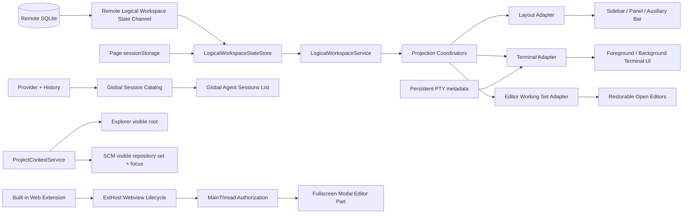

# PR #1：Logical Workspace 与全屏会话宿主

> - 文档定位：PR #1 的统一设计与验收入口
> - PR：[feat: add vibe vscode logical workspaces and fullscreen panel](https://github.com/ActivePeter/vibe-vscode/pull/1)
> - 审查基线：以 PR #1 当前 HEAD 与本仓库工作树为准
> - 状态：Open；Logical Workspace 视图状态由远程 Server 持久化，Terminal ownership 由 PTY metadata 持有

## 1. 这次 PR 要解决什么

vibe vscode 面向常驻个人工作站或云端的 Web 开发环境。PR #1 不重写 VS Code 的编辑器、终端或 Agent 能力，而是在 Physical Workspace 之上增加一层可持久化的任务上下文：用户无需刷新页面，即可切换 Logical Workspace，并让工作台布局、Terminal 和可恢复 editor working set 投影到对应任务。

本 PR 同时提供两个后续能力的基础设施：

- Project Context：在多根 Physical Workspace 内聚焦一个项目；
- Fullscreen Session Host：承载未来全屏 Agent 会话管理面板。

本 PR 的核心设计判断是：**业务状态由明确的 authority 持有，Workbench 现有组件只负责投影；切换上下文不等于销毁资源。**

## 2. 交付边界

| 能力 | PR #1 当前实现 | 合并状态 |
| --- | --- | --- |
| Logical Workspace catalog 与页面内切换 | 创建、选择、页面独立的 active ID、远程共享 catalog | 远程原子初始化和刷新后跨页面可见已实现 |
| Shell 布局 | 保存并恢复主侧栏、Panel、辅助侧栏的显隐、尺寸和 active composite | 可验收 |
| Terminal 隔离 | 唯一 owner、Logical Terminal ID、前后台迁移、持久化链路 | 创建 identity、真实 detach 生命周期、批量投影与 Remote backend 分区已闭环；可验收 |
| Agent Session catalog | 保持 VS Code 原有的全局 catalog 与全局 Agent Sessions 列表 | 已撤掉 Workspace owner/filtering；Session Tab working set 为 Planned |
| Project Context | Project 选择、Explorer/Find generation、SCM repository 集合投影与聚焦 | 核心完成；真实 Git 扩展验收通过，待托管浏览器验收 |
| Fullscreen Session Host | 受控 proposed API、Modal Editor 宿主、Webview 生命周期 | 基础设施完成；会话管理 UI 不在本 PR |
| Web-first 构建 | 内置 Web 扩展接入 compile/watch、typecheck、打包和本地化 | 可验收 |

以下内容明确不属于本 PR 的已交付能力：

- 完整的全屏会话浏览、创建、切换和管理界面；
- 文档选区右键创建 Agent Session；
- Codex Agent-first 的完整交互产品；
- 非阻塞远程断线、状态栏重连和网络恢复策略；
- 对 Agent Session Tab working set 的专门 capture/restore 与产品验收；
- 托管 Web 环境中的 Project 与 Git/SCM 产品验收。

## 3. 术语与层级

| 概念 | 含义 | 不能混淆为 |
| --- | --- | --- |
| Physical Workspace | VS Code 原生 folder 或 `.code-workspace`，决定文件集合、扩展宿主和服务端进程 | Logical Workspace |
| Logical Workspace | Physical Workspace 内的长期任务上下文，管理布局和 editor working set，并投影 Terminal | 新窗口、项目目录或 Git branch |
| Project Context | 当前聚焦的一个 root folder，只改变 Explorer/SCM 的关注点 | Logical Workspace activation |
| Terminal ownership | 一个 Terminal instance 最多归属一个 Logical Workspace | Terminal 当前是否可见 |
| Session catalog | provider/history 管理的全局 Session 集合，不归属于 Logical Workspace | 某个 Workspace 当前打开的 tabs |
| Session Tab working set | 后续由 editor working-set projection 表达的打开 Tab 集合；同一 Session 可同时在多个 Workspace 打开 | Session owner、Session catalog 或删除语义 |
| Projection | 把 authority 中的目标状态应用到 Workbench UI | 第二份业务状态 |
| Fullscreen Session Host | 覆盖 Workbench 的受控 Webview 宿主 | 普通 editor tab 或已完成的会话管理产品 |

层级关系如下：

```text
Physical Workspace
├── Logical Workspace A
│   ├── Shell layout snapshot
│   ├── Terminal projection（owner 存在 PTY metadata）
│   └── Serialized editor working set
├── Logical Workspace B
│   └── ...
└── Project Context: 当前聚焦的 root folder
```

Project Context 与 Logical Workspace 是正交维度：切 Project 不应关闭 editor、terminal 或 session；切 Logical Workspace 也不应隐式改变 Physical Workspace。

## 4. 必须统一遵循的设计契约

这些契约是本 PR 多轮 Review 后形成的实现规约。后续扩展资源类型时应复用它们，而不是再增加一套特化事件、Terminal owner map 或 Session owner graph。

### 4.1 Authority 与 projection 分离

- 远程 `RemoteLogicalWorkspaceStateStorage` 只持久化 Workspace catalog、布局快照和 serialized editor working set。
- `LogicalWorkspaceService` 持有当前页面的 projection，不生成服务端 revision，也不裁决页面间冲突；新 Workspace identity 只在 Server durable 确认后进入可激活 catalog，layout/editor 仍可 optimistic。
- Chat Sessions Service/provider history 是 Session catalog authority；`LogicalWorkspaceService` 不保存 Session owner，不创建、过滤或删除 Session 本体。
- Terminal process metadata 是 Terminal identity/ownership authority；Terminal Adapter 只据此投影前后台实例。
- Editor、Explorer 和 Workbench Layout 只投影各自 authority，不保存平行的关系集合。
- PTY process ID 只在所属 backend 内有效；Terminal 持久化直接复用 VS Code 的 `remoteAuthority`/backend 归属，不能根据 process ID 反推或合并不同 backend 的实例。
- UI 过滤不能改变全局模型查询语义。例如 Project 只限制 Explorer 的 `visibleRoots`，不能删减窗口级 `model.roots`。

### 4.2 Shared、page-local 与 ephemeral 分层

- Remote shared：Workspace catalog、布局快照和 serialized editor working set；由远程 Server 持久化，其他页面刷新或重连后可见。
- Terminal shared：`logicalWorkspaceId` 与 `logicalTerminalId` 随 persistent PTY process 保存。
- Page-local：`activeWorkspaceId`；写入带 Physical Workspace ID 的 `sessionStorage`。
- Ephemeral：Quick Pick、hover、pending generation 等页面瞬时状态；不得持久化为共享业务数据。

一个页面切换 Logical Workspace 不得迫使另一个页面跟随。只有当前 active ID 已从共享 catalog 删除时，本页才允许回退到剩余 Workspace。

### 4.3 异步边界前捕获 identity

任何可能跨越 Quick Pick、extension activation、provider、backend、SCM 注册或 editor open 的操作，都必须在发起边界捕获 Workspace ID 与资源 identity。异步完成时不得重新读取“当前 Workspace”，否则 A 发起的资源可能被错误归到后来切入的 B。

### 4.4 Projection 使用 generation，资源创建使用 transaction

- UI projection 通过 `AsyncProjectionCoordinator` 串行化，并以 `context.isCurrent()` 拒绝过期 generation。
- Coordinator 以 projection target identity 区分“同一目标刷新”和“目标切换”：同一目标的 change event 合并为 transaction 尾部的一次刷新，不使当前 generation 失效；新的 Workspace activation 才立即 supersede 当前 generation。
- `createWorkspace()` 是 identity transaction：UUID 由页面生成，但创建 Promise 只有在权威 snapshot 包含该 UUID 后才完成；完成前不能激活或让 durable resource 归属它。
- Terminal 创建入口捕获 immutable identity，并在创建前写入 Shell launch config；不存在额外 Workspace ownership commit。
- Editor working-set capture/restore 使用统一 projection generation；未来 Session Tab 依赖这一层恢复，不建立 Session owner API。

### 4.5 完整 catalog 与 partial result 必须可区分

Session catalog 的 refresh 只有在取得完整结果后才能发布权威 removed delta。失败、取消或跳过某一数据源不能降级成空数组，否则临时错误会被解释为“删除全部 Session”。该规则属于全局 catalog 正确性，不应通过 Workspace owner 补丁解决。

完整的数据结果协议、失败动作、后台重试与日志规约见 [Agent Session Catalog 的可靠刷新与失败处理](./reliable_agent_session_catalog.md)。

### 4.6 消费者声明 state slice，不猜事件

消费者通过 `onDidChangeLogicalWorkspaceStateSlice(service, selector)` 声明自己读取的完整语义切片，并用结构相等抑制无关变化。Terminal Adapter 监听 Terminal instances，并读取进程 metadata；全局 Agent Sessions catalog 不订阅任何 Workspace slice。

### 4.7 Event 不承担远端复制

跨组件的控制流优先使用直接方法和 service transaction。Logical Workspace Server 不广播 committed snapshot；其他页面通过刷新、重连或重新打开执行 `read`。Terminal 和 Session 使用各自 authority 的事件，不拼接跨层事务。

### 4.8 远程单主与语义 mutation

- 浏览器 IndexedDB 不是共享业务状态 authority；旧值只允许作为首次远程初始化的 migration candidate。
- 服务端以 `initialize-if-absent` 原子建立首份状态，并独占 revision 分配。
- 页面只提交 `createWorkspace`、layout 和 editor 更新；Terminal bind/unbind 不属于该协议。
- 服务端按到达顺序串行持久化，layout/editor 冲突字段采用 Last Write Wins；页面 optimistic projection 可由 `read` 重建。
- layout/editor mutation transport outcome 未知时丢弃该写并重新读取，禁止自动重放旧视图写；`createWorkspace` 先读取对账，snapshot 缺少同一 UUID 时才重试这个幂等创建。
- Logical Workspace SQLite 打开失败时返回终止性错误并停止客户端重试；不得自动替换、清空、恢复 backup 或回退内存库，恢复方式由用户决定。

完整协议、迁移与失败边界见 [Logical Workspace 远程权威状态](./remote_logical_workspace_state.md)。
durable write 的最小接口、上游复用边界和测试要求见 [远端持久化状态最小接口设计](./remote_persistent_state_minimal_interfaces.md)。

## 5. 总体架构



## 6. Logical Workspace 状态

### 6.1 数据模型

共享 schema v2 不包含页面当前选择，也不保存全局 Session catalog 或 Session owner：

```ts
interface LogicalWorkspaceSharedState {
  schemaVersion: 2;
  workspaces: Array<{
    id: string;
    name: string;
    terminalIds: string[];
    shellLayout?: {
      primarySideBar: ShellPartLayout;
      panel: ShellPartLayout;
      auxiliaryBar: ShellPartLayout;
    };
    editorWorkingSet?: string;
  }>;
}
```

`terminalIds` 是旧构建的迁移字段，新代码不再向其中增删 ownership，新 Terminal 保持该数组为空。Terminal layer 会用旧值为老进程补齐 `logicalWorkspaceId`，随后以 PTY metadata 为 authority。`editorWorkingSet` 是 Workbench Editor Groups 的序列化结果；它可以包含具备恢复 identity 的 Session editor tab，但 Logical Workspace 不解析其中的 Session，也不据此过滤全局 catalog。

PR 早期版本写入过 `chatSessionResources`。当前 decoder 接受该额外字段以兼容已有开发态快照，但会在规范化时丢弃，不能把旧 owner 数据解释成 Session tabs。共享快照写入远程 Server 的独立 SQLite，不经过 Configuration Service，因此不会修改用户的 `.vscode/settings.json` 或 `.code-workspace`。浏览器 `WORKSPACE/MACHINE` 旧值只用于一次性迁移候选，远程状态确认后即删除。

外部输入始终从 `unknown` 开始逐层校验。schema、Workspace 元素、旧 Terminal ID、shell layout 和 editor working set 任一层畸形时应拒绝该输入，而不是在 Workbench 启动阶段抛出异常。

### 6.2 远程初始化与刷新一致性

State Store 通过 Remote Agent IPC 访问按 Physical Workspace ID 隔离的服务端状态：

- `initialize` 是服务端原子的 create-if-absent；已有 snapshot 永远优先于页面 candidate；
- revision 只由服务端单调递增，浏览器不再生成 UUID source；
- 页面提交 mutation，服务端串行应用并等待持久化后返回 snapshot；
- 页面以“最新 authoritative snapshot + pending layout/editor mutations”计算 optimistic projection；pending Workspace creation 不提前发布；
- 其他页面不接收 committed event；刷新、重新打开或 Remote Agent 重连后主动 `read`；
- layout/editor response 丢失时移除 pending mutation 并读取 Server truth，不重放旧写；create response 丢失时先 read，已存在即确认，不存在才重试相同 UUID；
- 初始化结果应用前再次读取 State Store 的最新权威 snapshot，再校验并写回 page-local active ID；reentrant refresh 不能让过期初始化结果覆盖页面选择；
- BroadcastChannel、页面间 Request/State anti-entropy 和整包 last-write-wins 均已移除。

这从结构上关闭了“空持久层、已有页面持有 revision `1`、新页面立即写默认值”的覆盖窗口。

### 6.3 Activation 生命周期

一次显式切换的顺序为：

1. `onWillChangeActiveWorkspace`：捕获旧 Workspace 的可投影状态；
2. 更新 page-local active ID 与 activation sequence；
3. `onDidChangeActiveWorkspace`：请求目标 Workspace projection；
4. 每个异步投影只允许仍为 current 的 generation 提交。

`onDidChangeState` 携带 previous/current immutable snapshot。`onWill/onDidChangeActiveWorkspace` 只表达 activation，不替代 Terminal、editor working-set 或全局 Session catalog 变更事件。

## 7. Workbench projection

### 7.1 统一协调器

`ILogicalWorkspaceProjection` 定义两个阶段：

- `capture(workspaceId)`：离开当前 Workspace 或保存页面前采集前台状态；
- `restore(context)`：把目标 snapshot 投影到 UI，并在异步边界检查 `isCurrent()`。

`LogicalWorkspaceProjectionCoordinator` 统一负责初始恢复、切换前 capture、切换后 restore 和页面保存。`AsyncProjectionCoordinator` 合并 pending intent；同 target 的反馈保留当前 generation 并在尾部收敛，不同 target 才使旧事务过期。调用方若需要最终稳定状态，应等待自己关心的最新请求，不能假定旧 generation 的 Promise 代表后续所有请求都已完成。所有被投影 Service 的 Promise 必须表达真实 UI commit，例如 editor terminal 的 restore 只有在 `openEditor()` 完成后才能 resolve。

每个 Adapter 声明自身完整且最小的 active state slice；active ID 不变但 slice 内容更新时仍需排队 reconcile。只有 restore 成功才能推进 projected snapshot；capture 仅在 projected slice 与当前 authority slice 相同时执行，失败或 pending restore 不能把旧 UI 反写覆盖新状态。capture 写回的本地 slice 直接确认为当前 UI 已投影状态，不再对自身反馈执行破坏性 restore；外部 slice 更新仍走 reconcile。初始 editor projection 暴露独立 readiness，Workbench 在打开后续 startup editors 前等待它及其同 target 尾部刷新全部完成。Projection apply 失败必须拒绝对应的 transaction Promise，但不能停止队列处理更新的请求；事件入口负责消费并记录 rejection，显式等待者则据此停止后续破坏性步骤。

### 7.2 Shell layout

Layout Adapter 保存三个 shell part 的 `visible`、`width`、`height` 与 `activeCompositeId`。恢复时先恢复 composite 和尺寸，再提交最终可见性；目标为隐藏的 part 也必须恢复自己的尺寸，避免以后显示时继承另一个 Workspace 的布局。

### 7.3 Editor working set

`LogicalWorkspaceEditorAdapter` 通过 Editor Groups Service 序列化和恢复 editor working set，并监听 Webview state 更新补充 capture。它只处理 editor input 的通用恢复 identity，不读取 Agent Session catalog，也不建立 Session owner。

Terminal editor 的 tab 位置也由 editor working set 恢复；Terminal serializer 复用 Terminal/PTY authority 已保留或已 revive 的同一实例，不创建第二个 attach client。Terminal layout 的 background 列表只恢复 Panel Terminal，不同时持有 editor Terminal 的恢复权。
切换事务采用 `Terminal prepare → editor working-set apply/adopt → Terminal finalize`：普通 reconcile 先隐藏其他 Workspace 的 Terminal；紧邻 destructive apply 的 prepare 再把当前 owner 的前台 editor Terminal 保护性 detach 到 background。随后 editor working set 关闭/替换 groups 并领养其中引用的实例，最后只把仍未被领养且 owner 为当前 Workspace 的可见用户 Terminal 恢复到 active editor group。这样创建跨越 Workspace 切换而晚完成、甚至尚未来得及执行旧 target reconcile 的 Editor Terminal 仍有可达入口，同时不会抢走 working set 中已有 Terminal 的原 group；hidden/tool Terminal 不参加 fallback finalize。

具备可恢复 editor identity 的 Session Tab 可以自然包含在 serialized working set 中；但 PR #1 尚未为 Session Tab 单独完成 open/close、多 Workspace 重复打开和恢复正文的产品验收，因此 README 仍标记为 Planned。window geometry、panel split 和 active terminal 不属于 editor working set。

## 8. Terminal ownership 与持久化

### 8.1 已实现主链路

Terminal 创建与投影遵循以下目标流程：

1. 在发起边界捕获 Workspace ID，并为委托路径预分配稳定 Logical Terminal ID；
2. 沿既有创建链传递 identity，不重新读取 active Workspace；
3. 将 `logicalWorkspaceId` 和 `logicalTerminalId` 写入 Shell launch config 与 persistent PTY metadata；
4. 非当前 Workspace 的实例移到 background，不关闭 PTY；
5. 切回 owner Workspace 时，Panel Terminal 由 Terminal Adapter 挂回；editor Terminal 先由 editor working set 在原 group 中领养同一 background instance；
6. working set 应用后仍留在 background 的当前 owner editor Terminal 由 Terminal Adapter 恢复到 active group，并通过受保护的下一次 capture 纳入 working set。

`ITerminalCreationContext` 是只携带 initiating Workspace 与稳定 Logical Terminal ID 的小型 immutable value object。普通创建、Extension Host contributed profile 和 Agent Host profile 都沿已有调用链转发它。Terminal 创建失败只留下未使用的局部 config，不写 Workspace 共享状态，因此不会发布 ghost owner。

Terminal projection 通过通用 Coordinator 把自身触发的 `onDidChangeInstances` 合并到同 target transaction 尾部，因此一次 reconcile 可以完成整批迁移，而不会每移动一个实例就启动新 generation。`showBackgroundTerminal()` 的完成语义包含 editor `openEditor()`；若期间切换到另一 Workspace，旧恢复完成后会被 generation check 截断，再由新 target transaction 收敛。

Terminal ownership 随 PTY process 存活，不再根据 `TerminalExitReason.Shutdown` 修改 Workspace snapshot。是否可重连继续由 VS Code 原有的 PTY detach/persistence 生命周期决定；真正结束的进程自然不再出现在 Terminal authority 中。

旧 snapshot 的 `terminalIds` 只用于一次兼容迁移：恢复老进程时查找对应 Workspace，把结果写入 `ProcessPropertyType.LogicalWorkspaceId`。后续投影只读取 Terminal instance metadata。

### 8.2 Remote backend 分区

Remote Workbench 的持久化不创建新的 Terminal 分类，而是复用每个 `ITerminalInstance.remoteAuthority` 与既有 backend 的对应关系：

- 写入 Remote primary backend 时，panel group、active process 与 background 列表只序列化 `remoteAuthority` 等于当前 Remote authority 的实例；
- Remote reload 复用 Local 分支已有的 background revive 流程，恢复 Remote layout 中的隐藏 Terminal；
- process ID 的相等不代表资源相同；即使 Local 与 Remote backend 分配了相同 ID，也必须按实例的 authority 过滤后再序列化；
- Remote Workbench 中 authority-less Local PTY 不写入 Remote layout。本 PR 不额外扩展这类 Local PTY 的跨 reload 持久化，保留 VS Code 现有生命周期语义。

### 8.3 Planned：Closed Terminal Transcript

进程结束后不会继续出现在 Live Terminal authority；若产品需要保留历史，应建立独立的只读 Transcript catalog，而不是把已关闭 ID 写回 Workspace snapshot。Transcript 可以保存有限输出、退出码、标题、CWD 与起止时间，并提供“以相同 CWD/Profile 新建终端”，但不允许输入，也不能称为重连。该 catalog 需要独立的容量、保留时间、手动清理与敏感输出策略，不属于 PR #1 的交付范围。

## 9. 全局 Agent Session catalog

### 9.1 PR #1 的决定

Session 本体、provider/history catalog 和 Agent Sessions 列表保持 VS Code 原有的全局语义。PR #1 不再让 `AgentSessionsModel` 或 `LocalAgentsSessionsController` 依赖 `ILogicalWorkspaceService`，具体约束为：

- `AgentSessionsModel.sessions` 返回全局 catalog，不按 active Workspace 过滤；
- model create、provider delta、cache restore 和删除 action 不写 Logical Workspace state；
- `ILogicalWorkspace` schema 不包含 `chatSessionResources`；
- `ILogicalWorkspaceService` 不提供 `bind/unbind/workspaceContainsChatSession`；
- Workspace 切换不触发 provider add/remove，也不触发无意义的 Session list refresh。

这使 Session catalog 与 Logical Workspace 生命周期解耦，也避免在真正定义 Tab 语义前固化错误的 first-owner-wins API。

### 9.2 后续 Session Tab working set

Workspace 未来只关心“哪些 Session Tabs 当前打开”，不拥有 Session。本 PR 已有的通用 `editorWorkingSet` 是承载这一关系的正确层级：同一 Session editor identity 可以分别出现在 A、B 的 serialized working set 中；关闭 A 的 Tab 不删除 Session，也不改变 B。

后续实现应验证 Session editor input 的序列化与恢复闭包，而不是重新添加 Session owner 字段。验收至少覆盖：相同 Session 同时存在于 A/B、切换只恢复目标 tabs、关闭一个 tab 不删除 Session、删除 Session 后旧 editor identity 安全失效。

全局 catalog 自身仍需保证 refresh 失败或取消时不会把 partial `[]` 当成权威删除；这是独立的 provider catalog 正确性问题。

## 10. Project Context

Project Context 以选中 folder URI 为 selection authority，并通过同一个异步 projection 路径驱动 Explorer 和 SCM：

- Quick Pick 使用 `activeItem` 聚焦当前 Project；
- Add Project Directory 比较命令执行前后的 folders，并选中新增加的项；
- Explorer `roots`、`findClosest()` 和 `findClosestRoot()` 保持窗口级完整 model；`visibleRoots`、`findClosestVisible()` 和 `findClosestVisibleRoot()` 专门表示当前 Project 投影，UI context、文件操作与过滤不得回退到全局 root；
- Explorer tree input 只能从当前 `visibleRoots` 派生；Project 切换先结束 Find session 并递增其 generation；
- Find session 仅在 Project 未变化时恢复原 view state，Project 已变化时从最新 `visibleRoots` 重建 input；晚返回的旧 Find generation 会重新投影当前 input，不能回滚 Project；
- SCM catalog 保持窗口级全局语义，但 `visibleRepositories` 是 Project projection：multiple 模式原子替换为当前 Project 内的全部 repositories，single 模式只保留离 Project root 最近的一项；其他 Project 的 repositories 必须隐藏；
- SCM projection 同时监听 repository add/remove、selection mode 和用户可见集合变化。Git 扩展延迟发现任意仓库后都重新从 Project authority 派生完整集合，不能用逐项 `toggleVisibility()` 累加；目标集合提交后再 focus 最近的 repository；
- 每个异步步骤检查 selection sequence，过期结果不能覆盖新选择。

这里沿用 Workbench 的 Model/Projection 结构，而不是让多个事件监听器分别写 Tree 或 SCM：folder URI 是唯一 authority，Find、Explorer 与 SCM 都只能提交可由当前 authority 重建的 projection。对应回归覆盖正常 Find 结束、Find 中切 Project、旧搜索晚返回、嵌套物理 roots 的 global/visible 查询分离、快速 A→B→A 时旧 projection 不得再 reveal/focus，以及 SCM single/multiple、手动选择、延迟 add/remove 后的集合收敛。

## 11. Fullscreen Session Host

内置扩展 `vibe-vscode.project-switcher` 通过 proposed API `vibeVscodeFullscreenPanel` 请求 `vibe-vscode.projectSwitcher.fullscreen` Webview。MainThread 同时校验：

- extension ID 与 View Type；
- builtin 身份；
- extension 实际运行位置；
- 当前是否存在 modal editor 冲突。

Fullscreen presentation 始终映射到 `MODAL_GROUP`。首次创建与后续 `reveal()` 共用同一 presentation identity，不能逃入普通 editor group。

创建 RPC 可等待 MainThread editor open。ExtHost 对同步返回的 `WebviewPanel` 建立 pending operation queue；创建失败时清理 handle、Webview 和 extension 侧引用。Workbench 内部 singleton 调用方使用共享 pending Promise，避免并发打开两个 Webview。

这一层只是安全、可靠的 UI 宿主。扩展当前仍是占位内容，不能称为“全屏会话管理面板已实现”。项目原生 ID 统一使用 `vibe-vscode.*`，用户可见品牌统一为 `vibe vscode`；仅隐藏的旧配置键保留用于一次性数据迁移。

## 12. Web-first 构建与运行规约

- 根目录 `npm run compile`/`npm run watch` 包含内置 Web 扩展；
- 扩展的 `compile-web` 同时执行 bundle 与 typecheck，`watch-web` 同时启动两者；
- 产品打包和开发 Web server 都能加载该 builtin extension；
- 开发 Web server 按 locale fallback 链本地化 manifest，而不是固定读取英文 `package.nls.json`。

托管服务遵循仓库级运行规约：

- 当前 checkout 是端口 `18080`、`18081` 唯一允许的构建源，部署入口相对自身位置解析仓库根目录；
- `18080` 运行当前 checkout 的可变开发输出；`18081` 可运行不可变 package，但 package 也必须由本 checkout 构建；
- 两个服务的公开入口都监听 `0.0.0.0`；`18080` 由仓库固定版本的单文件 Caddy 终止 HTTPS/WSS，VS Code Server 恢复上游 HTTP 实现并只通过私有 Unix socket 接入；
- 当前 `18080` 保持匿名访问，Caddy 为下一 PR 的统一登录、首次注册和 `forward_auth` 提供边界；在该能力落地前，私有 backend socket 不得对外暴露；
- 服务 state 与 TLS material 由部署环境通过单一 operator input 提供，并保存在 checkout 与不可变 release 之外。

本地通用 quick start 可以使用默认端口；它不覆盖上述托管端口和监听地址规约。

## 13. 代码责任地图

| 责任 | 主要入口 |
| --- | --- |
| Logical Workspace API、slice selector、schema 与 mutation reducer | [`logicalWorkspace.ts`](../../src/vs/workbench/services/logicalWorkspace/common/logicalWorkspace.ts) |
| Registry 与页面投影快照 | [`logicalWorkspaceService.ts`](../../src/vs/workbench/services/logicalWorkspace/browser/logicalWorkspaceService.ts) |
| Remote IPC protocol | [`logicalWorkspaceRemote.ts`](../../src/vs/workbench/services/logicalWorkspace/common/logicalWorkspaceRemote.ts) |
| 页面 view-state optimistic mutation、durable Workspace creation 与 refresh reconcile | [`logicalWorkspaceRemoteStateClient.ts`](../../src/vs/workbench/services/logicalWorkspace/browser/logicalWorkspaceRemoteStateClient.ts) |
| Remote/local backend 选择、旧值迁移与 page-local selection | [`logicalWorkspaceStateStore.ts`](../../src/vs/workbench/services/logicalWorkspace/browser/logicalWorkspaceStateStore.ts) |
| 远程权威 SQLite、revision 与 mutation serialization | [`logicalWorkspaceStateChannel.ts`](../../src/vs/server/node/logicalWorkspaceStateChannel.ts) |
| 通用异步 projection 协议 | [`logicalWorkspaceProjection.ts`](../../src/vs/workbench/services/logicalWorkspace/browser/logicalWorkspaceProjection.ts) |
| Workspace picker 与贡献注册 | [`logicalWorkspace.contribution.ts`](../../src/vs/workbench/contrib/workspace/browser/logicalWorkspace.contribution.ts) |
| Shell layout projection | [`logicalWorkspaceLayoutAdapter.ts`](../../src/vs/workbench/contrib/workspace/browser/logicalWorkspaceLayoutAdapter.ts) |
| Terminal projection | [`logicalWorkspaceTerminalAdapter.ts`](../../src/vs/workbench/contrib/workspace/browser/logicalWorkspaceTerminalAdapter.ts) |
| Editor working-set projection | [`logicalWorkspaceEditorAdapter.ts`](../../src/vs/workbench/contrib/workspace/browser/logicalWorkspaceEditorAdapter.ts) |
| Terminal identity、ownership metadata 与持久化入口 | [`terminalService.ts`](../../src/vs/workbench/contrib/terminal/browser/terminalService.ts) |
| 全局 Agent Session catalog | [`localAgentSessionsController.ts`](../../src/vs/workbench/contrib/chat/browser/agentSessions/localAgentSessionsController.ts)、[`agentSessionsModel.ts`](../../src/vs/workbench/contrib/chat/browser/agentSessions/agentSessionsModel.ts) |
| Project selection 与 Explorer/SCM projection | [`projectContext.ts`](../../src/vs/workbench/contrib/workspace/browser/projectContext.ts) |
| Fullscreen Webview authorization/lifecycle | [`mainThreadWebviewPanels.ts`](../../src/vs/workbench/api/browser/mainThreadWebviewPanels.ts) |
| Fullscreen Modal Editor 宿主 | [`modalEditorPart.ts`](../../src/vs/workbench/browser/parts/editor/modalEditorPart.ts) |
| Built-in Web extension | [`extension.ts`](../../extensions/vibe-vscode/src/extension.ts) |

## 14. Review gate 状态

以下问题已经由结构调整关闭：

- 删除 Session owner state，关闭空 ChatModel ghost owner 与错误独占语义；
- generation-aware Find 恢复关闭 Project/Explorer projection 冲突；
- `AgentSessionCatalog` 的 complete/partial/cancelled 结果协议关闭 history 失败被当作权威空 catalog；
- 远程原子初始化、服务端 revision 和语义 mutation 关闭同 revision 默认 catalog 覆盖；
- view-state mutation 单次发送并在未知结果后 refresh，关闭旧写跨越新写再次执行；
- Terminal ownership 下沉到 persistent PTY metadata，关闭 Workspace mutation 复活资源；
- Remote layout 按既有 `remoteAuthority` 过滤并恢复 background，关闭 local PTY 串写 Remote backend。

## 15. 验证矩阵

| 领域 | 已有覆盖重点 | 合并前必须补齐 |
| --- | --- | --- |
| State Store | 远程原子初始化、durable revision、刷新后跨页面可见、未知 response 不重放、SQLite 打开失败 fail-closed、丢弃旧 `chatSessionResources` | 托管服务双页面与服务重启验收 |
| Layout | 初始恢复、显隐、active composite、隐藏 part 尺寸 | 保持现有覆盖通过 |
| Terminal | initiating identity、PTY ownership metadata、旧 owner 迁移、批量 projection、editor A→B 快切、Remote background revive、同 process ID 的 authority 分区 | 托管 Remote background reload |
| Agent Sessions | 全局 provider catalog、complete/partial/cancelled refresh、Workspace 切换后列表不变、无 Logical Workspace Session API | Session Tab working set 留待后续专项验收 |
| Project | active item、新增 folder、全局/可见 roots、Find generation、快速切换 stale projection、SCM exact-set、single/multiple、延迟 add/remove；隔离 Workbench 已用两个真实 Git repositories 验收 A/B 双向切换 | 托管 Web 服务中的多根 Project 与 Git 扩展联动 |
| Fullscreen Host | authorization、创建失败清理、pending 操作、reveal、singleton | 保持现有覆盖通过 |
| Build/Web | extension bundle+typecheck、产品打包入口、locale fallback | 干净 checkout 的 compile/watch 验证 |

验证应优先运行最小相关测试，再根据改动范围运行 client typecheck、layer check、proposed DTS check 和 Web extension compile。PR 描述中的历史“passed”记录不能替代最终 HEAD 的重新验证。

## 16. PR 完成定义

PR #1 可以进入合并状态的条件是：

1. Session catalog 已恢复全局语义，且全部有效 Review gate 均由代码与针对性测试关闭；
2. README 对 Available、In progress、Planned 的标识与实际边界一致；
3. Terminal ownership、Workspace view state、全局 Session catalog 和 projection transaction 之间没有语义混用或旁路实现；
4. Web 开发构建与产品打包都能从干净 checkout 生成并加载 builtin extension；
5. PR 验证记录更新为最终 HEAD 的结果。

合并后的后续工作按产品能力拆分 PR：Session Tab working set 专项验收、Project Context 浏览器级验收、全屏 Session 管理 UI、文档驱动会话、Codex Agent-first 交互，以及非阻塞远程连接。这样基础设施与产品交互不会再次混在一个无法独立验收的提交中。
