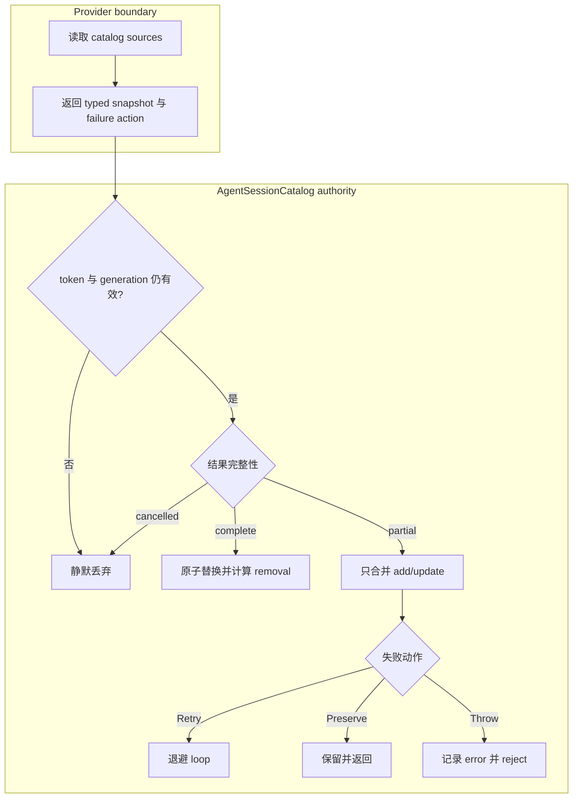
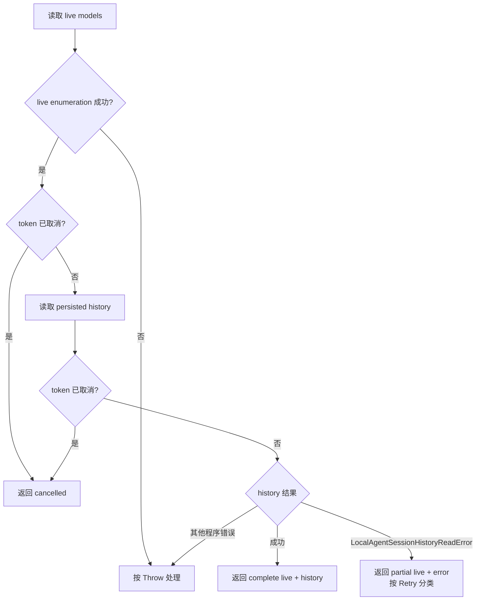

# Agent Session Catalog 的可靠刷新与失败处理

> - 状态：Implemented（Local Agent Sessions 已接入）
> - 源码入口：`src/vs/workbench/contrib/chat/browser/agentSessions/agentSessionCatalog.ts`
> - 适用范围：Agent Session provider catalog 的读取、缓存、增量通知与后台恢复

## 1. 问题

Session catalog refresh 同时承担两种不同职责：

- 发布本次成功读取到的 Session；
- 根据“本次没有读取到”推断已有 Session 已被删除。

第二项只在所有必需数据源均成功返回时成立。过去 `LocalAgentsSessionsController` 会把 history/storage 异常转换为 `[]`，也会在 cancellation 跳过 history 后继续提交结果。这让以下三种情况变得无法区分：

- history 成功返回空列表；
- history 读取失败；
- refresh 被取消，只取得 live sessions。

结果是 partial result 被当成完整快照，历史 Session 被错误发布为 `removed`，存储恢复后又作为新增项出现。

## 2. 核心决策

Catalog 的数据完整性与失败恢复策略是两个正交维度，必须分别建模：

- 数据协议回答：“这个结果能不能证明缺失项已经删除？”
- 失败动作回答：“保留旧状态后，是重试、返回，还是让调用失败？”

全局不变量是：

> 只有 complete snapshot 可以把“结果中缺失”解释为删除。partial、failed、cancelled 和 superseded 结果都不得发布推断出来的 removal。

## 3. 专用模块

`AgentSessionCatalog<T>` 是 Agent Sessions 域内唯一的可靠 catalog 状态机。它负责：

- 持有 last-known-good items；
- 区分 complete、partial 与 cancelled snapshot；
- complete snapshot 原子替换并计算 added/updated/removed；
- partial snapshot 只合并 added/updated，禁止根据缺失项删除；
- generation 检查，拒绝过期异步结果；
- 显式 provider event 的 `upsert` 与 `delete`；
- Retry / Preserve / Throw 失败动作；
- 一个可释放、可合并的后台退避循环；
- 独立 loop 的结构化事件流与最近 100 条有界事件记录；
- 事件级别到系统日志的统一投影。

该抽象暂时位于 Agent Sessions 域，而不是 `vs/base`。目前被验证的共同语义是 provider catalog；在出现第二个非 Session consumer 前，不把领域判断升级成全局基础设施。

## 4. 数据结果协议

| 结果 | 含义 | 允许新增/更新 | 允许推断删除 |
| --- | --- | --- | --- |
| `complete` | 所有必需数据源均成功返回 | 是 | 是 |
| `partial` | 只取得可安全使用的子集 | 是，只能合并 | 否 |
| `cancelled` | 调用取消，没有可提交结果 | 否 | 否 |
| superseded | 更新的 generation 已开始 | 否 | 否 |
| thrown failure | 未取得可安全使用的数据 | 否 | 否 |

空数组不是失败表示。只有 `complete([])` 才表示 catalog 权威为空，并允许删除旧项。

Partial items 自身必须可靠。例如 Local provider 在 history 失败时，可以把已成功读取的 live sessions 作为 partial items；不能把解析到一半、identity 不确定的数据放入 partial snapshot。

## 5. 失败动作

| 动作 | 典型场景 | 当前状态 | 调用结果 | 后续行为 |
| --- | --- | --- | --- | --- |
| `Retry` | 临时存储不可用、网络中断、服务忙、可恢复 transport 错误 | 保留 last-known-good；可合并 partial | 当前 refresh 正常返回 | 独立后台 loop 退避重试 |
| `Preserve` | 当前上下文无法自行恢复、需要外部配置或用户动作 | 保留 last-known-good；可合并 partial | 正常返回 | 不自动重试；上层可提示并在外部状态变化后重新 refresh |
| `Throw` | schema/invariant 破坏、程序错误、继续运行可能污染状态 | 保留 last-known-good；partial 中明确安全的项仍可合并 | reject | 记录 error，由调用边界处理 |

Cancellation 不进入错误分类，不记录 warning，也不安排重试。权威的 `not found` 或空 catalog 也不是异常，应由 source 转换为 `complete([])`。

分类发生在最了解领域语义的 provider 边界。底层 getter 不得用 `catch { return []; }` 抹掉错误信息，通用模块也不根据错误字符串猜测业务含义。

## 6. 后台重试规约

只有 `Retry` 可以进入独立 loop：

- 每个 catalog 最多一个 `RunOnceScheduler`；Controller 不再创建平行 timer；
- 默认延迟为 1 秒、5 秒、30 秒、120 秒，之后保持 120 秒；
- 用户或外部事件触发的显式 `refresh()` 会取消等待并立即尝试；
- 等待中的 retry 被显式 refresh 接管时，必须先记录 `retrySuperseded`，不能让已排期的 loop 无痕消失；
- 如果该 foreground refresh 自身被取消，已有失败周期的后台 recovery loop 必须重新排期，不能被 UI cancellation 顺带终止；
- catalog dispose 会取消 timer，并使所有 in-flight generation 失效；
- retry 是新 generation，旧请求即使稍后返回也不能提交；
- loop 必须记录 foreground/retry 来源、generation、失败次数与下次 retry delay；
- 当前框架只自动重试幂等 catalog read。写操作必须另行定义幂等键、确认或回滚语义。

网络型 provider 后续可在自身 connectivity-restored 事件上调用 `refresh()`，从而跳过剩余退避时间。若大量客户端共享同一远端服务，再在 provider policy 增加 jitter；本地 history 不需要随机抖动。

## 7. 并发与提交

Catalog 维护两个单调 generation：

- refresh generation：新的显式刷新或后台重试使旧读取结果过期；
- content generation：显式 `upsert/delete` 在读取期间发生时，当前 snapshot 过期并重新读取。

失败恢复状态另有单调 revision。Session delta 是同步广播的，监听器可能在旧 refresh 提交期间启动并立即失败一个更新的 refresh；旧 refresh 随后的 success bookkeeping 只有在 revision 未变化时才能清除失败次数或取消 retry，不能覆盖新一代已经建立的恢复 loop。

提交顺序如下：

Event 只在状态已经提交后广播。失败和重试本身不能伪造 Session delta。

## 8. Local Agent Sessions 接入

Local catalog 由两个数据源组成：

- live models；
- persisted history。

Live model dispose 只表示模型卸载，不等于持久化 Session 删除，因此触发完整 reconcile。只有完整 catalog 不再包含该 Session，或收到语义明确的删除事件时，才发布 `removed`。

未被包装的 live enumeration、item conversion 或其他程序错误按 `Throw` 处理，不进入无限重试。Local history 目前没有暴露更细的 typed error；若后续能区分临时 IO、用户配置和数据不变量，应继续在 provider classifier 中细化，而不是修改 catalog 的提交规则。

## 9. 事件记录与日志规约

独立 loop 的每个状态转换先形成 `IAgentSessionCatalogEvent`，再决定如何写入系统日志。事件至少包含：

- 单调 `sequence` 与 `timestamp`；
- catalog 名称；
- foreground 或 retry 触发来源；
- refresh generation；
- event kind 与 level；
- 可选的 failure action、attempt 和 retry delay。

事件类型包括：`refreshStarted`、`snapshotDiscarded`、`refreshCancelled`、`refreshFailed`、`retryScheduled`、`retrySuperseded`、`refreshSucceeded` 和 `refreshRecovered`。Catalog 默认在内存中保留最近 100 条，并通过 `onDidRecordEvent` 实时广播；该事件只供诊断、遥测和状态展示，不能反向驱动 catalog 控制流。

系统日志由事件级别统一投影：

- 同一失败周期第一次可恢复失败形成 `Warning` 事件，并调用 `ILogService.warn`；
- 同一周期重复失败形成 `Trace` 事件，附 attempt，避免每轮刷 warning；
- `Throw` 形成 `Error` 事件，并调用 `ILogService.error`；
- 后续成功形成 `Info` recovery 事件；
- started、scheduled、cancelled、superseded 和普通成功保留为 `Trace`。

因此 WARN/ERROR 不可能只有内存事件而没有系统日志；同时完整事件流仍能回答“何时进入 loop、计划何时重试、何时恢复”。

## 10. 验收要求

任何接入该模块的 provider 至少覆盖：

- complete snapshot 可以删除缺失项；
- partial snapshot 更新已有项但不删除未返回项；
- failed read 保留 last-known-good；
- cancellation 不提交、不删除、不重试；
- 较旧 generation 晚返回不能覆盖较新结果；
- retryable failure 在后台恢复，且成功后重置退避；
- 独立 loop 记录 failure、retryScheduled、retry start 与 recovered 事件；
- Warning/Error 事件分别落入系统 warn/error 日志；
- live unload 与 persisted delete 使用不同语义。

当前自动化测试位于：

- `src/vs/workbench/contrib/chat/test/browser/agentSessions/agentSessionCatalog.test.ts`
- `src/vs/workbench/contrib/chat/test/browser/agentSessions/localAgentSessionsController.test.ts`

## 11. 推广边界

新建 Agent Session catalog provider 必须使用该协议，不得自行把异常转换成空列表。已有 provider 应在修改其刷新逻辑时逐步迁移；带 server notification、optimistic mutation 或 workspace filtering 的 store 需要在迁移时保留各自的显式 event 语义，不能为了复用而把 notification 降格为 partial snapshot。

该模块不处理用户命令写失败、Session 内容流、Terminal ownership 或 Logical Workspace projection；这些操作有不同的事务和恢复边界。
