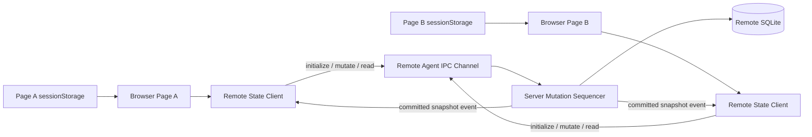

# Logical Workspace 远程权威状态

> 文档状态：PR #1 目标契约；剩余 durable write 与 exactly-once gate 见 [远端持久化状态最小接口设计](./remote_persistent_state_minimal_interfaces.md)
>
> 适用范围：Logical Workspace catalog、Terminal ownership、Shell layout 与 editor working set

## 1. 设计决定

Logical Workspace 的共享状态由远程 VS Code Server 单点排序并持久化。浏览器不是共享业务状态的 authority；IndexedDB 旧值只允许作为首次迁移候选，不能参与 revision 裁决。

状态按以下边界拆分：

| 状态 | Authority | 生命周期 |
| --- | --- | --- |
| Workspace catalog、Terminal ownership、Shell layout、editor working set | 远程 Server | 跨标签页、浏览器和服务重启 |
| 当前 `activeWorkspaceId` | 每个标签页的 `sessionStorage` | 当前标签页刷新 |
| pending mutation、projection generation、picker 状态 | 当前页面内存 | 当前页面进程 |

判断一个浏览器副本是否只是缓存的方法是：删除它以后，是否能从远程完整重建。远程 snapshot 可以完整重建共享状态；页面 optimistic projection 可以随时丢弃，因而不构成第二个 authority。

## 2. 数据模型

远程 snapshot 由服务端 revision 和 schema v2 state 组成：

```ts
interface RemoteSnapshot {
  revision: number; // 仅由服务端递增
  state: {
    schemaVersion: 2;
    workspaces: Array<{
      id: string;
      name: string;
      terminalIds: string[];
      shellLayout?: ShellLayout;
      editorWorkingSet?: string;
    }>;
  };
}
```

`activeWorkspaceId` 不进入远程 snapshot。一个页面切换 Workspace 不得驱动其他页面切换；只有远程 catalog 已不包含本页 active ID 时，本页才回退到第一项。

## 3. 架构



服务端数据库位于：

```text
<remote userDataPath>/User/globalStorage/vibe-vscode/logical-workspaces.vscdb
```

数据库以 Physical Workspace ID 分区。托管服务仍使用既有 service state 目录，因此重新构建源码或重启 `18080` 不会迁移、复制或清空用户状态。

## 4. 初始化协议

客户端使用原子的 `initialize-if-absent`，而不是页面间 Request/Response：

1. 页面读取旧浏览器快照和旧 Workspace configuration，只生成 migration candidate，不落盘新默认状态。
2. 页面调用远程 `initialize(physicalWorkspaceId, candidate)`。
3. 若服务端已有状态，服务端返回已有 snapshot，完全忽略 candidate。
4. 只有服务端明确确认该 Physical Workspace 尚未初始化时，才以 candidate 创建 revision `1`。
5. 客户端收到远程 snapshot 后进入 ready，并删除旧浏览器共享快照。
6. projection、Workspace picker 和 Terminal 创建在 `whenReady` 后继续。

因此两个新页面即使同时持有不同默认 candidate，也只有服务端队列中的第一个初始化成功；第二个页面得到同一 snapshot。不存在两个页面分别生成 `(counter=1, source=UUID)` 再随机决胜的窗口。

## 5. 写入协议

客户端不提交整份替换快照，而是提交下列语义 mutation：

- `createWorkspace`
- `setShellLayout`
- `setEditorWorkingSet`
- `bindTerminal`
- `unbindTerminal`

服务端在一个 `Sequencer` 中读取当前 snapshot、应用 mutation、递增 revision、等待 SQLite flush，再发布 committed event。不同页面对不同字段的并发修改按服务端顺序合并，不会因为任一页面持有旧快照而丢失另一项修改。

这些 mutation 在相邻重复、且中间没有其他 mutation 时具有业务幂等性：

- 相同 Workspace ID 只能创建一次；
- 重复设置相同布局或 working set 不增加 revision；
- 已绑定的 Terminal 不会重复加入；
- 重复解绑不存在的 Terminal 不产生变化。

业务幂等性不能提供 transport exactly-once。若 A 已提交后响应丢失、B 又提交了更新，A 再次执行仍可能覆盖 B；安全重试还需要稳定 operation ID 与服务端持久化去重。

## 6. 页面 optimistic projection

Workbench 的现有调用方需要同步看到 create、layout capture 和 terminal binding 的结果，因此客户端维护可丢弃的 optimistic projection：

```text
projected state = latest authoritative snapshot + ordered pending mutations
```

该 projection 不是 authority：

- 每次服务端 event 或 response 都替换 authoritative base；
- 尚未确认的 mutation 会在新 base 上重新应用；
- mutation 得到确认后从队列移除；
- 如果更新后的服务端 revision 已超过迟到 response，仍必须重新计算 projection，避免已确认 mutation继续覆盖较新的服务端值；
- 页面重载后直接从远程 snapshot 重建，不依赖旧 projection。

高频的 `setShellLayout` 与 `setEditorWorkingSet` 会按 Workspace 合并尚未发送的相邻值；资源创建和 Terminal ownership mutation 保留完整顺序。

## 7. 同步与重连

服务端在 mutation 持久化成功后广播完整 committed snapshot。客户端只接受更高的服务端 revision，并保留自己的 page-local active ID。

Remote Agent 重连成功后，客户端主动执行 `read`：

- 补齐断线期间错过的 event；
- 以最新服务端 snapshot 作为 optimistic queue 的新 base；
- 随后继续发送未确认的 mutation；完成 exactly-once gate 后，transport retry 必须携带首次入队时生成的相同 operation ID。

BroadcastChannel 不再参与 Logical Workspace 状态同步、revision 或 winner 选择。

## 8. 失败契约

失败分为两类：

| 类型 | 示例 | 动作 |
| --- | --- | --- |
| 可重试 transport/storage failure | 连接暂时中断、IPC 调用失败、SQLite 暂时不可写 | 保留 mutation，按 `1s/5s/15s/30s` 退避重试，并记录 warning；Server 只能从 durable confirmed state 重试 |
| 不可容忍 protocol/state failure | 服务端记录损坏、返回畸形 snapshot、初始化后权威记录消失 | 停止写入并记录 error，不创建默认状态覆盖 |

远程不可用期间，页面可以保留已经显示的 projection，但不得把它升级为新 authority。`whenReady` 在初始远程状态成功确认前不会完成；依赖共享 identity 的 Terminal 创建和 Workspace projection 必须等待它。

无 Remote Agent 的兼容运行形态沿用 VS Code 平台 Workspace Storage，并且不运行浏览器多主协议；本地桌面由 Main Process 持有该存储，standalone Web 只提供本地单页面能力。该兼容路径不提供跨设备共享，也不改变 Web-first 托管模式的远程 authority。

## 9. schema 与迁移

- schema parser 和 mutation parser 位于共享 common 层，浏览器与 Server 使用同一套运行时校验。
- 旧 schema 中的 `chatSessionResources` 在 candidate 规范化时丢弃，不恢复 Session ownership。
- 旧 `{ counter, source }` envelope 只读取其中 `state` 作为 migration candidate。
- 远程记录已存在时，任何浏览器旧值、默认 Workspace 或旧 configuration 都无权覆盖它。
- 远程记录损坏与远程记录不存在必须严格区分；损坏不能降级为“空”。

## 10. 验证要求

最低回归覆盖：

1. 远程已有 revision `1`，新页面本地持久层为空并立即初始化，已有状态仍获胜。
2. 两个客户端同时初始化不同 candidate，只产生一份 revision `1` 状态。
3. 两个页面并发写 Terminal ownership 与 Shell layout，最终 snapshot 同时包含两项。
4. SQLite update 失败后 retry，再关闭并重新打开数据库，成功响应对应的 revision/state 必须真实落盘。
5. mutation response 丢失、另一客户端插入 mutation、原客户端携带相同 operation ID retry，不得再次 apply 原 mutation；Server 重启后去重仍成立。
6. 较新 event 先于较旧 response 到达时，客户端移除已确认 optimistic mutation，并显示较新的服务端值。
7. active Workspace 保持 page-local，不随远程 catalog 的普通字段变化切换。
8. 畸形远程 snapshot 被拒绝，不能触发默认状态写回。
