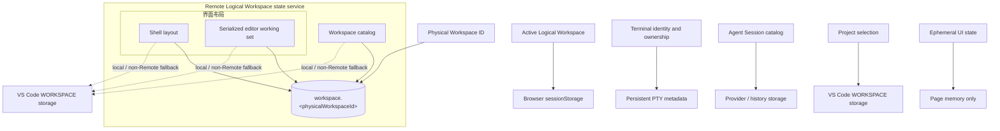
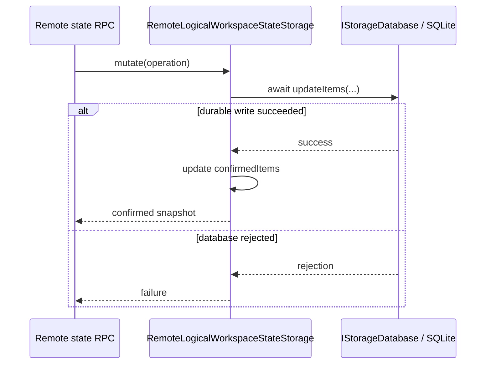
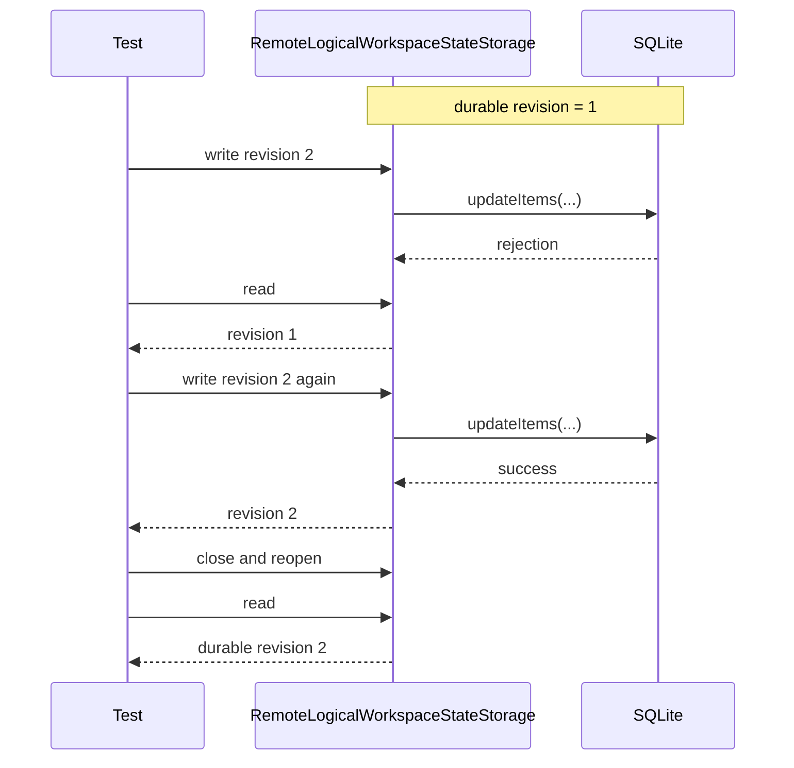

# 远端持久化：最小修改方案

> 目标：Server 只确认已经写入 SQLite 的 Logical Workspace 视图状态。
>
> 总体协议：[Logical Workspace 远端视图状态](./remote_logical_workspace_state.md)

## 状态与持久化边界

只有 Workspace catalog 和界面布局的两个状态切片——Shell layout、serialized editor working set——进入 Logical Workspace 专用 SQLite。相邻状态分别保留自己的 authority 与持久化介质：

### Physical Workspace 命名空间与公共落点

Physical Workspace 是当前 Workbench 的 VS Code Workspace identity，也是 Logical Workspace 状态的上层命名空间。

#### Authority 与持久化

- `IWorkspaceContextService.getWorkspace().id` 提供稳定的 Physical Workspace ID；Logical Workspace state service 使用它分区，不修改该 identity。
- Remote SQLite 位于 `<appSettingsHome>/globalStorage/vibe-vscode/logical-workspaces.vscdb`；每个 Physical Workspace 使用独立的 `workspace.<physicalWorkspaceId>` record。
- 多个 Physical Workspace 可以共用数据库文件，但记录彼此隔离。“归属于 Physical Workspace”不表示写入 folder、`.code-workspace` 或 `.vscode/settings.json`。
- Remote shared state 的 Local / non-Remote fallback 使用 `StorageScope.WORKSPACE`、`StorageTarget.MACHINE` 下的 `workbench.logicalWorkspace.sharedState.v2`。Remote authority 可用后，该值只作为首次迁移 candidate，随后删除。

#### 复用与改动

- 复用 VS Code 的 Workspace identity、`IStorageDatabase`、`SQLiteStorageDatabase` 和 workspace-scoped storage。
- VS Code 桌面端通常为每个 Workspace ID 使用独立的 `<workspaceStorageHome>/<workspaceId>/state.vscdb`，Web 端使用 `vscode-web-state-db-<workspaceId>` IndexedDB；共享数据库、record key、revision 与 mutation 协议均为 Vibe 新增。
- 共用文件不是产品要求。当前单库只为让 Remote Server 管理一个数据库实例；代价是不提供独立文件、故障域或权限隔离。未来可以按 Workspace 拆库而不改变 RPC 与状态模型。

### Workspace catalog（Remote shared）

Workspace catalog 表示一个 Physical Workspace 内存在哪些 Logical Workspace；每项包含稳定 UUID、用户可见名称和对应的可投影视图状态。它不是 folder、窗口或 Git branch 列表。

#### Authority 与持久化

- Remote Logical Workspace state service 决定 identity 是否存在、能否激活；新 identity 只有写入 SQLite 并确认后才能激活。
- Remote record 与 local fallback payload 都使用 `workspaces[].id`、`workspaces[].name`。
- 其他页面在刷新、重连或重新打开后读取已提交的 catalog。

#### 复用与改动

- VS Code 原本没有 Logical Workspace catalog；Vibe 新增 catalog、revision 和 mutation 协议。
- Local / non-Remote 路径复用 VS Code workspace-scoped storage；Remote 路径复用 SQLite backend，但增加 durable-confirm-before-activate 约束。

### 界面布局（Remote shared）

界面布局由两个相互独立的状态切片组成：Shell layout 管理 Editor Area 外部的 Workbench 外壳，serialized editor working set 管理 Editor Area 内部的分组与 Tabs。两者共同恢复完整界面，但继续由 VS Code 的不同组件负责。

#### Shell layout

Shell layout 表示切入 Logical Workspace 时 Workbench 外壳应呈现的布局，保存 Primary Side Bar、Panel、Auxiliary Bar 的显隐、宽高和 active composite。Active composite 即使是 Terminal，也不映射具体 Terminal、Panel split 或 active Terminal。

##### Authority 与持久化

- Remote snapshot 是目标状态 authority，当前页面的 Workbench Layout 是可重建 projection。
- Remote record 与 local fallback payload 都使用 `workspaces[].shellLayout`。
- 当前页面可以 optimistic 投影；其他页面刷新或重连后可见，同一字段按 Server 到达顺序 Last Write Wins。

##### 复用与改动

- 复用 VS Code 的 `IWorkbenchLayoutService`、`IPaneCompositePartService` 及现有布局状态。
- Vibe 新增按 Logical Workspace 捕获、持久化和恢复 Shell layout 的 adapter，不新增第二套布局实现。

#### Serialized editor working set

Serialized editor working set 表示切入 Logical Workspace 时 editor area 应恢复的状态，保存 main/auxiliary editor group grid、可恢复 editor inputs、MRU、active selection 和 group layout。

##### Authority 与持久化

- Remote snapshot 是目标状态 authority，当前 Editor Groups 是可重建 projection。
- Remote record 与 local fallback payload 都使用 `workspaces[].editorWorkingSet`。
- 当前页面可以 optimistic 投影；其他页面刷新或重连后可见，同一字段按 Server 到达顺序 Last Write Wins。
- Working set 只保存可恢复 identity 与布局，不成为文件内容、Terminal process 或 Agent Session catalog 的 authority。

##### 复用与改动

- 复用 VS Code named working set 的序列化与 apply 实现；Vibe 只补充 portable serialize/apply 入口和按 Logical Workspace 保存的字段。
- VS Code 用户命名的 working sets 仍位于 `editor.workingSets`，Vibe 不改写或借用该 key。
- Working set 可以引用可恢复的 Terminal editor；Session Tab 尚未完成本 PR 的产品验收。

### Active Logical Workspace（Page-local）

Active Logical Workspace 表示当前浏览器页面选择的 `activeWorkspaceId`。

#### Authority 与持久化

- 当前页面独立决定 projection target。
- 选择持久化到浏览器 `sessionStorage` 的 `vibe.logicalWorkspace.activeWorkspaceId.<physicalWorkspaceId>`，只支持同一页面刷新恢复。
- 它不进入 Remote SQLite，也不会迫使其他页面同步切换。

#### 复用与改动

- 复用浏览器 `sessionStorage` 的 page-local 生命周期。
- Vibe 新增按 Physical Workspace 分区的 key，并在权威 catalog 就绪后校验恢复值；不修改 VS Code shared storage 或 Remote mutation 协议。

### Terminal resource identity（Process lifetime）

Terminal resource identity 表示一个 Terminal process 的 Logical Workspace 归属及其局部稳定 identity。

#### Authority 与持久化

- Terminal/PTY 层是进程生命周期、`logicalWorkspaceId` 与 `logicalTerminalId` 的 authority。
- 两个 identity 保存在 persistent PTY metadata 中，跟随 Terminal process 的持久化、attach 与 reconnect 生命周期。
- Logical Workspace SQLite 不维护 Terminal owner map；旧 `terminalIds` 只用于一次迁移。

#### 复用与改动

- 复用 VS Code 的 Shell launch config、persistent PTY metadata、attach 与 reconnect 主链路。
- Vibe 新增 `logicalWorkspaceId`、`logicalTerminalId` 及其 creation context，并沿现有创建链路传递，不建立第二套 Terminal registry。完整规则见 [Logical Workspace Terminal：identity、投影与持久化](./logical_workspace_terminal.md)。

### Agent Session catalog（Global）

Agent Session catalog 表示 provider/history 提供的全局 Session 集合，不归属于 Logical Workspace。

#### Authority 与持久化

- Authority、持久化能力和介质由原有 Session provider/history 决定。
- Catalog 不进入 Physical Workspace 对应的 Logical Workspace record。

#### 复用与改动

- 保持 VS Code 原有的全局 catalog、provider 和 history 语义，不新增 Logical Workspace 绑定或持久化路径。
- 本 PR 不修改 Agent Session catalog 的刷新、失败恢复或持久化实现。

### Project selection（Physical Workspace-local）

Project selection 表示当前聚焦的 folder URI；Explorer、Find 和 SCM 都是该 selection 的 UI projection。

#### Authority 与持久化

- `IProjectContextService` 是 selection authority。
- Selection 持久化到 `StorageScope.WORKSPACE`、`StorageTarget.MACHINE` 下的 `workbench.projectContext.selectedFolderUri`，具体介质由当前平台的 VS Code storage backend 决定。
- 它只用于当前 Physical Workspace 的 Project Context 恢复，不进入 Logical Workspace SQLite。

#### 复用与改动

- 复用 VS Code workspace folder model、`IStorageService`、Explorer 和 SCM 服务。
- Vibe 新增单一 Project selection 及其 projection adapter，不修改项目文件或复制 Explorer、Find、SCM 的内部状态。

### Ephemeral UI state（不持久化）

Ephemeral UI state 包括 Quick Pick、hover 和 pending projection generation。

#### Authority 与持久化

- 各 UI controller 只管理自身页面生命周期内的临时状态。
- 这些状态不写入任何持久层。

#### 复用与改动

- 复用 VS Code UI component 的 lifecycle、cancel 和 dispose 机制。
- Vibe 的 projection generation 也保持 memory-only，不新增恢复协议或 storage key。

## 修改边界

| 边界 | 决定 |
| --- | --- |
| 新增业务接口 | 0 |
| 修改存储类 | `SQLiteStorageDatabase` 增加可选严格打开策略；`RemoteLogicalWorkspaceStateStorage` 启用它 |
| 复用 VS Code | `IStorageDatabase`、`SQLiteStorageDatabase`、`Sequencer` |
| 保持不变 | 通用 `Storage`、`IStorageService` |

当前 `Storage.set()` 先更新 cache；SQLite rejection 不会回滚 cache，重试可能把未落盘 revision 误认为成功。

修复后，`RemoteLogicalWorkspaceStateStorage` 直接通过 `IStorageDatabase` 写入 SQLite，并只在数据库确认成功后更新自己的 `confirmedItems`。

## 唯一正确顺序

数据库失败时，`confirmedItems` 保持旧 revision，RPC 不返回成功，recovery 只使用 confirmed state。

数据库初始化失败时更严格：Server 返回 `storageUnavailable`，客户端停止重试并显示错误。不得自动删除或替换数据库、恢复 backup、创建空库或回退内存；恢复决策留给用户。定期备份另由 [#10](https://github.com/ActivePeter/vibe-vscode/issues/10) 跟踪。

## 客户端规则

Layout 和 editor working set 是可覆盖的视图状态。mutation response 丢失时，客户端丢弃该 mutation 并重新 `read`，不自动重放，因此不需要 `operationId`。

Workspace UUID 是 durable identity：创建结果未知时先 `read`，已存在即确认，不存在才重试相同的幂等 create。创建确认前不会进入可激活 catalog。

Terminal ownership、Agent Session catalog、Project selection 与 page-local/ephemeral state 均保持上文列出的独立 authority，不经过该客户端 mutation 协议。

## 验收

另需覆盖：mutation 已提交但 response 丢失，另一页面写入 revision 3；原页面只 refresh、不重放，最终保持 revision 3。

还需覆盖：SQLite 无法打开时 initialize/read 均返回 `storageUnavailable`，原路径保持不变，客户端不重试且不发布成功的权威 catalog。
