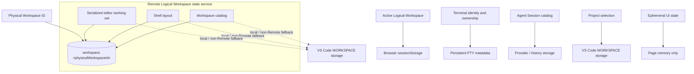
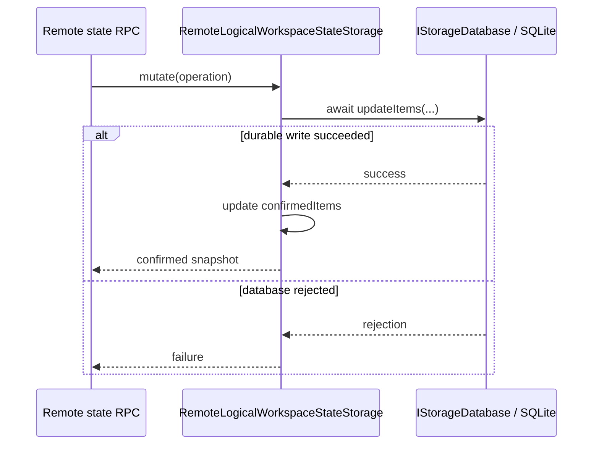
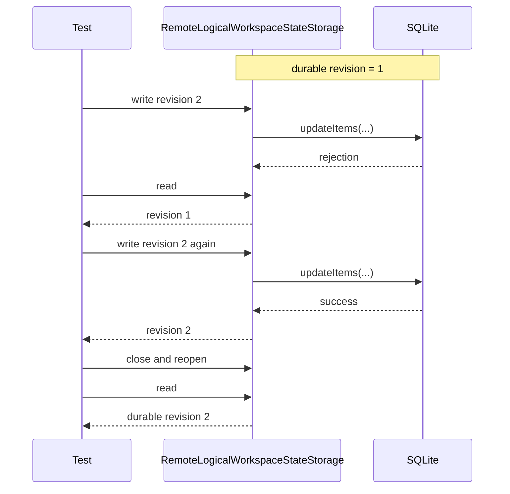

# 远端持久化：最小修改方案

> 目标：Server 只确认已经写入 SQLite 的 Logical Workspace 视图状态。
>
> 总体协议：[Logical Workspace 远端视图状态](./remote_logical_workspace_state.md)

## 状态与持久化边界

只有 Workspace catalog、Shell layout 和 serialized editor working set 进入 Logical Workspace 专用 SQLite。相邻状态分别保留自己的 authority 与持久化介质：

### Physical Workspace 命名空间与公共落点

- “归属于 Physical Workspace”表示以稳定的 Physical Workspace ID 建立命名空间，不表示把状态写入 folder、`.code-workspace` 或 `.vscode/settings.json`。
- Remote SQLite 位于 `<appSettingsHome>/globalStorage/vibe-vscode/logical-workspaces.vscdb`；部署环境只通过仓库外的 operator input 决定具体 `appSettingsHome`。
- 每个 Physical Workspace 使用 `workspace.<physicalWorkspaceId>` record。多个 Physical Workspace 可以共用数据库文件，但记录彼此隔离。
- VS Code 桌面端通常为每个 Workspace ID 使用独立的 `<workspaceStorageHome>/<workspaceId>/state.vscdb`，Web 端使用 `vscode-web-state-db-<workspaceId>` IndexedDB；共享数据库、record key、revision 与 mutation 协议均为 Vibe 新增。
- 产品要求是不同 Physical Workspace 不混写，并不要求共用一个文件。当前单库让 Remote Server 只管理一个数据库实例；代价是它不提供独立文件、故障域或权限隔离。未来可以按 Workspace 拆库而不改变 RPC 与状态模型。
- Remote shared state 的 Local / non-Remote fallback 使用 `StorageScope.WORKSPACE`、`StorageTarget.MACHINE` 下的 `workbench.logicalWorkspace.sharedState.v2`。Remote authority 可用后，该值只作为首次迁移 candidate，随后删除。

### Workspace catalog（Remote shared）

- 表示一个 Physical Workspace 内存在哪些 Logical Workspace；每项包含稳定 UUID、用户可见名称和对应的可投影视图状态。
- 它决定 Logical Workspace identity 是否存在、能否激活，不是 folder、窗口或 Git branch 列表。
- Remote Logical Workspace state service 是 authority；新 identity 只有写入对应 SQLite record 并确认后才能激活。
- Remote record 与 local fallback payload 都使用 `workspaces[].id`、`workspaces[].name`；其他页面在刷新、重连或重新打开后读取已提交的 catalog。

### Shell layout（Remote shared）

- 表示切入 Logical Workspace 时 Workbench 外壳应呈现的布局，保存 Primary Side Bar、Panel、Auxiliary Bar 的显隐、宽高和 active composite。
- Active composite 即使是 Terminal，也不映射具体 Terminal、Panel split 或 active Terminal。
- Remote snapshot 是目标状态 authority，当前页面的 VS Code Workbench Layout 是可重建 projection；Adapter 继续复用 `IWorkbenchLayoutService` 与 `IPaneCompositePartService`。
- Remote record 与 local fallback payload 都使用 `workspaces[].shellLayout`；当前页面可以 optimistic 投影，其他页面刷新或重连后可见，同一字段按 Server 到达顺序 Last Write Wins。

### Serialized editor working set（Remote shared）

- 表示切入 Logical Workspace 时 editor area 应恢复的状态，保存 main/auxiliary editor group grid、可恢复 editor inputs、MRU、active selection 和 group layout。
- 它只保存可恢复 identity 与布局，不成为文件内容、Terminal process 或 Agent Session catalog 的 authority。
- Remote snapshot 是目标状态 authority，当前 Editor Groups 是 projection；Vibe 复用 VS Code named working set 的序列化与 apply 实现，只补充 portable serialize/apply 入口。
- Remote record 与 local fallback payload 都使用 `workspaces[].editorWorkingSet`；当前页面可以 optimistic 投影，其他页面刷新或重连后可见，同一字段按 Server 到达顺序 Last Write Wins。
- VS Code 用户命名的 working sets 仍位于 `editor.workingSets`，Vibe 不改写或借用该 key。Working set 可以引用可恢复的 Terminal editor；Session Tab 尚未完成本 PR 的产品验收。

### Active Logical Workspace（Page-local）

- 表示当前浏览器页面选择的 `activeWorkspaceId`，由该页面独立决定当前 projection target。
- 持久化到浏览器 `sessionStorage` 的 `vibe.logicalWorkspace.activeWorkspaceId.<physicalWorkspaceId>`，只支持同一页面刷新恢复。
- 它不进入 Remote SQLite，也不会迫使其他页面同步切换。

### Terminal resource identity（Process lifetime）

- Terminal/PTY 层是进程生命周期、`logicalWorkspaceId` 与 `logicalTerminalId` 的 authority。
- Identity 通过现有 Shell launch config 进入 persistent PTY metadata，并跟随 Terminal process 的持久化、attach 与 reconnect 生命周期。
- 它不在 Logical Workspace SQLite 中维护 owner map；旧 `terminalIds` 只用于一次迁移。完整规则见 [Logical Workspace Terminal：identity、投影与持久化](./logical_workspace_terminal.md)。

### Agent Session catalog（Global）

- 表示 provider/history 提供的全局 Session 集合，不归属于 Logical Workspace。
- Authority、持久化能力和介质仍由原有 Session provider/history 决定，不进入 Physical Workspace 对应的 Logical Workspace record。
- 可见范围保持 VS Code 原有的全局 catalog 语义；可靠刷新和失败边界见 [Agent Session Catalog 的可靠刷新与失败处理](./reliable_agent_session_catalog.md)。

### Project selection（Physical Workspace-local）

- 表示当前聚焦的 folder URI；Explorer、Find 和 SCM 都只是该 selection 的 UI projection。
- 持久化到 `StorageScope.WORKSPACE`、`StorageTarget.MACHINE` 下的 `workbench.projectContext.selectedFolderUri`，具体介质由当前平台的 VS Code storage backend 决定。
- 它只用于当前 Physical Workspace 的 Project Context 恢复，不修改项目文件，也不进入 Logical Workspace SQLite。

### Ephemeral UI state（不持久化）

Quick Pick、hover 和 pending projection generation 只存在于当前页面生命周期，不写入任何持久层。

## 修改边界

| 边界 | 决定 |
| --- | --- |
| 新增业务接口 | 0 |
| 修改存储类 | `SQLiteStorageDatabase` 增加可选严格打开策略；`RemoteLogicalWorkspaceStateStorage` 启用它 |
| 复用 VS Code | `IStorageDatabase`、`SQLiteStorageDatabase`、`Sequencer` |
| 保持不变 | 通用 `Storage`、`IStorageService` |

当前 `Storage.set()` 先更新 cache；SQLite rejection 不会回滚 cache，重试可能把未落盘 revision 误认为成功。

修复后，`RemoteLogicalWorkspaceStateStorage` 直接通过 `IStorageDatabase` 写入 SQLite，并只在数据库确认成功后更新自己的 `confirmedItems`。

## 唯一正确顺序

数据库失败时，`confirmedItems` 保持旧 revision，RPC 不返回成功，recovery 只使用 confirmed state。

数据库初始化失败时更严格：Server 返回 `storageUnavailable`，客户端停止重试并显示错误。不得自动删除或替换数据库、恢复 backup、创建空库或回退内存；恢复决策留给用户。定期备份另由 [#10](https://github.com/ActivePeter/vibe-vscode/issues/10) 跟踪。

## 客户端规则

Layout 和 editor working set 是可覆盖的视图状态。mutation response 丢失时，客户端丢弃该 mutation 并重新 `read`，不自动重放，因此不需要 `operationId`。

Workspace UUID 是 durable identity：创建结果未知时先 `read`，已存在即确认，不存在才重试相同的幂等 create。创建确认前不会进入可激活 catalog。

Terminal ownership、Agent Session catalog、Project selection 与 page-local/ephemeral state 均保持上文列出的独立 authority，不经过该客户端 mutation 协议。

## 验收

另需覆盖：mutation 已提交但 response 丢失，另一页面写入 revision 3；原页面只 refresh、不重放，最终保持 revision 3。

还需覆盖：SQLite 无法打开时 initialize/read 均返回 `storageUnavailable`，原路径保持不变，客户端不重试且不发布成功的权威 catalog。
