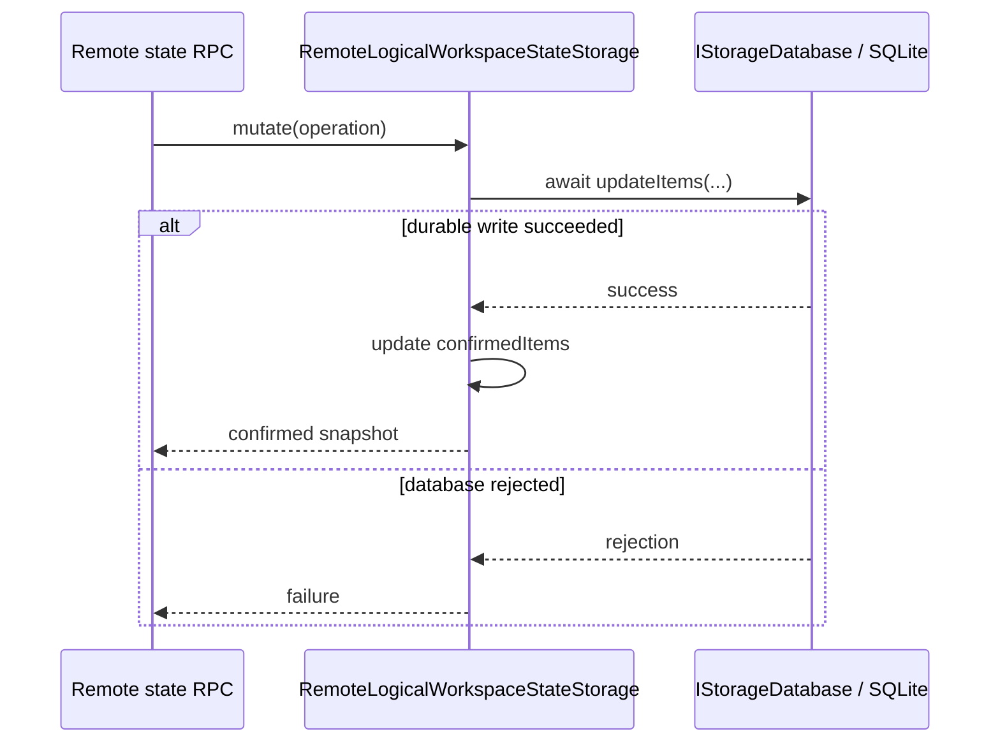
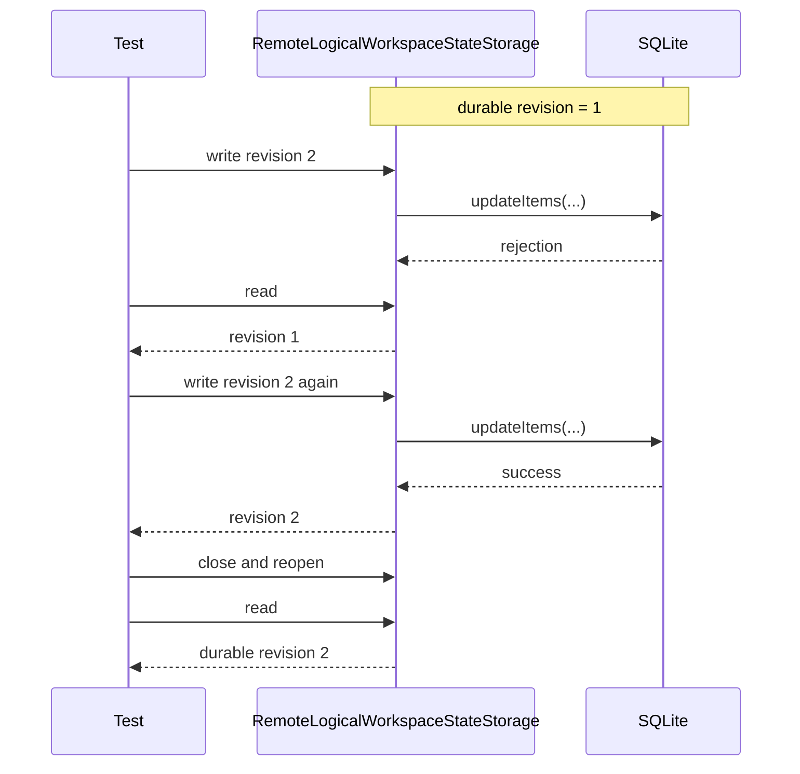

# 远端持久化：最小修改方案

> 目标：Server 只确认已经写入 SQLite 的 Logical Workspace 视图状态。
>
> 总体协议：[Logical Workspace 远端视图状态](./remote_logical_workspace_state.md)

## 修改边界

| 边界 | 决定 |
| --- | --- |
| 新增业务接口 | 0 |
| 修改存储类 | `SQLiteStorageDatabase` 增加可选严格打开策略；`RemoteLogicalWorkspaceStateStorage` 启用它 |
| 复用 VS Code | `IStorageDatabase`、`SQLiteStorageDatabase`、`Sequencer` |
| 保持不变 | 通用 `Storage`、`IStorageService` |

VS Code 桌面端通常为每个 Workspace ID 使用独立的 `state.vscdb`，Web 端使用按 Workspace ID 命名的 IndexedDB。Vibe 保留按 Physical Workspace ID 分区的原则，但新增一个共享的 Logical Workspace 专用 SQLite，并以 `workspace.<physicalWorkspaceId>` record 在库内分区；该共享数据库、record key、revision 和 mutation 协议均非上游原生逻辑。

必须保证的是不同 Physical Workspace 不混写，共用数据库文件不是产品要求。当前单库让 Remote Server 只管理一个数据库实例，避免动态维护文件路径、连接和释放生命周期。它只提供命名空间隔离；若未来需要按 Workspace 备份、恢复或隔离故障，可以拆库而不改变 RPC 与状态模型。

当前 `Storage.set()` 先更新 cache；SQLite rejection 不会回滚 cache，重试可能把未落盘 revision 误认为成功。

修复后，`RemoteLogicalWorkspaceStateStorage` 直接通过 `IStorageDatabase` 写入 SQLite，并只在数据库确认成功后更新自己的 `confirmedItems`。

## 唯一正确顺序

数据库失败时，`confirmedItems` 保持旧 revision，RPC 不返回成功，recovery 只使用 confirmed state。

数据库初始化失败时更严格：Server 返回 `storageUnavailable`，客户端停止重试并显示错误。不得自动删除或替换数据库、恢复 backup、创建空库或回退内存；恢复决策留给用户。定期备份另由 [#10](https://github.com/ActivePeter/vibe-vscode/issues/10) 跟踪。

## 客户端规则

Layout 和 editor working set 是可覆盖的视图状态。mutation response 丢失时，客户端丢弃该 mutation 并重新 `read`，不自动重放，因此不需要 `operationId`。

Workspace UUID 是 durable identity：创建结果未知时先 `read`，已存在即确认，不存在才重试相同的幂等 create。创建确认前不会进入可激活 catalog。

Terminal ownership 不属于这套状态；它随 persistent Terminal process 保存，详见 [Logical Workspace Terminal：identity、投影与持久化](./logical_workspace_terminal.md)。

## 验收

另需覆盖：mutation 已提交但 response 丢失，另一页面写入 revision 3；原页面只 refresh、不重放，最终保持 revision 3。

还需覆盖：SQLite 无法打开时 initialize/read 均返回 `storageUnavailable`，原路径保持不变，客户端不重试且不发布成功的权威 catalog。
