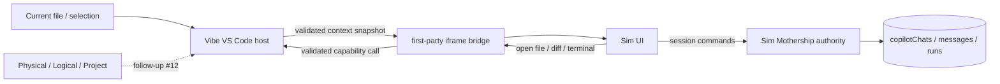

# Sim 集成与 Agent Session 唯一权威

> 适用范围：Sim 宿主、上下文桥接，以及 Agent Session 的最终收束方向
>
> 当前实现：托管 Web 的三个 surface 共用原生同源 iframe 宿主与 main 登录；Vibe 产品已关闭 VS Code 原生 Agent Sessions 的用户界面，运行态 authority 与数据迁移仍按后续阶段推进

## 结论

产品最终只保留一套 Agent Session：**Sim Mothership 是 Session 的唯一权威**。

- Sim 管理 Session identity、消息、运行状态、资源、停止与取消、归档、恢复和 fork。
- Vibe VS Code 管理 Sim 的 Sidebar、Editor、Fullscreen 投影，并提供打开文件、Diff、Terminal 和外部链接等宿主能力。
- 当前 PR 把语言、当前文件和选区作为上下文快照发送给 Sim；Physical Workspace、Logical Workspace 和 Project 等 [#12](https://github.com/ActivePeter/vibe-vscode/issues/12) 建立动态连接上下文后再接入。
- Vibe VS Code 不把 Sim Session 镜像或双写到 VS Code provider/history、Logical Workspace SQLite 或 editor working set。
- Sim 画布中的 `AgentSessionCatalog` 只组织 Workflow block 共享的逻辑 Agent ID，不是运行态 Session catalog。

## 角色边界

### Sim Mothership

Sim Mothership 拥有完整 Session 生命周期。`copilotChats` 保存 Session 与归档状态，`copilotMessages` 保存 transcript，`copilotRuns` 及其 checkpoint/tool-call 状态保存运行生命周期。

创建、更新或恢复只有在 Sim 自己的持久化契约成功后才对外确认。Vibe 页面关闭、刷新或切换 Logical Workspace 都不改变 Session 是否存在。

### Vibe VS Code 宿主

Workbench 宿主只拥有 presentation，内置扩展保留标准 VS Code API capability：

- 创建、恢复和关闭 Sidebar、Editor、Fullscreen surface；
- 采集当前可用的 Vibe 上下文并向已打开 surface 广播；
- Workbench 验证来自当前可信 Sim frame 的消息，再经内置扩展调用 VS Code API；
- 保存可重建的 Sim route，不保存 Session 内容或运行状态。

### 上下文桥接

桥接只负责跨 iframe 边界传递不可变快照和受控操作。它不持久化业务关系，也不推断 Session ownership。



## Workspace 关系

Vibe Physical/Logical Workspace ID 与 Sim Workspace ID 属于不同 authority 和命名空间，不能比较、复制或默认相等。

当前 PR 尚不把 Physical/Logical Workspace 或 Project identity 交给 Sim，只发送标准扩展 API 能稳定取得的文件上下文。扩展激活完成后提供初始快照，期间更新的上下文优先于迟到的读取结果；Sim 获取焦点时保留最后一个文本编辑器的选区。Sim 仍根据自己的 route 和权限选择 Sim Workspace；收到任何 host context 都不会自动迁移现有 Session。

后续若需要持久绑定，由 Sim 保存一条显式的外部上下文映射。缺少映射或出现歧义时由 Sim 请求用户选择，不能让 Vibe 根据当前页面状态静默创建关系。一次创建开始后应捕获 initiating context；等待 Agent、模型或后端期间切换 Workspace，不能把该 Session 重新绑定到新的当前上下文。

## 创建与恢复

```mermaid
sequenceDiagram
    participant User
    participant Host as Vibe VS Code host
    participant UI as Sim UI
    participant Sim as Sim Mothership
    participant DB as Sim persistence
    Host->>UI: available Vibe context snapshot
    User->>UI: create or open Session
    UI->>Sim: request with Sim Workspace and captured context
    Sim->>DB: persist Session / run state
    alt persistence succeeded
        DB-->>Sim: committed
        Sim-->>UI: stable Session ID and state
    else persistence failed
        DB-->>Sim: failure
        Sim-->>UI: error; no confirmed Session
    end
    Note over Host,UI: Host never writes a parallel Session record
```

刷新或重连后，Sim UI 从 Mothership 重新读取 Session。Vibe 只恢复 Sim route 和 presentation；route 可以引用 Session，但不成为 Session 的存在证明。

托管 Web 的 Sidebar、Editor 和 Fullscreen 由 Workbench 直接挂载同一 `SimFrame`，不存在 CDN Webview 祖先。Editor serializer 只保存 route；旧扩展面板恢复时把 route 交给原生 Editor 后关闭旧面板。Fullscreen 复用现有 modal editor，不覆盖别人的 modal，也不单独持久化一份 Session。

每次重试或宿主导航都替换 iframe 节点并生成新 token，不能仅修改 URL hash。只有来自当前 iframe、正确 origin 和 token 的 `ready` 才建立连接；旧 frame、超时和异步 status 响应不能覆盖新代际。服务超时提供重试入口，迟到的有效握手仍可完成连接。

当前已连接且持有焦点的 frame 将 Sim 未处理的 Escape、F1 和 Ctrl/Cmd+Shift+P 转交 Workbench 原有快捷键系统；全屏退出仍由 modal editor 拥有。普通文本编辑与 Sim 已消费的按键留在 Sim，监听随文档导航、frame 替换、登录失效或销毁释放。

## 迁移阶段

### 当前 PR：宿主与桥接

- 把 Sim 接入 Activity Bar、Editor 和 Fullscreen surface。
- 建立带 origin、frame token 和 route 校验的消息桥。
- 发送语言、当前文件和选区，并提供受控 VS Code capability。
- 保持现有 VS Code Session 实现不变，不增加 adapter、mirror 或双写。

### 当前增量：会话界面收束

- `product.json` 通过单一产品开关关闭 VS Code 原生 Agent Sessions UI；未声明该开关的上游产品仍保持默认启用。
- Web Server 在加载 Workbench 模块前把运行时产品配置合并进产品对象，确保命令、菜单和贡献点从一开始就不注册，而不是只在首次渲染时隐藏。
- 普通 Chat 不再展示 Sessions catalog、会话选择标题栏、Agent 状态栏、Sessions Quick Access、Agent Sessions Welcome 或 Agents Window 推广入口。
- Electron 的命令、`--agents`、最近项目和程序化窗口路径使用同一开关；`--agents` 在关闭时按普通窗口启动，底层窗口服务也拒绝创建 Agents Window。
- 底层 Session service、provider 和历史实现暂时保留，避免把 UI 收束扩大为上游基础设施删除；它们不接收 Sim Session 的镜像或双写。
- 本增量只建立“用户只看到 Sim 一套会话界面”的边界，不代表原生 Session 数据已经导入 Sim，也不提前实现 Workspace authority 映射。

### 后续 PR：Sim 消费上下文

- 由 [#12](https://github.com/ActivePeter/vibe-vscode/issues/12) 提供 authority-ready、可更新的 Physical/Logical Workspace 与 Project context。
- 在 Sim 内建立明确的 Vibe context 消费入口和可选 Workspace binding。
- 将 Vibe 中面向用户的 Session 创建、浏览和恢复入口统一路由到 Mothership。
- 用 Sim contract test 覆盖创建失败、重连、归档、恢复、fork 和权限。

### 最终切换

- 产品入口不再展示一套竞争的 VS Code 原生 Session catalog。
- 若已有用户数据需要保留，执行一次由 Sim 拥有、可对账的导入；导入完成后删除迁移路径，不长期维护双 authority。

## 信任与依赖边界

- Vibe VS Code 的源码、构建和部署不依赖任何本地 Sim checkout。
- Sim 是运行时服务依赖，通过同源 Caddy gateway 接入；`vibe-vscode.sim.baseUrl` 仅接受同源地址，留空使用 Workbench origin，不接受凭证、query 或 fragment。
- Sim 前端是受信任的第一方应用，不是任意扩展 Webview。它与 Workbench 同源；消息 token 防止过期 frame 和错误来源调用能力，不是对被攻陷的同源应用的安全隔离。
- route 必须始终解析在已配置的 origin 和 base path 内；frame 消息还必须匹配当前 iframe、origin 和一次性 token。
- Caddy 提供传输与统一授权入口，不成为 Agent Session authority。

### 对齐 main 的登录职责

账号、登录 Cookie、续期、退出及请求授权以 [全屏登录与实例认证](login_authentication.md) 为唯一契约。Sim 宿主不读写凭据、不创建登录 token、不维护认证会话副本，也不改变 main 的 `SameSite=Lax` 或 CSP。

旧链路中的 CDN Webview 祖先使内层 Sim 请求变成跨站请求，浏览器不发送 main 的登录 Cookie，并可能另行要求 Local Network Access。现在 iframe 直接位于同源 Workbench 中，沿用第一方 Cookie；删除旧授权提示状态机，不为通用扩展 Webview 增加同源例外。

Sim 页面、资源、API 和 Socket.IO 握手全部经过 Caddy 的同一个 `forward_auth`。加载失败或页面重新获得焦点时，宿主只读取 main 的 `/auth/api/status`：明确的未登录响应会移除当前 frame，并提供顶层登录入口；404、网络失败和无效响应不能被解释为退出。登录页始终留在顶层，返回地址保留 Workbench 路径与查询参数。

当前 Sim 网关使用根路径路由，托管集成使用根路径实例入口；非根 `serverBasePath` 的 Sim 路由与 Cookie path 适配不在本次验证范围。独立 Sim 服务的直接入口仍由它自己的部署负责保护，Vibe gateway 不替代那一入口的访问控制。

## 主要代码

- `src/vs/workbench/contrib/sim/browser/simWorkbenchService.ts`：surface 编排、route 投影和扩展能力调用。
- `src/vs/workbench/contrib/sim/browser/simFrame.ts`：第一方 iframe、连接代际和消息桥。
- `src/vs/workbench/contrib/sim/browser/simEditorInput.ts`、`simEditorPane.ts`、`simViewPane.ts`：Editor 恢复、modal 和 Activity Bar projection。
- `src/vs/workbench/contrib/sim/common/sim.ts`：消息与 route 边界。
- `extensions/vibe-vscode/src/extension.ts`：旧面板迁移、上下文采集和标准 VS Code capability。
- `resources/server/vibe-vscode/Caddyfile`：Sim 运行时反向代理。

## 验收边界

- 干净 Vibe checkout 可以独立构建，不读取或调用 sibling checkout。
- 任意 route 都不能逃离配置的 Sim origin 或 base path。
- 旧 iframe、错误 origin 或错误 token 不能调用宿主 capability。
- 只有 main 决定登录是否有效；过期鉴权响应不覆盖新 frame 或已完成的握手，非认证服务故障不会变成第二个登录流程。
- 已接入的文件与选区变化会更新 Sim projection，但不会修改已确认 Session 的 identity；未来 Workspace context 必须遵守同一约束。
- Vibe 仓库中不存在 Sim Session catalog、transcript、run-state mirror 或 Logical Workspace Session owner。
- Vibe 产品中无法通过设置、命令、启动参数、最近项目或程序化窗口调用重新打开 VS Code 原生 Agent Sessions UI。
