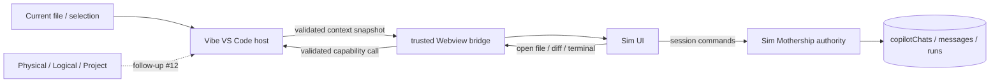

# Sim 集成与 Agent Session 唯一权威

> 适用范围：Sim 宿主、上下文桥接，以及 Agent Session 的最终收束方向
>
> 当前实现：PR #11 只交付宿主与桥接；Session authority 的产品入口切换尚未执行

## 结论

产品最终只保留一套 Agent Session：**Sim Mothership 是 Session 的唯一权威**。

- Sim 管理 Session identity、消息、运行状态、资源、停止与取消、归档、恢复和 fork。
- Vibe VS Code 管理 Sim 的 Sidebar、Editor、Fullscreen 投影，并提供打开文件、Diff、Terminal 和外部链接等宿主能力。
- 当前 PR 把语言、当前文件和选区作为上下文快照发送给 Sim；Physical Workspace、Logical Workspace 和 Project 等 [#12](https://github.com/ActivePeter/vibe-vscode/issues/12) 建立动态连接上下文后再接入。
- Vibe VS Code 不把 Sim Session 镜像或双写到 VS Code provider/history、Logical Workspace SQLite 或 editor working set。
- Sim 画布中的 `AgentSessionCatalog` 只组织 Workflow block 共享的逻辑 Agent ID，不是运行态 Session catalog。

## 角色边界

### Sim Mothership

Sim Mothership 拥有完整 Session 生命周期。`copilotChats` 保存 Session 与归档状态，`copilotMessages` 保存 transcript，`copilotRuns` 及其 checkpoint/tool-call 状态保存运行生命周期。

创建、更新或恢复只有在 Sim 自己的持久化契约成功后才对外确认。Vibe 页面关闭、刷新或切换 Logical Workspace 都不改变 Session 是否存在。

### Vibe VS Code 宿主

宿主只拥有 Webview presentation 与 VS Code capability：

- 创建、恢复和关闭 Sidebar、Editor、Fullscreen surface；
- 采集当前可用的 Vibe 上下文并向已打开 surface 广播；
- 验证来自可信 Sim frame 的消息，再调用 VS Code API；
- 保存可重建的 Sim route，不保存 Session 内容或运行状态。

### 上下文桥接

桥接只负责跨 iframe 边界传递不可变快照和受控操作。它不持久化业务关系，也不推断 Session ownership。



## Workspace 关系

Vibe Physical/Logical Workspace ID 与 Sim Workspace ID 属于不同 authority 和命名空间，不能比较、复制或默认相等。

当前 PR 尚不把 Physical/Logical Workspace 或 Project identity 交给 Sim，只发送标准扩展 API 能稳定取得的文件上下文。Sim 仍根据自己的 route 和权限选择 Sim Workspace；收到任何 host context 都不会自动迁移现有 Session。

后续若需要持久绑定，由 Sim 保存一条显式的外部上下文映射。缺少映射或出现歧义时由 Sim 请求用户选择，不能让 Vibe 根据当前页面状态静默创建关系。一次创建开始后应捕获 initiating context；等待 Agent、模型或后端期间切换 Workspace，不能把该 Session 重新绑定到新的当前上下文。

## 创建与恢复

```mermaid
sequenceDiagram
    participant User
    participant Host as Vibe VS Code host
    participant UI as Sim UI
    participant Sim as Sim Mothership
    participant DB as Sim persistence
    Host->>UI: available Vibe context snapshot
    User->>UI: create or open Session
    UI->>Sim: request with Sim Workspace and captured context
    Sim->>DB: persist Session / run state
    alt persistence succeeded
        DB-->>Sim: committed
        Sim-->>UI: stable Session ID and state
    else persistence failed
        DB-->>Sim: failure
        Sim-->>UI: error; no confirmed Session
    end
    Note over Host,UI: Host never writes a parallel Session record
```

刷新或重连后，Sim UI 从 Mothership 重新读取 Session。Vibe 只恢复 Sim route 和 presentation；route 可以引用 Session，但不成为 Session 的存在证明。

## 迁移阶段

### 当前 PR：宿主与桥接

- 把 Sim 接入 Activity Bar、Editor 和 Fullscreen surface。
- 建立带 origin、frame token 和 route 校验的消息桥。
- 发送语言、当前文件和选区，并提供受控 VS Code capability。
- 保持现有 VS Code Session 实现不变，不增加 adapter、mirror 或双写。

### 后续 PR：Sim 消费上下文

- 由 [#12](https://github.com/ActivePeter/vibe-vscode/issues/12) 提供 authority-ready、可更新的 Physical/Logical Workspace 与 Project context。
- 在 Sim 内建立明确的 Vibe context 消费入口和可选 Workspace binding。
- 将 Vibe 中面向用户的 Session 创建、浏览和恢复入口统一路由到 Mothership。
- 用 Sim contract test 覆盖创建失败、重连、归档、恢复、fork 和权限。

### 最终切换

- 产品入口不再展示一套竞争的 VS Code 原生 Session catalog。
- 若已有用户数据需要保留，执行一次由 Sim 拥有、可对账的导入；导入完成后删除迁移路径，不长期维护双 authority。

## 信任与依赖边界

- Vibe VS Code 的源码、构建和部署不依赖任何本地 Sim checkout。
- Sim 是运行时服务依赖，通过同源 Caddy gateway 或显式 `vibe-vscode.sim.baseUrl` 接入。
- 配置的 Sim URL 代表用户信任的服务；URL 不接受凭证、query 或 fragment。
- route 必须始终解析在已配置的 origin 和 base path 内；frame 消息还必须匹配当前 iframe、origin 和一次性 token。
- Caddy 只提供传输与同源入口，不成为 Session authority。

## 主要代码

- `extensions/vibe-vscode/src/extension.ts`：surface 生命周期、上下文采集和 VS Code capability。
- `extensions/vibe-vscode/src/simWebview.ts`：可信 iframe 宿主与消息桥。
- `extensions/vibe-vscode/src/simSidebar.ts`：Activity Bar projection。
- `extensions/vibe-vscode/src/simWebviewProtocol.ts`：URL 与 route 边界。
- `resources/server/vibe-vscode/Caddyfile`：Sim 运行时反向代理。

## 验收边界

- 干净 Vibe checkout 可以独立构建，不读取或调用 sibling checkout。
- 任意 route 都不能逃离配置的 Sim origin 或 base path。
- 旧 iframe、错误 origin 或错误 token 不能调用宿主 capability。
- 已接入的文件与选区变化会更新 Sim projection，但不会修改已确认 Session 的 identity；未来 Workspace context 必须遵守同一约束。
- Vibe 仓库中不存在 Sim Session catalog、transcript、run-state mirror 或 Logical Workspace Session owner。
