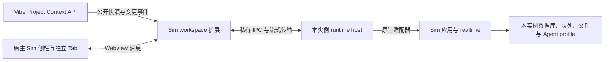
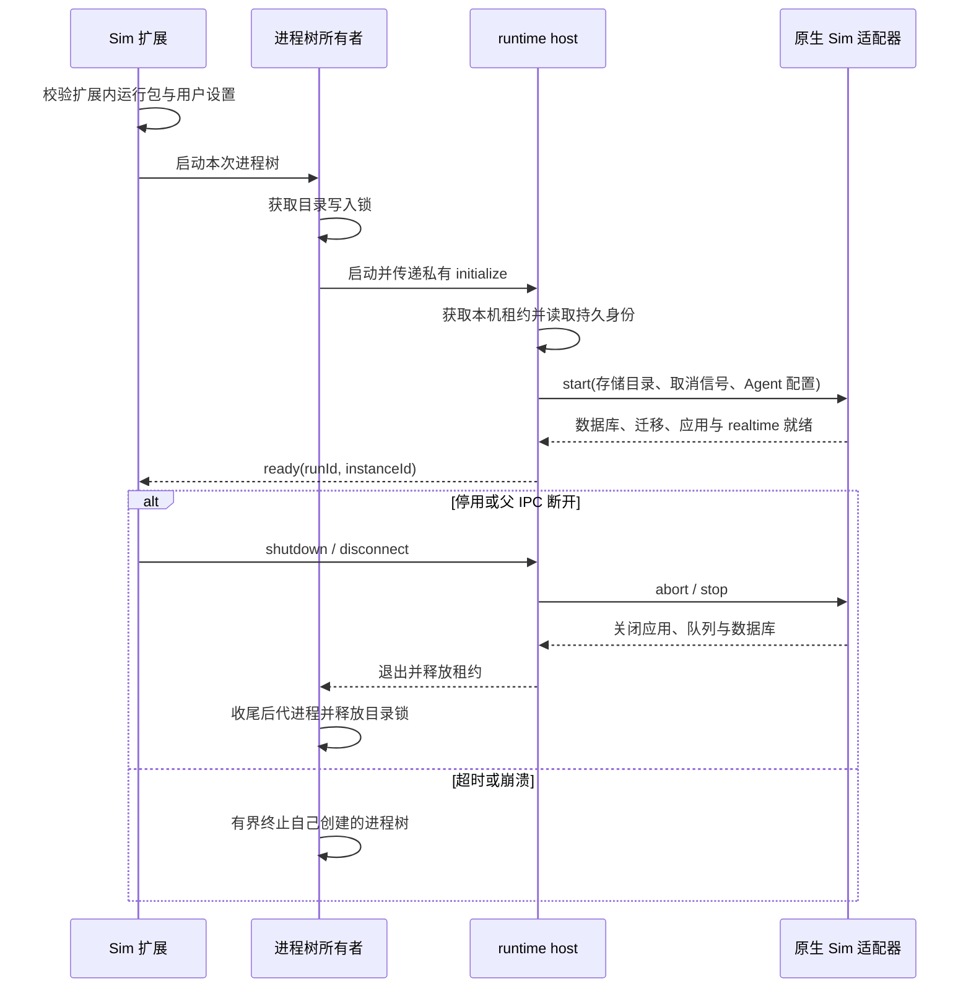

# Sim 插件运行时：生命周期与实例隔离

## 实现边界

Sim 的原生侧栏、workflow、DAG、Agent 会话和全局监控由 `extensions/vibe-sim` 承载。
它是运行在 Node Extension Host 的 workspace 扩展，使用标准 Webview View 和 Webview Panel；
不再依赖 Workbench 中的第二套 Sim 宿主或固定共享网站。当前完整原生包支持 Linux x64。

会话、消息、模型及权限选择、工作流和 DAG 都继续使用 Sim 自身的组件、API 与数据库。
插件只提供宿主能力、私有传输和生命周期，不维护另一份会话列表或写死业务内容。
原有共享数据不自动导入；具体边界见[旧实例与数据](#旧实例与数据)。

## 唯一所有者与接口

| 角色 | 拥有 | 不拥有 |
| --- | --- | --- |
| Vibe Project Context API | 就绪后的不可变物理工作区、Logical Workspace 和项目快照 | Sim 运行时与会话 |
| Sim workspace 扩展 | 运行实例、标准侧栏/Tab、Agent 用户设置、宿主能力与私有连接 | Vibe 项目选择权、第二份业务数据库 |
| 插件进程树所有者与 runtime host | 子进程清理、单写入者租约、实例身份、已确认的项目投影 | 浏览器登录、Sim 业务编排 |
| 原生 Sim 适配器 | 本实例 PostgreSQL、Redis、文件、Agent profile 及原生服务的生命周期 | 全局共享服务、其他实例的凭据 |
| 原生 Sim | 会话、执行、持久化、查询、工作流、DAG 及监控 | VS Code 工作区的权威事实 |
| main 的登录边界 | 浏览器账户、会话 Cookie、HTTP/WebSocket 入口鉴权 | Agent profile、跨插件协作的业务代理 |

插件之间通过公开 API 或命令协作，跨 Extension Host 复用 VS Code RPC。
Vibe UI 扩展保留自己的运行位置；Sim 不通过共享后端读取项目或控制编辑器。

### 项目投影的就绪与顺序

订阅在等待初始快照前注册，初始读取与变更事件使用同一 generation 空间。
Sim 扩展先等待 Vibe authority 就绪，再把快照交给持有存储租约的 runtime host。
host 以私有文件的原子替换应用新 generation，并返回匹配 runId/requestId 的确认；
确认之前不向界面发布该快照，确认超时则停止该运行实例，不能继续使用未知权限投影。

同一 run 的旧 generation 不能覆盖新快照；重启开启新的 generation 空间。
Agent 执行根据该投影核验物理工作区、remote authority、项目 URI 及真实路径，不接受页面伪造的项目目录。
这是 Vibe 权威事实的只读投影，不是另一套项目管理功能。

文件右键创建 Chat 时立即捕获选区，在 authority 就绪处固定发起者项目身份。
后续侧栏初始化、创建与回包均使用同一个请求身份；焦点或项目已切换时不抢回新页面。
重试由 Sim 原生幂等创建契约处理，不自动重放 Agent turn。

## 生命周期与隔离单位

服务所有者是 Extension Host 中的插件实例，不是某个 Tab。打开 Sim 侧栏、资源或显式启动命令
会按需启动运行时；关闭、隐藏、切换 Tab 不停止它。扩展停用或 Extension Host 退出才释放服务。
宿主关闭后的后台续跑不是当前承诺，不能把中断伪装成成功或自动重发可能有副作用的任务。

存储使用 `storageUri/runtime`，空窗口使用 `globalStorageUri/empty-workspace/runtime`。
这里的工作区是 VS Code 物理工作区，不是当前选择的 Logical Workspace 或项目。
不同 Vibe 实例必须提供各自的扩展存储；端口、临时 URL、PID 和活动 Tab 都不是实例身份。
持久化随机身份保存在 `instance.json`，重启不得重新生成或静默修复损坏身份。

每个存储域独立持有 PostgreSQL 数据目录、Redis 持久化文件、uploads、应用密钥和 Agent profile。
数据库不继承 `DATABASE_URL`、`REDIS_URL` 或共享 Sim 环境；密钥在首次持有租约时生成并以私有权限保存。
部署和运行包不包含这些可变数据。包回滚不等于数据库回退，数据库兼容性和迁移仍由 Sim 原生协议检查。

### 单写入者与进程退出

Linux 进程树所有者在接收 initialize 之前对真实存储目录持有 `flock`；
runtime host 另以目录设备/inode 对应的 abstract Unix socket 保持本机租约。
重复启动或经符号链接进入同一目录都明确报告 busy，不删除“疑似过期”的锁来抢占。
同一 storage 的多窗口目前不支持共享 attach；独立存储域才能独立运行。
这不是操作系统权限沙箱，也不承诺未经验证的跨主机共享文件系统协调。

并发 start 合并。迟到的 ready、项目确认和请求响应只能作用于所属 run。
stop 等待真实退出；未确认退出前不启动第二个 writer。清理只针对本插件创建的进程，
不按固定端口查杀、不接管任意 PID、不依赖正常情况下才执行的 `deactivate`。
该进程树清理程序随插件运行，不是系统级 Supervisor 或常驻全局服务。

## 原生界面与私有传输

侧栏保持原生 Sim 布局。同一 workflow、DAG 或 Chat 复用对应标准 Tab，不同资源各自打开；
全局 Agent 监控是单独的单例 Tab。活动 Tab 只发送侧栏导航/选择消息，不重新设置侧栏 HTML。
新 Tab 通过标准 Webview serializer 保存路径与标题，不保存运行时地址或业务副本。

静态资源通过只读 VS Code 文件系统提供；fetch、SSE、WebSocket 和清理 beacon 通过 Webview 消息传输。
响应分块并受拉取背压约束，关闭 Tab 只取消该 Tab 的 I/O。普通请求正文上限 64 MiB，
兼容 Sim 原有 50 MiB 整文件 PUT 与后续分片上传；上传仍复用原生重试、取消和完成校验。
fetch 上传仅报告已确认的完成进度。beacon 是尽力发送，不能替代持久化或关闭确认。

内部 HTTP/realtime 使用随机 loopback 监听，数据库与 Redis 使用私有 Unix socket 并由适配器按需转接。
这些是受控进程间实现细节，不提供独立网页或固定公开端口，也不要求用户启动外部 Sim 网站。
页面只提交 Sim 路径，不获得内部地址、数据库凭据或 gateway 密钥。
NativeClient 独占设置虚拟同源 authority、过滤伪造头，并将内部重定向改为页面路径；
不同实例及外部重定向均不能携带当前实例凭据。

main 继续独占浏览器登录。新 Caddy 配置没有共享 Sim 上游，也不加载共享 Sim 配置；
恢复已验证旧版本时，由该版本的部署兼容契约保留所需输入，不能让新插件依赖它们。
插件使用私有随机 gateway 校验内部请求，不再要求浏览器执行第二次“Allow and Open Session”登录授权。

## Agent 安装、登录与权限

Agent CLI 由运行 Extension Host 的环境提供；可在 Sim 的“配置 Agent 运行环境”命令中选择
`sim.agent.codexExecutable` 和 `sim.agent.claudeExecutable`。只读取用户/远端机器设置，
忽略工作区配置，不能让项目文件替换待执行程序。

“为本实例登录 Agent”使用 VS Code Terminal，“打开本实例的 Agent 配置”使用标准编辑器。
两者与原生执行共用 `agents/codex`、`agents/claude` 下的 profile 契约及私有 HOME，
不复制主机默认凭据、共享服务凭据或另一实例的历史会话；并发登录不会创建重复终端。

权限上限同样由插件用户/远端机器设置提供：默认只读，`sim.agent.codexSandbox` 可开启项目内读写，
`sim.agent.allowUnrestricted` 可允许会话显式选择“不限制”。开启上限不把“不限制”设为默认。
实际选择和执行前校验仍由 Sim 负责，工作区覆盖无权提升上限。
更改可执行程序或权限上限后需停止并重新启动 Sim；同一 run 内使用启动时捕获的设置。

## 运行包与发布

`native/lock.json` 固定 Sim 提交和下载校验和，以及 Bun、PostgreSQL、pgvector 和 Redis 的版本。
构建入口相对本 checkout 解析资源，从锁定归档创建干净的临时源码；不构建 sibling checkout，
不把开发缓存中的未提交 Sim 修改当成发布源。Node.js 24、原生依赖及许可证随包交付。

`runtime/sim-runtime.json` 描述版本、适配器、包内 Node 和进程树所有者。
manifest、入口和所有必需资源必须真实位于包内。缺失、越界、非可执行数据库程序或不兼容版本
会失败关闭，绝不以测试夹具或共享网站兜底。

Linux x64 Server 产品打包和 18080 更新入口都先构建完整原生包；普通 TypeScript 编译不重复执行大构建。
已有相同锁定产物可复用。标准扩展收集器负责把包放进产品，没有第二条旁路打包体系。
`verifyRuntime` 在切换服务前只读校验完整资源与 Node 版本，不打开用户数据库。
发布锁、不可变候选、健康检查与回滚继续由现有部署事务拥有。

开发、构建和测试命令见[扩展 README](../../extensions/vibe-sim/README.md)；
浏览器鉴权见[main 登录契约](login_authentication.md)。

## 旧实例与数据

旧共享数据库、会话、运行记录、文件及登录凭据都保留原位，不自动复制、删除、迁移或合并。
新插件存储域从自身原生数据库读取，旧数据库中的同名资源不会被写死成界面内容。
迁移需先确定目标 Vibe 实例，再针对明确范围备份、导入并核验。

旧 Workbench 自定义 Sim Tab 不映射到新数据库：相同路径 ID 不代表相同资源。
切换版本后需从新的 Sim 侧栏重新打开资源；只有新插件创建的标准 Webview Tab 才按其 serializer 恢复。
旧共享服务可以继续服务旧实例，但不再作为新插件的隐式后备。

## 验收边界

自动回归覆盖真实子进程的启动合并、取消、崩溃、IPC 断开、单写入者、路径越界及有界清理；
原生包回归另外使用真实 PostgreSQL、Redis 和 Sim API 验证双实例会话、凭据、停止/重启及队列隔离。
项目 generation 确认、Webview 流式传输、上传、Agent 用户设置和标准 Tab 投影各有针对性测试。

界面验收需覆盖侧栏创建项目会话、不同资源独立 Tab、切换保留侧栏、监控投影及 Agent 流式结果。
模型端真实成功回复依赖当前实例的明确登录和上游可用性；上游拒绝必须显示为失败，不能算成成功验收。
