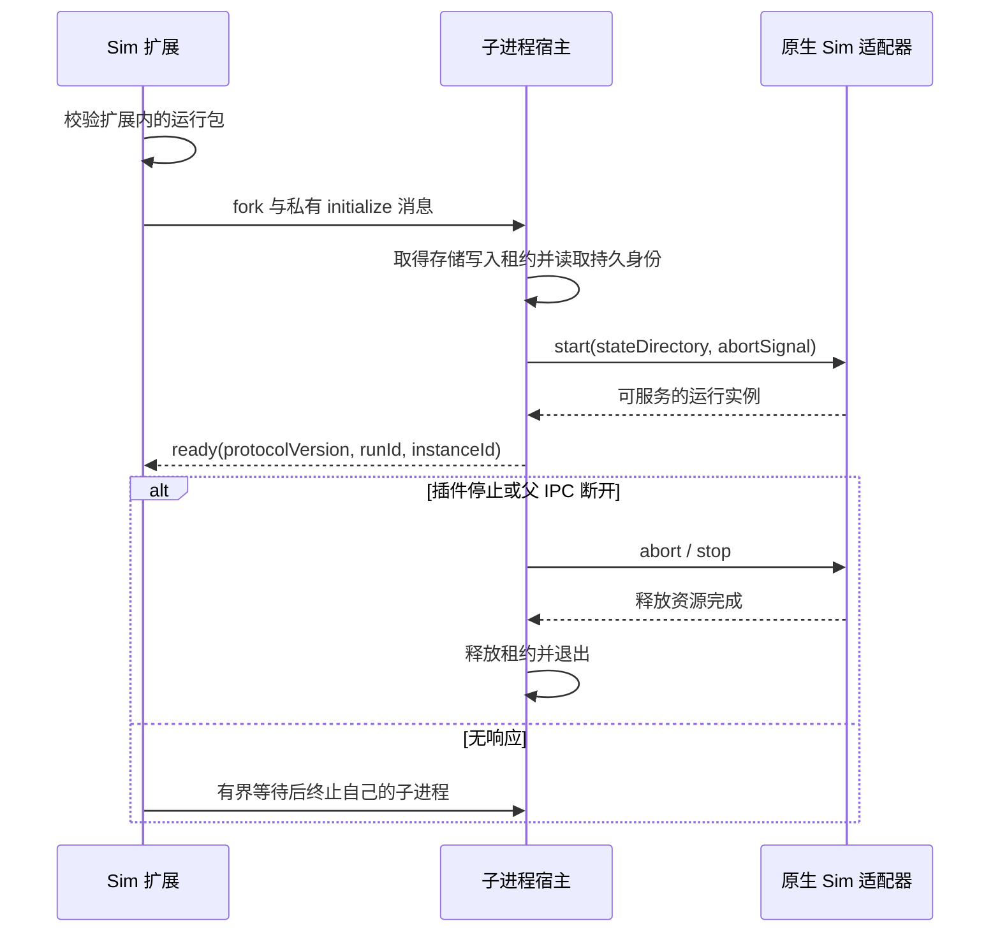

# Sim 插件运行时：生命周期与实例隔离

## Review 结论与当前差距

本设计用于 PR #11 的插件化整改。共享 Sim 网站的同源 iframe 接入不等于完整插件化：
目前 Vibe 插件提供项目上下文和编辑器能力，Sim UI 主要由 Workbench 承载，服务由部署配置
指向外部上游。两个 Vibe 实例连接相同上游时会使用同一个 Sim 数据域，登录 Cookie 隔离不能
改变这一点。本次结论修正该过渡实现，不改变“Sim 是 Agent 会话唯一 authority”的方向。

## 唯一所有者与接口

| 角色 | 拥有 | 不拥有 |
| --- | --- | --- |
| Sim workspace 扩展（Node Extension Host） | 服务启动、就绪门槛、连接、停止与失败报告 | Vibe 项目选择、第二份 Agent 会话目录 |
| Sim 子进程 | 原生会话、消息、执行、持久化及存储写入租约 | Workbench UI 生命周期、跨插件命令转发 |
| Sim 界面 | 原有侧栏、独立资源 Tab、可重建展示状态 | 子进程启动、数据库凭据、任务所有权 |
| Vibe Project Context API | 权威就绪后的不可变项目快照 | Sim 服务启动与 Sim 存储 |
| Vibe main 鉴权与通用宿主能力 | 实例入口鉴权、已有 Extension Host RPC、受控文件/终端能力 | 独立部署一个全局 Sim 网站 |

插件之间通过导出 API 或公开命令协作；跨 Extension Host 使用 VS Code 已有 RPC。
界面与扩展使用受控消息桥。Agent 执行和持久化可以在服务器进行，但不能把共享业务网站
当成插件之间读取项目、选择文件或控制编辑器的中转层。


## 生命周期与隔离单位

Sim 服务必须由插件按需启动；正常停用时优雅停止，Extension Host 异常退出时由父子 IPC
断开触发清理，超时只终止本插件实际创建的子进程。不能按固定端口查杀、按任意 PID 接管，
不能默默附着到已有全局服务，也不能只依赖正常退出才执行的 `deactivate`。

服务所有者是 Extension Host 中的插件实例，而非侧栏或某个 Tab。关闭、隐藏或切换 Tab
只释放展示资源。整个宿主退出后的后台续跑不是本阶段承诺；需要另行定义任务托管协议。
持久化会话仍保留；服务中断不能被伪装成任务成功，也不能自动重放可能已产生副作用的任务。

存储使用扩展的 `storageUri`，无工作区时使用 `globalStorageUri` 下的专用子目录。
身份由该目录中的持久化随机 ID 确定，不由端口、PID、窗口或临时 URL 推导。独立 Vibe
实例必须提供独立扩展存储，且原生 Sim 适配器必须真实绑定相应数据库、文件与队列命名空间。
给两个进程传入不同目录，却继续读取同一个环境变量中的数据库地址，不算隔离。

同一个存储目录只允许一个写入运行时。首阶段使用进程持有的独占租约，重复启动明确报 busy，
不暗中启动第二个 writer。多窗口共享需要经过有身份校验的 attach/lease 协议后再开放，
不能把两个 Extension Host 误当成天然互斥，也不能用目录名冒充权限隔离。

首阶段具体使用 `storageUri/runtime`，空窗口使用 `globalStorageUri/empty-workspace/runtime`。
这里的工作区是 Extension Context 对应的 VS Code 物理工作区，不是侧栏当前选中的 Vibe
Logical Workspace 或项目；项目切换不得重建该服务。`instance.json` 在独占租约内创建并持久化。
Linux 租约由内核持有的 abstract Unix socket 实现，以真实目录的设备与 inode 标识互斥，
不使用固定 TCP 端口，也不靠删除“疑似过期”的锁文件恢复。首阶段只支持同一 Linux 内核及
网络命名空间；这不是跨机器共享文件系统的分布式锁，也不是操作系统权限沙箱。
其他平台在具备等价的崩溃安全租约之前明确拒绝启动。

## 启动、取消与退出契约



并发启动合并为同一次操作。启动就绪前不返回可用状态；停止与启动交错、旧进程迟到的 ready、
初始化失败与进程崩溃不得把已停止的新一代状态改回 ready。停止返回时必须确认子进程已退出。
失败显式报告且允许一次新的用户请求重试，不自动重复会话创建或 Agent 执行。

运行包来自扩展自己的资源目录，采用版本化 manifest 和适配器接口；禁止构建/启动另一个
VS Code checkout，禁止接受工作区提供的任意 shell 命令。缺少运行包、入口越界、协议不兼容、
损坏的身份文件或占用中的存储都失败关闭，不回退到全局上游。进程通信不使用固定 TCP 端口；
运行包不继承部署环境中可能指向共享数据库或携带服务凭据的整个环境。

### 运行包格式与扩展入口

`extensions/vibe-sim` 是独立的 Node workspace 扩展，不更改现有 UI project-switcher 扩展的
运行位置。它只在显式命令触发时激活：`vibe-vscode.sim.startRuntime`、`stopRuntime` 与
`showRuntimeStatus`（后两者同属 `vibe-vscode.sim` 命名空间），不贡献第二份会话界面。
不受信任和虚拟工作区不支持启动；命令不接受工作区提供的入口或环境覆盖。

原生包须随扩展放在 `runtime/`，由 `runtime/sim-runtime.json` 声明：

```json
{
  "protocolVersion": 1,
  "version": "0.0.1",
  "entrypoint": "./adapter.mjs"
}
```

manifest、运行目录和入口的真实路径都必须位于扩展自有资源边界中。适配器导出 `start`，
完整参数与停止接口以 [SimRuntimeAdapter](../../extensions/vibe-sim/src/protocol.ts) 为准。
`start` 完成代表真实可服务；它必须在取消或失败时清理尚未返回的资源，返回的实例拥有
之后的 `stop`，包括它创建的 worker。父 IPC 断开后的有界清理要求适配器不阻塞宿主事件循环。
强制退出不代表未完成的 Agent 任务成功；原生执行恢复协议仍由第二阶段补齐。

子进程只保留运行所需的基本进程环境，并明确丢弃数据库、Redis、Sim upstream、鉴权密钥、
`NODE_OPTIONS` 等环境配置。运行包不能依靠自动读取工作区或用户的共享配置恢复这些值；
原生适配时必须通过专属存储及明确的凭据契约接入，而不是解除环境筛选。

## 迁移与实施顺序

- 第一阶段（本 PR 当前实现）：增加 Node workspace Sim 扩展和可测试的真实子进程宿主，交付启动合并、身份存储、
  独占租约、就绪/取消/停止/崩溃协议与测试。通过显式命令启动，不替换现有 UI，不宣称已运行原生 Sim。
- 第二阶段：在 Sim 工程产出不可变运行包，适配其原生数据库、文件、队列及执行生命周期；
  验证实际 Sim 双实例隔离，再把侧栏和资源 Tab 转为扩展宿主下的原生 Sim UI。
- 第三阶段：明确现有数据的目标实例并执行可核验迁移，完成多窗口 attach 及端到端验收后，
  移除共享上游的默认依赖和过渡 Workbench 宿主。不得自动清空、复制整套数据库或修改现有账号。

第一阶段的 fixture 仅验证插件进程和文件隔离，不能替代第二阶段的原生 Sim 数据库/队列测试。
原有 Project Context API、选择快照的 initiating identity、main 鉴权以及逐资源 Tab 语义保持不变。
当前构建未包含原生 `runtime/sim-runtime.json`；启动命令明确报告未打包，不运行测试夹具，
现有共享 Sim 数据与页面入口也尚未切换。测试与开发构建入口见
[Sim Runtime 扩展](../../extensions/vibe-sim/README.md)。

## 验收门槛

- 两个不同存储目录可以并行启动，身份不同，互不停止或写入对方数据；同目录第二个 writer 被拒绝。
- 并发 start 只创建一个子进程；ready 之前的调用不能把 starting 当作可用。
- 启动中 stop、延迟 ready、超时、进程 error/exit、插件 dispose 及父 IPC 断开均有可控测试。
- 停止有界且等待实际退出，异常清理不触碰未知进程；重启保留持久身份和数据。
- 缺失运行包、目录穿越、入口符号链接越界、未知协议、损坏身份和共享环境变量均不能绕过隔离。
- 正式切换还须覆盖原生 Sim 会话、运行记录、文件和队列隔离；同实例多窗口与独立实例均不能串数据。
- 扩展包可从任意 checkout 位置构建，运行只使用包内资源及扩展提供的存储目录；不发布开发机路径。
