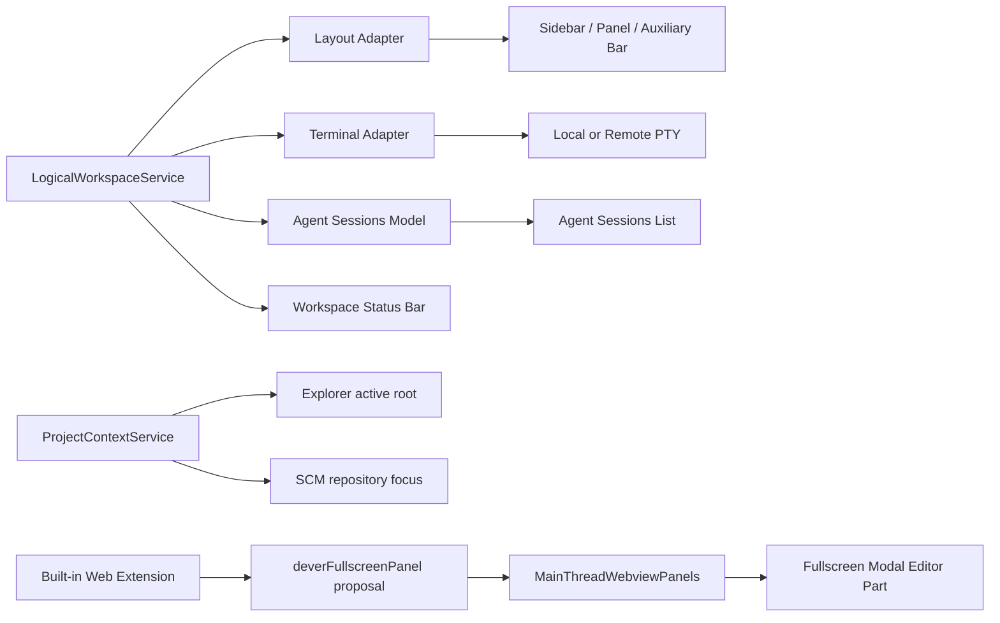
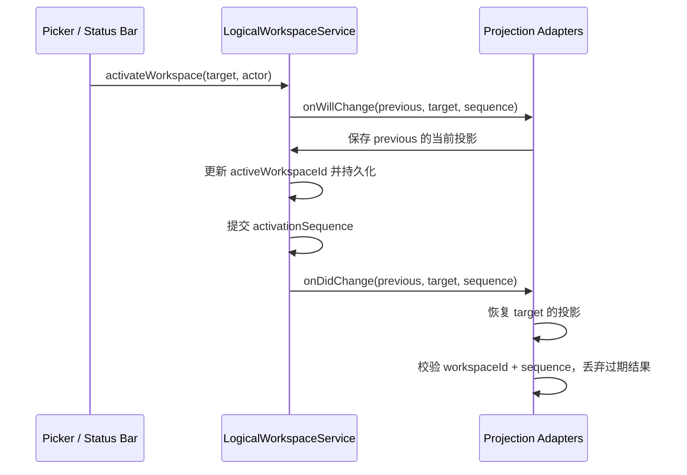

# vibe vscode 当前改动设计

本文记录 PR #1（`feat/dever-workspaces-fullscreen`）所引入代码的实际设计与边界。它描述当前实现，不把 Roadmap 中尚未完成的能力视为已交付。

## 1. 实现边界

| 能力 | 当前状态 | 本次改动的边界 |
| --- | --- | --- |
| Logical Workspace registry 与切换事务 | 已实现基础能力 | 创建、选择、唯一资源归属和 activation sequence |
| 工作台布局投影 | 已实现基础能力 | 主侧栏、底部面板、辅助侧栏的显隐、尺寸和 active composite |
| 终端隔离与持久化 | 已实现基础能力 | Logical Terminal ID、前后台迁移、本地/远程 PTY 重连 |
| Agent Session 隔离 | 已实现基础能力 | 会话唯一归属和当前 Workspace 列表过滤 |
| Project Context | 原型，Roadmap 状态为 Planned | Explorer root 聚焦已接线；新增目录和 Git 跟随尚未闭环 |
| 全屏会话管理 | 仅宿主基础能力 | proposed API、身份校验和 fullscreen modal host；会话管理 UI 尚未实现 |
| Web-first 运行 | 开发模式入口已接线 | 内置 Web 扩展可注入开发 Web Workbench；非阻塞远程重连不在本 PR 中 |

## 2. 核心概念

### 2.1 Physical Workspace

VS Code 原生文件夹或 `.code-workspace`，决定可访问的项目集合、扩展宿主和服务端进程。切换 Physical Workspace 仍遵循 VS Code 原有的窗口或页面生命周期。

### 2.2 Logical Workspace

Physical Workspace 内的长期任务上下文。它不重新加载页面，而是保存并投影以下资源：

- 工作台 shell 布局；
- 终端归属；
- Chat / Agent Session 归属。

每个终端或会话最多归属于一个 Logical Workspace。切换只改变当前页面展示的投影，不应结束后台资源。

### 2.3 Project Context

Physical Workspace 中当前聚焦的一个 root folder。Project 切换的目标是改变 Explorer 与 SCM 的关注点，不关闭编辑器、终端或会话，也不等同于 Logical Workspace 切换。

### 2.4 Fullscreen Session Host

覆盖整个 Workbench 的独占 Webview 宿主。它是未来会话管理界面的承载层，不是普通 editor tab，也不向第三方扩展开放。

## 3. 组件关系



`LogicalWorkspaceService` 是 Workspace catalog、资源归属和布局快照的单一内存 authority。各 adapter 只负责把服务状态投影到现有 Workbench 服务，不维护第二份 owner map。

## 4. 状态模型与持久化

### 4.1 Logical Workspace schema v1

当前 `workbench.logicalWorkspace.state.v1` 保存为一个 JSON：

```ts
interface LogicalWorkspaceState {
  schemaVersion: 1;
  activeWorkspaceId: string;
  workspaces: Array<{
    id: string;
    name: string;
    terminalIds: string[];
    chatSessionResources: string[];
    shellLayout?: {
      primarySideBar: ShellPartLayout;
      panel: ShellPartLayout;
      auxiliaryBar: ShellPartLayout;
    };
  }>;
}
```

`ShellPartLayout` 包含 `visible`、`width`、`height` 和 `activeCompositeId`。加载时会校验 Workspace ID、资源 ID 的全局唯一性以及布局字段；无效数据不会进入运行时。

旧键 `workbench.projectContext.logicalWorkspaces.v2` 只迁移 Workspace ID 与名称，旧 owner map 会被丢弃，以免延续不明确的归属。

### 4.2 当前存储位置

当前 v1 把完整状态写入 `StorageScope.WORKSPACE + StorageTarget.MACHINE`。Project Context 另存于 `workbench.projectContext.selectedFolderUri`。

这是过渡实现，尚不满足多标签页 authority 设计：

- Workspace catalog、资源快照和 owner map 应由服务端共享；
- `activeWorkspaceId` 应属于当前标签页的 `sessionStorage`；
- 页面收到共享快照更新时，不应被迫切换当前 Workspace；
- 共享状态需要增量合并或版本冲突处理，不能由每个页面整包覆盖。

后续 schema 必须先拆分页面选择与共享快照，再实现跨页同步。

## 5. Workspace 切换事务

切换使用同步事件边界和单调递增的 activation sequence：



异步 adapter 使用 coalescing reconcile loop。快速连续切换时，只要恢复结果的 Workspace ID 或 sequence 不再匹配当前 intent，就必须停止写 UI。

## 6. 布局投影

`LogicalWorkspaceLayoutAdapter` 在离开当前 Workspace 前采集三个 shell part：

- `Parts.SIDEBAR_PART`；
- `Parts.PANEL_PART`；
- `Parts.AUXILIARYBAR_PART`。

恢复顺序为：

1. 恢复每个 location 的 active composite；
2. 打开目标状态中应可见的 part；
3. 恢复可见 part 的尺寸；
4. 隐藏目标状态中应隐藏的 part。

该顺序避免在 composite 尚不存在时直接调整布局，并在每个异步边界检查 activation intent。

当前限制：首次加载不会主动 reconcile 已保存布局；隐藏 part 会跳过尺寸恢复；当前 Workspace 的最新布局只在离开它时保存。这些问题需要在刷新恢复和跨标签页同步前解决。

## 7. 终端隔离与 Logical Terminal ID

### 7.1 ID 链路

普通用户终端在创建或恢复时获得稳定 UUID，并设置 `forcePersist`。ID 沿完整进程链路传播：

```text
TerminalService
  -> IShellLaunchConfig.logicalTerminalId
  -> remoteTerminalChannel / local backend
  -> PtyService / TerminalProcess
  -> ProcessPropertyType.LogicalTerminalId
  -> persistent process attach target
  -> page restoration
```

当 attach target 已包含 ID 时，renderer 复用它；PTY 属性更新也会回写 shell launch config，保证本地与远程重连使用同一 identity。

### 7.2 前后台投影

`LogicalWorkspaceTerminalAdapter` 在启动、终端集合变化和 Workspace 切换时 reconcile：

- 当前 Workspace 不拥有的前台终端通过 `moveToBackground` 从 panel/editor 脱离，但进程不关闭；
- 当前 Workspace 拥有的后台终端通过 `showBackgroundTerminal` 重新挂回 panel/editor；
- 迁移最后一个 panel terminal 时抑制 `hideOnLastClosed`，避免切换过程闪烁或提前关闭 panel；
- 用户真正关闭终端时解除 owner；Workbench shutdown 不解除，以便下次重连。

当前实现隔离终端集合，但不承诺恢复原始 split/group 几何或每个 Workspace 的 active terminal。

## 8. Agent Session 隔离

Logical Workspace 在 `chatSessionResources` 中记录唯一 owner。`AgentSessionsModel.sessions` 只返回当前 Workspace 拥有的资源；Workspace 切换时触发列表刷新。

归属建立路径包括：

- Local Chat model 创建时绑定当前 Workspace；
- provider resolve 返回未归属会话时批量绑定；
- cache 首次加载时为未归属历史会话建立迁移归属。

显式删除单个会话或当前 Workspace 的全部 Local Session 时会解除归属。`bindResources` 使用 first-owner-wins，防止同一 URI 同时出现在多个 Workspace。

当前限制：provider resolver 在 throttled 回调执行时才读取 active Workspace，存在创建后快速切换导致的错绑竞态；provider 外部删除也没有清理 owner。正确设计应在创建或 delta 边界捕获 initiating Workspace，并按 provider 前后资源差集清理归属。

## 9. Project Context 原型

`ProjectContextService` 保存 folder URI，并通过 `ExplorerService.setActiveRoot` 把 Explorer 限制到单个 root。用户显式选择 Project 后，会展开并选中该 root，再尝试聚焦属于该 folder 的 SCM repository。

它目前仍是 Planned 能力，原因包括：

- Add Project Directory 完成后没有自动选择新增 folder；
- Git repository 可能在选择完成后才异步注册，当前一次性查找不会重试；
- 页面恢复没有重放 SCM focus；
- URI 直接持久化包含 remote authority，跨 hostname 的 identity 尚未收束。

因此 Project Context 不应作为已完成特性对外承诺。

## 10. 全屏 Webview 宿主

### 10.1 调用链

内置 Web 扩展通过 `WebviewPanelOptions.deverFullscreen` 请求全屏。ExtHost 先检查扩展是否启用了 `deverFullscreenPanel` proposed API；MainThread 再做不可绕过的身份校验：

- extension ID 必须为内置宿主 ID；
- View Type 必须匹配固定值；
- extension 必须标记为 builtin；
- ExtHost 上报位置必须与 Extension Service 注册位置相同。

校验通过后，Webview 以 `MODAL_GROUP` 和 `{ fullscreen: true }` 打开。Modal Editor Part 使用覆盖 Workbench 的布局、无普通弹窗边框，并保持单例和独占行为。

### 10.2 当前边界

内置扩展目前只渲染占位界面和关闭按钮。完整的会话浏览、创建、切换和状态管理仍是 Roadmap 项。

创建失败的 RPC 目前没有可靠回传给 ExtHost，可能留下幽灵 panel handle；`WebviewPanel.reveal()` 也没有保留 fullscreen identity，可能把面板移入普通 editor group。正式承载会话 UI 前必须修复这两个生命周期问题。

## 11. Web-first 开发入口

开发态 `WebClientServer` 会把内置 Web 扩展注入 Workbench 配置，README 推荐以 `npm run watch` 和 `./scripts/code-web.sh .` 启动浏览器开发环境。

当前默认 watch/compile 流程不会生成该扩展声明的 `dist/browser/extension.js`；必须把 `compile-web`/`watch-web` 接入标准流程。非阻塞远程重连没有包含在本 PR，文档状态应保持 In progress 或 Planned，直到实现和断网恢复测试一并提交。

## 12. 已知问题与修复顺序

1. 单选 Quick Pick 应通过 `activeItem` 高亮当前 Workspace，不能使用仅面向多选的 `picked`。
2. 初始页面需要恢复 Logical Workspace 布局，并正确恢复隐藏 part 的保存尺寸。
3. Agent Session owner 必须在创建边界捕获，provider 删除时必须清理。
4. Fullscreen panel 创建需要可确认的 RPC，reveal 必须保持 modal identity。
5. 拆分页面 `activeWorkspaceId` 与服务端共享 snapshot authority。
6. 把内置 Web 扩展接入默认 build/watch。
7. 完成 Project 新增目录和异步 SCM 跟随。
8. 统一用户可见品牌为 `vibe vscode`；兼容所需的内部 ID 可单独迁移。
9. 实现并验证非阻塞远程连接后，再将其标为 Available。

## 13. 验证策略

当前改动至少需要以下验证层级：

- 类型与构建：`npm run gulp compile`、`npm run typecheck-client`、`npm run vscode-dts-compile-check`；
- Web 扩展：`npm --prefix extensions/dever-project-switcher run compile-web`；
- Logical Workspace：activation 顺序、schema、初始恢复、快速连续切换；
- 布局：三类 part 的显隐、尺寸、active composite，以及隐藏尺寸恢复；
- 终端：前后台迁移、显式关闭、Workbench shutdown、本地与远程 persistent attach；
- Agent Session：创建时切换竞态、provider 外部增删、唯一归属和删除；
- Fullscreen host：未授权扩展、重复打开、创建失败、dispose、reveal 与普通 modal 冲突；
- 多页面：两个独立 session 选择不同 Workspace，确认共享快照更新不会改变另一页 active ID；
- Project Context：新增 root、Git 延迟注册、页面恢复和 remote authority 变化。

只有构建通过不足以证明投影正确；关键路径需要在独立浏览器页面和 persistent PTY 条件下做端到端验收。
