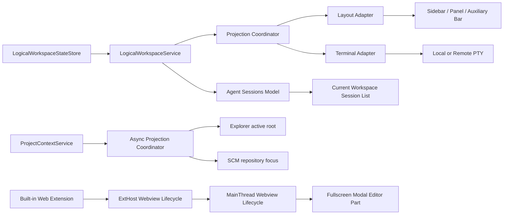

# vibe vscode 当前改动设计

本文记录 PR #1（`feat/dever-workspaces-fullscreen`）当前代码的设计、状态 authority 与实现边界。Roadmap 中未完成的能力不会因为底层宿主或原型已经存在而被视为已交付。

## 1. 实现边界

| 能力 | 当前状态 | 本次改动的边界 |
| --- | --- | --- |
| Logical Workspace | 已实现基础能力 | 创建、选择、页面内无刷新切换、唯一资源归属和 activation sequence |
| 工作台布局投影 | 已实现基础能力 | 初始恢复，以及主侧栏、底部面板、辅助侧栏的显隐、尺寸和 active composite |
| 终端隔离与持久化 | 已实现基础能力 | Logical Terminal ID、前后台迁移、本地/远程 PTY 重连 |
| Agent Session 隔离 | 已实现基础能力 | 会话唯一归属、当前 Workspace 列表过滤、provider 删除清理 |
| Project Context | 原型，Roadmap 仍为 Planned | 新增目录后选中、Explorer root 投影、延迟注册的 Git repository 跟随 |
| 全屏会话管理 | 仅宿主基础能力 | 受控 proposed API、身份校验、可靠创建生命周期和 fullscreen modal host；会话管理 UI 尚未实现 |
| Web-first 运行 | 开发入口已接线 | 内置 Web 扩展进入默认 compile/watch；非阻塞远程重连不在本 PR 中 |

## 2. 核心概念

### 2.1 Physical Workspace

VS Code 原生文件夹或 `.code-workspace`。它决定文件集合、扩展宿主与服务端进程；切换它仍遵循 VS Code 原有窗口或页面生命周期。

### 2.2 Logical Workspace

Physical Workspace 内的长期任务上下文。切换 Logical Workspace 不重新加载页面，而是重新投影：

- 工作台 shell 布局；
- 终端归属；
- Chat / Agent Session 归属。

每个终端和会话最多归属于一个 Logical Workspace。切换只改变前台投影，不应结束后台资源。

### 2.3 Project Context

Physical Workspace 中当前聚焦的一个 root folder。Project 切换改变 Explorer 与 SCM 的关注点，不等于 Logical Workspace 切换，也不关闭编辑器、终端或会话。

### 2.4 Fullscreen Session Host

覆盖整个 Workbench 的独占 Webview 宿主。它是未来会话管理界面的承载层，不是普通 editor tab，也不向普通第三方扩展开放。

## 3. 组件与 authority



`LogicalWorkspaceService` 是 Workspace catalog、布局快照和资源 owner 的单一内存 authority。Adapter 只把 registry 状态投影到现有 Workbench 服务，不维护第二份 owner map。

## 4. 状态模型与多页面边界

### 4.1 Shared schema v2

共享状态不包含当前页面选择：

```ts
interface LogicalWorkspaceSharedState {
  schemaVersion: 2;
  workspaces: Array<{
    id: string;
    name: string;
    terminalIds: string[];
    chatSessionResources: string[];
    shellLayout?: {
      primarySideBar: ShellPartLayout;
      panel: ShellPartLayout;
      auxiliaryBar: ShellPartLayout;
    };
  }>;
}
```

共享 catalog 与快照写入内部 Workspace storage：键为 `workbench.logicalWorkspace.sharedState.v2`，scope 为 `WORKSPACE`，target 为 `MACHINE`。它不进入 Configuration Service，因此不会创建或修改 `.vscode/settings.json` / `.code-workspace`，也不依赖项目配置文件可写。

`LogicalWorkspaceStateStore` 同时监听该 storage key 的 `onDidChangeValue` 和专用跨页面 channel。Web 的 Workspace storage 虽由 IndexedDB 持久化，但当前通用实现不会为 Workspace scope 开启广播，因此 Logical Workspace 使用按 Physical Workspace ID 隔离的 `BroadcastDataChannel`；底层优先使用 `BroadcastChannel`，不可用时回退到 storage event。接收页把 payload 以 external change 写入自己的 Workspace storage cache，再触发 shared-state 解析，不能只发一个信号后读取仍然陈旧的 cache。

共享冲突采用整包 **last-write-wins**，不做字段级或 Workspace 级合并。storage 中的 shared schema 外层带有 `{ counter, source }` Lamport revision；counter 大者获胜，并用页面 source UUID 作为并发同 counter 的稳定决胜项。接收页只接受更高 revision，因此两个页面同时写入时不会各自把对方视为最后写入而形成 split-brain。旧的无 envelope 值仍可读取，下一次写入时升级。

channel payload 仍被视为 `unknown`，先校验 Physical Workspace identity、revision 和 envelope，内部 snapshot 再由 Service 的严格 decoder 校验。这样删除和 owner 迁移具有明确语义，也符合当前阶段的复杂度选择。

### 4.2 Page-local active ID

`activeWorkspaceId` 写入当前页面的 `sessionStorage`，键中包含 Physical Workspace ID；浏览器存储不可用时使用页面内存 fallback。它不会触发共享快照写入，因此两个页面可以选择不同的 Logical Workspace。

外部共享快照到达时：

- 当前 ID 仍存在：保留本页选择；
- 当前 ID 已被 winning snapshot 删除：按事件顺序先发出 `onWillChangeActiveWorkspace`，再回退到第一项并发出 `onDidChangeActiveWorkspace`；
- 所有共享数据在进入运行时前从 `unknown` 开始逐层判型：数组元素、资源数组、`shellLayout` 和每个 shell part 都不能依赖 TypeScript cast；`null`、primitive 或畸形布局只会被拒绝，不会中断启动。

旧 `workbench.logicalWorkspace.state.v1` 会迁移为 schema v2；更早的 Project Context prototype 只迁移 Workspace ID 与名称，不继承含义不清的 owner map。

### 4.3 统一状态变更与 selector 规约

构造完成后，`LogicalWorkspaceService._state` 只能通过一个 state transition 方法更新。该方法负责：

1. 原子替换 immutable snapshot；
2. 在需要时保存 shared snapshot；
3. 根据 previous/current state 自动计算 active 与 Workspace catalog 的变更位；
4. 发出同时携带 previous/current snapshot 的 `onDidChangeState`。

因此新增写路径不能只改内存而忘记广播统一状态事件。`onWillChangeActiveWorkspace` / `onDidChangeActiveWorkspace` 继续承担 activation 的有序生命周期，但不再被当成 catalog 或 ownership 的替代事件。

消费者使用 `onDidChangeLogicalWorkspaceStateSlice(service, selector)` 一次性声明完整依赖。helper 会在每次统一状态变更后重新执行 selector，并用结构相等抑制无关变化。例如 Agent Sessions 选择：

```ts
{
  activeWorkspaceId,
  sessionResources: activeWorkspace.chatSessionResources
}
```

这样同一 active Workspace 下的跨标签页 ownership 更新会刷新列表，而只保存 `shellLayout` 不会造成 Session 列表重绘。该规约的重点是让消费者描述“读取了什么状态”，而不是自行猜测并拼接多个底层事件。

## 5. 统一投影协议

`ILogicalWorkspaceProjection` 统一规定两个阶段：

- `capture(workspaceId)`：离开当前 Workspace 或页面保存前采集前台状态；
- `restore(context)`：恢复目标状态，并在每个异步边界检查 `context.isCurrent()`。

`LogicalWorkspaceProjectionCoordinator` 负责所有 adapter 共有的生命周期：

1. Contribution 创建后主动恢复当前 Workspace；
2. Picker 切换的 `onWillChange` 阶段采集旧 Workspace；
3. `onDidChange` 阶段请求目标投影；
4. 页面保存时采集仍在前台的 Workspace；
5. 通过 Workspace ID 与 activation sequence 拒绝过期结果。

底层 `AsyncProjectionCoordinator<T>` 串行执行异步投影，只保留最新 pending intent。被合并请求的 Promise 会在更新的投影完成后才结束，调用方不会在实际 UI 写入前提前返回。Project Context 也复用这一协调器，因此初始恢复、显式选择、新增目录、目录集合变化和延迟 SCM 注册都走同一条 selection-to-projection 路径。

## 6. 布局投影

`LogicalWorkspaceLayoutAdapter` 采集三个 shell part：

- `Parts.SIDEBAR_PART`；
- `Parts.PANEL_PART`；
- `Parts.AUXILIARYBAR_PART`。

每项保存 `visible`、`width`、`height` 和 `activeCompositeId`。恢复顺序为：

1. 恢复各 location 的 active composite；
2. 临时 materialize 目标应显示或尺寸需要变化的 part；
3. 恢复尺寸；
4. 提交最终隐藏状态。

因此隐藏 part 也会先恢复自身尺寸；以后手动显示时不会继承另一个 Workspace 的尺寸。Adapter 在 `WorkbenchPhase.AfterRestored` 创建，并由统一协调器执行初始恢复。

当前不保存 editor group、open editors、窗口几何、panel split 或 active terminal；这些仍由原生服务各自管理。

## 7. 终端隔离与 Logical Terminal ID

普通用户终端创建或恢复时获得稳定 UUID，并设置 `forcePersist`。ID 贯穿：

```text
TerminalService
  -> IShellLaunchConfig.logicalTerminalId
  -> remoteTerminalChannel / local backend
  -> PtyService / TerminalProcess
  -> ProcessPropertyType.LogicalTerminalId
  -> persistent process attach target
  -> page restoration
```

Terminal adapter 根据 owner 做前后台投影：

- 非当前 Workspace 的前台终端通过 `moveToBackground` 脱离 UI，但进程不关闭；
- 当前 Workspace 的后台终端通过 `showBackgroundTerminal` 重新挂回；
- 移走最后一个 panel terminal 时抑制 `hideOnLastClosed`；
- 用户真正关闭终端时解除 owner，Workbench shutdown 则保留 owner 供重连；
- 终端集合或共享 owner 快照变化都会触发 reconcile。

## 8. Agent Session 隔离

`LocalAgentsSessionsController` 对 Chat Sessions Service 提供全局、权威的 provider item 集合，不再把 Workspace 显隐伪装成 provider 的 add/remove delta。可见性只由 `AgentSessionsModel.sessions` 按当前 owner 过滤。

归属建立与清理遵循以下边界：

- Local Chat model 创建时立即绑定创建它的 Workspace；
- provider 的 `addedOrUpdated` delta 到达时立即捕获当前 Workspace 并绑定新 URI；
- throttled resolver 同时携带触发时捕获的 Workspace ID；即使 500ms 内多个请求被合并，first-owner-wins 也不会把早先会话改绑到后来切入的 Workspace；
- provider resolve 前后按该 provider 的资源差集计算真实删除，并通过批量 `unbindChatSessions` 清理 owner；
- provider 项始终保持全局集合，Workspace 切换只刷新模型投影；
- Session 列表订阅 active ID 与当前 Workspace session URI 组成的统一 state slice；跨标签页只改变 owner 且 active ID 不变时仍会立即刷新，布局变化则被结构比较抑制。
- Model 自己发起的 owner 写入属于一次更大的 Session transaction。ownership API 的同步广播只在该同步写入区间内被抑制，等 `_sessions` map 提交后由 transaction 的最终事件统一刷新，避免消费者看到“owner 已建立但 Session 尚未进入 map”的中间态；外部 owner 更新不经过该抑制区间。

缓存中首次出现且尚无 owner 的历史会话会归入当时页面的当前 Workspace。这是兼容旧数据的迁移策略，不代表跨设备会话 identity 已完全解决。

常规 Workbench 与独立 Sessions entry 都显式导入 Logical Workspace service 注册模块。Sessions Web 启动测试在创建 Workbench 前检查 singleton registry，避免只在常规 `workbench.common.main.ts` 注册而让 Agents/Sessions window 缺失 DI 实现。

## 9. Project Context 原型

`ProjectContextService` 以选中 folder URI 为唯一 selection state，并将 Explorer 与 SCM 视为该 selection 的投影：

1. 初始加载解析已保存 folder；
2. Quick Pick 用 `activeItem` 聚焦当前项；
3. `Add Project Directory` 执行前后比较 folder 集合，并选择新增项；
4. Explorer 设置 active root，显式选择时再打开并选中对应 root；
5. 立即查找属于该 folder（包括其下嵌套仓库）的 SCM repository；
6. `onDidAddRepository` 对延迟注册重放当前投影；
7. 所有异步步骤检查 selection sequence，过期结果不能覆盖较新的 Project。

Roadmap 仍保持 Planned：状态栏交互、各类 SCM provider 的端到端行为、remote authority identity 和完整产品验收尚未闭环。

## 10. 全屏 Webview 宿主

内置 Web 扩展通过兼容保留的 `deverFullscreen` proposed API 请求全屏。MainThread 校验：

- extension ID 与 View Type 必须为固定内部值；
- extension 必须为 builtin；
- ExtHost 上报位置必须与 Extension Service 注册位置一致；
- 当前不能已有其他 modal editor。

创建 RPC 现在返回 `Promise<void>`。MainThread 拒绝时，ExtHost 会 dispose panel/webview、删除 handle map，并触发正常的 `onDidDispose`，扩展不会留下永久阻塞后续打开的幽灵引用。

MainThread 的 handle record 同时保存 Webview input 与 presentation identity。首次创建和后续 `WebviewPanel.reveal()` 复用同一个 Workbench show-options 生成入口；Fullscreen identity 始终得到 `{ group: MODAL_GROUP, preserveFocus: false, modal: { fullscreen: true } }`。因此 reveal 不会逃入普通 editor group，也不会以缺失 modal options 的方式重新创建不兼容的普通 modal part。record 随 input 生命周期统一清理。

当前内置扩展只渲染占位界面和关闭按钮。完整的会话浏览、创建、切换和状态管理仍是 Roadmap 项。

## 11. Web-first 构建入口与品牌

根目录默认脚本已包含内置 Web 扩展：

- `npm run compile` 并行执行 client、Copilot 与 `compile-vibe-vscode`；
- `npm run watch` 同时执行 `watch-vibe-vscode`；
- 扩展自身提供 `compile-web` 与 `watch-web`，生成 `dist/browser/extension.js`。

用户可见名称统一为 `vibe vscode`；为保持 proposed API、command、View Type 和扩展身份兼容，内部 `dever.*` ID 暂不迁移。

非阻塞远程连接尚未实现，README 保持 🚧，应在独立 PR 中同时提交断网、恢复和内容保持测试。

## 12. 仍然存在的限制

1. Logical Workspace 尚无重命名、删除、排序和显式 owner 迁移 UI。
2. Shared snapshot 使用整包 LWW；两个页面并发编辑不同字段时，后完成的整包写入获胜。
3. 布局只覆盖三个 shell part，不恢复 editor/terminal group 几何。
4. Project Context 仍是产品原型，不应在 README 标为 Available。
5. Fullscreen host 尚未实现真正的 Agent Session 管理界面。
6. 非阻塞远程连接、网络恢复重试与云端长期运行验收不在本 PR 中。

## 13. 验证策略

- 类型与构建：`npm run typecheck-client`、`npm run vscode-dts-compile-check`、`npm run gulp compile`、根目录 `npm run compile`；
- Web 扩展：直接运行 `compile-web`，并确认默认 compile/watch 已接线；
- Logical Workspace：内部 Workspace storage 与外部 change、schema 迁移、畸形 `unknown` 输入、页面 active ID、外部 LWW 更新、统一 state slice、activation 顺序、初始投影和快速连续切换；
- 布局：active composite、显隐、尺寸和隐藏 part 尺寸恢复；
- 终端：前后台迁移、显式关闭、Workbench shutdown、本地与远程 persistent attach；
- Agent Session：快速跨 Workspace delta、全局 provider 集合、provider 删除、唯一 owner、同 active ID 的外部 ownership 更新和布局无关变更抑制；
- Fullscreen host：创建拒绝清理、dispose、真实 `WebviewPanel.reveal()` options 透传、未授权扩展和 modal 冲突；
- Sessions entry：Web 启动前确认 `ILogicalWorkspaceService` 已进入 singleton registry；
- Project Context：Quick Pick active item、新增 root、嵌套 Git repository、延迟 SCM 注册和 selection 竞态；
- 隔离启动：使用临时 profile 与独立调试端口启动 Code OSS，避免污染用户环境。
